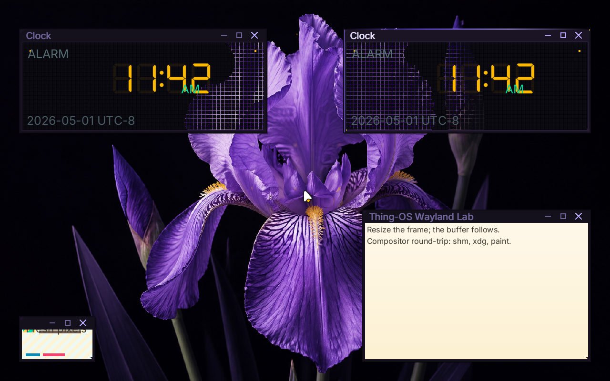
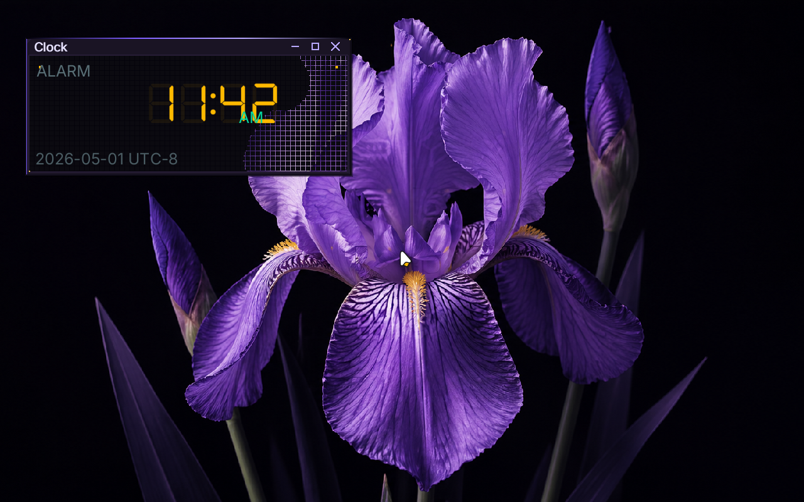
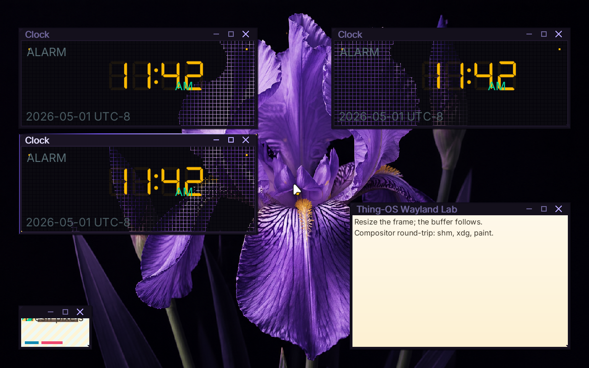
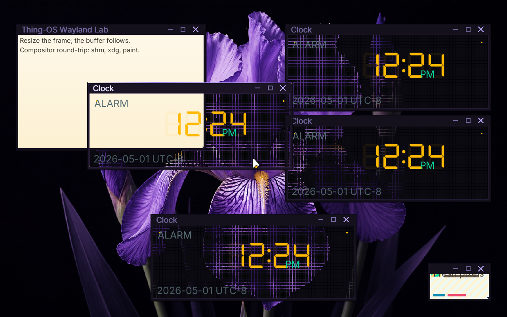

# ❌ Scenario: Alt+Tab cycles through multiple windows

> Last run: 2026-05-01 13:23:52

## Steps

| # | Step | Result | Duration | Before | After | Artifacts |
|---|------|--------|----------|--------|-------|-----------|
| 1 | Given the machine is booted | ✅ | 10845ms | <a href="./01/before.png"></a> | <a href="./01/after.png"></a> | [📜](./01/serial.log) |
| 2 | When I wait for the shell prompt | ✅ | 1134ms | <a href="./02/before.png"></a> | <a href="./02/after.png"></a> | [📜](./02/serial.log) [console_interactive.png](./02/console_interactive.png) |
| 3 | And I type "clock &" on the serial console | ✅ | 281ms | <a href="./03/before.png"></a> | <a href="./03/after.png"></a> | [📜](./03/serial.log) |
| 4 | And I wait for 2 seconds | ✅ | 2302ms | <a href="./04/before.png"></a> | <a href="./04/after.png"></a> | [📜](./04/serial.log) |
| 5 | And I type "clock &" on the serial console | ✅ | 585ms | <a href="./05/before.png"></a> | <a href="./05/after.png"></a> | [📜](./05/serial.log) |
| 6 | And I wait for 2 seconds | ✅ | 1518ms | <a href="./06/before.png"></a> | <a href="./06/after.png"></a> | [📜](./06/serial.log) |
| 7 | And I type "clock &" on the serial console | ✅ | 682ms | <a href="./07/before.png"></a> | <a href="./07/after.png"></a> | [📜](./07/serial.log) |
| 8 | And I wait for 5 seconds | ✅ | 4537ms | <a href="./08/before.png"></a> | <a href="./08/after.png"></a> | [📜](./08/serial.log) |
| 9 | Then the serial output should contain "First frame rendered" within 60s | ✅ | 477ms | <a href="./09/before.png"></a> | <a href="./09/after.png"></a> | [📜](./09/serial.log) |
| 10 | And the serial output should contain "bloom: registered bristle pointer sink" within 60s | ✅ | 5557ms | <a href="./10/before.png"></a> | - |  |
| 11 | When I press alt+tab | ✅ | 5817ms | - | - | [📜](./11/serial.log) |
| 12 | Then the latest output should contain "bloom: focus cycled from None" within 10s | ✅ | 15157ms | - | - |  |
| 13 | When I press alt+tab | ✅ | 742ms | - | <a href="./13/after.png"></a> |  |
| 14 | Then the latest output should contain "bloom: focus cycled from Some" within 10s | ❌ | 10119ms | <a href="./14/before.png"></a> | - |  |

<details>
<summary>📜 Full Serial Log</summary>

```
[=3h00BdsDxe: loading Boot0002 "UEFI QEMU DVD-ROM QM00005 " from PciRoot(0x0)/Pci(0x1F,0x2)/Sata(0x2,0xFFFF,0x0)
BdsDxe: starting Boot0002 "UEFI QEMU DVD-ROM QM00005 " from PciRoot(0x0)/Pci(0x1F,0x2)/Sata(0x2,0xFFFF,0x0)
[33149475348] [INFO ] [kernel::boot_progress] [CPU0] boot_progress: milestone="Framebuffer Initialized"
[33396268521] [INFO ] [kernel::boot_progress] [CPU0] boot_progress: milestone="Memory Map OK"
[33415513758] [INFO ] [kernel] [CPU0] Initializing global allocator...
[33444924777] [INFO ] [kernel::boot_progress] [CPU0] boot_progress: milestone="Global Allocator"
[33475476540] [INFO ] [kernel::boot_progress] [CPU0] boot_progress: milestone="Display Registry"
[33494096691] [INFO ] [kernel] [CPU0] Initializing SIMD...
[33495787479] [INFO ] [kernel::boot_progress] [CPU0] boot_progress: milestone="SIMD Ready"
[33532650030] [WARN ] [kernel::entropy] [CPU0] ENTROPY: no hardware RNG available, using timer fallback (weak entropy)
[33534279075] [INFO ] [kernel::boot_progress] [CPU0] boot_progress: milestone="SIMD Ready"
[33553892625] [INFO ] [kernel] [CPU0] Initializing tasking...
[33567739095] [INFO ] [kernel::sched] [CPU0] SCHED: 1 per-CPU scheduler(s) allocated
[33568339431] [INFO ] [kernel::sched] [CPU0] SCHED: per-CPU preemption initialized (1 independent preemption domains, no global preemption lock)
[33602277687] [INFO ] [kernel::sched] [CPU0] Scheduler initialized
[33603332862] [INFO ] [kernel::boot_progress] [CPU0] boot_progress: milestone="Tasking Initialized"
[33687490584] [INFO ] [kernel::boot_progress] [CPU0] boot_progress: milestone="VFS Root Ready"
[33769330089] [INFO ] [kernel::boot_progress] [CPU0] boot_progress: milestone="PCI Bus Scanned"
[33789965055] [INFO ] [kernel::boot_progress] [CPU0] boot_progress: milestone="Legacy Devices"
[33860298153] [INFO ] [kernel::boot_progress] [CPU0] boot_progress: milestone="BSP Timer OK"
[33958348842] [INFO ] [kernel::boot_progress] [CPU0] boot_progress: milestone="SMP Bring-up"
[33986150319] [INFO ] [kernel::boot_progress] [CPU0] boot_progress: milestone="Boot Info OK"
[34010558571] [INFO ] [kernel::boot_progress] [CPU0] boot_progress: milestone="Modules Scanned"
[34105909035] [INFO ] [kernel::boot_progress] [CPU0] boot_progress: hint="Press F12 for a terminal"
[34151943837] [INFO ] [kernel::boot_progress] [CPU0] boot_progress: milestone="Spawning Sprout"
[34278968130] [INFO ] [kernel::boot_progress] [CPU0] boot_progress: milestone="Entering Scheduler"
[34516423293] [INFO ] [kernel] [CPU0] [kernel:start] scheduler-entry total elapsed_ticks=893380422 elapsed_us=446690
[34517250240] [INFO ] [kernel] [CPU0] Entering scheduler loop.
[34595465685] [INFO ] [sprout] [CPU0] SPROUT: ENTERING MAIN (arg0=6291456)
[34598929530] [INFO ] [sprout] [CPU0] SPROUT: v0.4.1 [REBUILT] starting (Supervisor Mode)...
[34664083410] [INFO ] [sprout::supervisor] [CPU0] SPROUT: Initializing Supervisor...
[34700289393] [INFO ] [sprout::supervisor] [CPU0] SPROUT: Supervisor session started (FULL PIPELINE MODE)
[34708678950] [INFO ] [sprout::supervisor] [CPU0] SPROUT: Launching serial shell...
[34710051453] [INFO ] [sprout::pipelines] [CPU0] SPROUT: Setting up serial shell on /dev/console...
[34827108030] [INFO ] [sprout::pipelines] [CPU0] SPROUT: Spawned serial shell '/bin/sh' (PID=6)
[34830398823] [INFO ] [sprout::supervisor] [CPU0] SPROUT: Serial shell launched; yielding 50ms so the prompt can take the foreground
[34840197909] [INFO ] [sh] [CPU3] SH: starting v0.1.0-debug

        .-.
       /   \        THING-OS
      |     |       "People, places, things."
       \   /        
        `-'        
       /   \        v0.1  •  
      |     |       2026-04-16
       \   /
        `-'

--------------------------------------------------------------
 sprout has taken root. the system is awake.

  try:
    ls /bin       browse available shoots
    ps            observe living processes
    cat /version  inspect the genome

--------------------------------------------------------------
THING-OS [BOOT] / > [?25h[34998063276] [INFO ] [sprout::supervisor] [CPU0] SPROUT: Continuing supervisor startup
[34999760433] [INFO ] [sprout::supervisor] [CPU0] SPROUT: Spawning cambium for driver discovery...
[35032327011] [INFO ] [sprout::pipelines] [CPU0] SPROUT: Skipping early /hosts mount; mesocarp is disabled in init
[35034661332] [INFO ] [sprout::supervisor] [CPU0] SPROUT: Starting full pipeline (graphics + input)
[35036047431] [INFO ] [cambium] [CPU1] CAMBIUM: main started
[35036091189] [INFO ] [sprout::supervisor] [CPU0] SPROUT: Entering supervisor service loop (tick=100ms)
[35058970155] [INFO ] [cambium] [CPU1] CAMBIUM: starting device discovery manager (daemon mode)
[35074579782] [INFO ] [sprout::pipelines] [CPU0] SPROUT: Spawned bristle (PID=8)
[35079288750] [INFO ] [sprout::supervisor] [CPU0] SPROUT: Starting display pipeline setup
[35081816418] [INFO ] [sprout::pipelines] [CPU0] SPROUT: Probing /dev/fb0 for boot framebuffer metadata
[35095986321] [INFO ] [sprout::pipelines] [CPU0] SPROUT: /dev/fb0 ready width=1920 height=1080 stride=7680 format=2
[35099777757] [INFO ] [sprout::pipelines] [CPU0] SPROUT: Selected display driver '/drivers/display_virtio_gpu'
[35101499796] [INFO ] [sprout::pipelines] [CPU0] SPROUT: Creating display request port
[35111488335] [INFO ] [sprout::pipelines] [CPU0] SPROUT: Creating display response port
[35113967658] [INFO ] [sprout::pipelines] [CPU0] SPROUT: Creating display bootstrap memfd
[35118576504] [INFO ] [sprout::pipelines] [CPU0] SPROUT: Mapping display bootstrap memfd
[35124165582] [INFO ] [sprout::pipelines] [CPU0] SPROUT: Launching display driver '/drivers/display_virtio_gpu' (boot_fd=3, bind_id=322371585)
[35132372748] [INFO ] [bristle] [CPU2] bristle: published pid 8 to /run/bristle/pid
[35143263375] [INFO ] [bristle] [CPU2] bristle: published device handles kbd_in=1 mouse_in=3
[35153936862] [INFO ] [bristle] [CPU2] bristle: online (kbd_tok=Some(WaitToken(2)), mouse_tok=Some(WaitToken(3)))
[35181034713] [INFO ] [sprout::supervisor] [CPU0] SPROUT: Display pipeline initialized (backend=virtio_gpu)
[35189021835] [INFO ] [display_virtio_gpu] [CPU3] display_virtio_gpu: starting v0.4.1 (boot_arg=3)
[35277891330] [INFO ] [virtio_gpu] [CPU3] virtio_gpu: caps from sysfs - common BAR2 off=0x1000, notify BAR2 off=0x3000 mult=4
[35288370975] [INFO ] [virtio_gpu] [CPU3] virtio_gpu: device features=0x30000002 virgl=false
[35298139206] [INFO ] [virtio_gpu] [CPU3] virtio_gpu: cursor queue (queue 1) configured
[35299144386] [INFO ] [display_virtio_gpu] [CPU3] display_virtio_gpu: GPU initialized successfully
[35299794915] [INFO ] [display_virtio_gpu] [CPU3] display_virtio_gpu: composition paths: gpu_opaque_copy=enabled cpu_alpha_blend=enabled
[35308118010] [INFO ] [display_virtio_gpu] [CPU3] display_virtio_gpu: host scanout 1280x800 enabled=true (bootfb was 1920x1080)
[35347494237] [INFO ] [cambium::catalog] [CPU1] DEVD CATALOG: registered driver '/drivers/ahci_disk' name='ahci_disk' class=Block kind='dev.storage.Ahci' start='thingos_driver_start_safe'
[35510184930] [INFO ] [cambium::catalog] [CPU1] DEVD CATALOG: registered driver '/drivers/ata_disk' name='ata_disk' class=Block kind='dev.storage.Ide' start='thingos_driver_start_safe'
[35554848186] [INFO ] [display_virtio_gpu] [CPU3] display_virtio_gpu: cursor DMA buffer ready (16 pages at phys=0x2723000)
[35614116450] [INFO ] [sprout::supervisor] [CPU0] SPROUT: Mounted /dev/display/card0 successfully
[35622598671] [INFO ] [display_virtio_gpu] [CPU3] display_virtio_gpu: Sovereign registration COMPLETE. Assigned: /dev/display/card0
[35627124159] [INFO ] [display_virtio_gpu] [CPU3] display_virtio_gpu: VFS provider loop online
[35629104390] [INFO ] [sprout::supervisor] [CPU0] SPROUT: Display service is ready at /dev/display/card0
[35669441940] [INFO ] [cambium::catalog] [CPU1] DEVD CATALOG: registered driver '/drivers/chime' name='chime' class=Audio kind='dev.sound.Chime' start='thingos_driver_start_safe'
[35834649873] [INFO ] [cambium::catalog] [CPU1] DEVD CATALOG: registered driver '/drivers/display_bootfb' name='display_bootfb' class=Display kind='dev.display.Gpu' start='thingos_driver_start_safe'
[36014775159] [INFO ] [cambium::catalog] [CPU1] DEVD CATALOG: registered driver '/drivers/display_virtio_gpu' name='display_virtio_gpu' class=Display kind='dev.display.Gpu' start='thingos_driver_start_safe'
[36022779408] [INFO ] [sprout::supervisor] [CPU0] SPROUT: Spawned bloom (PID=10)
[36118621275] [INFO ] [bloom] [CPU1] bloom: ENTERING MAIN
[36119727072] [INFO ] [bloom] [CPU1] bloom: compositor service starting
[36262389009] [INFO ] [cambium::catalog] [CPU1] DEVD CATALOG: registered driver '/drivers/hdaudio' name='hdaudio' class=Audio kind='dev.sound.Hda' start='thingos_driver_start_safe'
[36349960185] [INFO ] [bloom] [CPU1] bloom: connected to /dev/display/card0 on try 0
[36369224562] [INFO ] [bloom] [CPU1] bloom: output0 1280x800 @ 60000mHz
[36370202781] [INFO ] [bloom] [CPU1] bloom: display driver does not support VBLANK
[36370987917] [INFO ] [bloom] [CPU1] bloom: display driver supports linear dmabuf import
[36371693985] [INFO ] [bloom] [CPU1] bloom: display driver supports GPU blit (hardware transfer/flush)
[36372530205] [INFO ] [bloom] [CPU1] bloom: display driver supports direct scanout (zero-copy path to display)
[36373327023] [INFO ] [bloom] [CPU1] bloom: display driver supports partial flush (damage regions)
[36373947126] [INFO ] [bloom] [CPU1] bloom: display driver supports resource cache (pre-allocated buffer pool)
[36374656164] [INFO ] [bloom] [CPU1] bloom: creating service port...
[36669610890] [INFO ] [bloom::render] [CPU1] bloom: pistil background renderer loaded from /lib/libpistil.so
[36670656528] [INFO ] [bloom::render] [CPU1] bloom: pistil font text renderer loaded with default /share/fonts/Inter-Regular.ttf
[36671385168] [INFO ] [bloom::render] [CPU1] bloom: pistil symbol renderer loaded with /share/fonts/NotoSansSymbol2-Regular.ttf
[36678653946] [INFO ] [bloom] [CPU1] bloom: initial theme configured Facet Frame
echo [36975921510] [INFO ] [cambium::catalog] [CPU1] DEVD CATALOG: registered driver '/drivers/hwrng' name='hwrng' class=Other kind='dev.rng.HwRng' start='_RNvCs7wlZbVUrQWf_5hwrng20thingos_driver_start'
BDD_C[37144309950] [INFO ] [bloom] [CPU1] bloom: initial wallpaper configured /share/wallpapers/flower.png
ONS[37268967450] [INFO ] [cambium::catalog] [CPU1] DEVD CATALOG: registered driver '/drivers/pci_stubd' name='pci_stubd' class=Other kind='drv.PciStubd' start='thingos_driver_start_safe'
OLE_[37435477299] [INFO ] [bloom::render] [CPU1] bloom: cursor ready buffer=2 size=48x48 hotspot=11,6
R[37444954635] [INFO ] [bloom] [CPU1] bloom: watching wallpaper config /session/desktop/wallpaper
[37446876027] [INFO ] [bloom] [CPU1] bloom: watching theme config /session/desktop/theme
[37489727385] [INFO ] [bloom] [CPU1] bloom: Wayland server thread spawned
[37491590631] [INFO ] [bloom::loop_types] [CPU1] bloom: service loop started
[37492440447] [INFO ] [bloom::loop_types] [CPU1] bloom: output0 1280x800 @ 60000mHz ready
[37494680553] [INFO ] [bloom::wayland] [CPU2] wayland-server: starting
E[37506666978] [INFO ] [cambium::catalog] [CPU1] DEVD CATALOG: registered driver '/drivers/ps2_kbd' name='ps2_kbd' class=Input kind='drv.Ps2Keyboard' start='thingos_driver_start_safe'
[37509748782] [INFO ] [bloom::wayland] [CPU2] wayland-server: listening on /run/wayland-0
[37510692450] [INFO ] [bloom::wayland] [CPU2] wayland-server: advertising globals wl_compositor wl_shm xdg_wm_base wl_seat wl_output wl_subcompositor wl_data_device_manager zwp_linux_dmabuf_v1
ADY_3[37660545054] [INFO ] [cambium::catalog] [CPU1] DEVD CATALOG: registered driver '/drivers/ps2_mouse' name='ps2_mouse' class=Input kind='drv.Ps2Mouse' start='thingos_driver_start_safe'
05[37765461756] [INFO ] [display_virtio_gpu] [CPU3] display_virtio_gpu: first commit copied buffer=1 rect=1280x800 src_px=0xff0b0a10 dst_px=0xff0b0a10 damage=1280x800+0,0 res_id=1 gpu_planes=0 cpu_planes=2
[37766779611] [INFO ] [display_virtio_gpu] [CPU3] display_virtio_gpu: cursor plane blended buffer=2 at 638,399 src_px=0x10202020 dst_before=0xff0b0a10 dst_after=0xff0c0b11
38[37808244375] [INFO ] [cambium::catalog] [CPU1] DEVD CATALOG: registered driver '/drivers/rtc_cmos' name='rtc_cmos' class=Other kind='dev.rtc.Cmos' start='thingos_driver_start_safe'
84[37895827134] [INFO ] [bloom::loop_types] [CPU1] First frame rendered
_1[37969013511] [INFO ] [cambium::catalog] [CPU1] DEVD CATALOG: registered driver '/drivers/rtl8168d' name='rtl8168d' class=Net kind='dev.net.Nic' start='thingos_driver_start_safe'
777[38073254241] [INFO ] [bloom::services::input_service] [CPU1] bloom: registered bristle pointer sink
[38080409631] [INFO ] [bristle] [CPU2] bristle: bloom sink registered (handle=5 mask=0x03)
66[38148446160] [INFO ] [cambium::catalog] [CPU1] DEVD CATALOG: registered driver '/drivers/virtio_netd' name='virtio_netd' class=Net kind='dev.net.Nic' start='thingos_driver_start_safe'
70437[38304720267] [INFO ] [cambium::catalog] [CPU1] DEVD CATALOG: registered driver '/drivers/virtio_sound' name='virtio_sound' class=Audio kind='dev.sound.Virtio' start='thingos_driver_start_safe'
0[38359615635] [INFO ] [sprout::supervisor] [CPU0] SPROUT: Spawned wayland_hello (PID=12)
[38371728615] [INFO ] [wayland_hello] [CPU3] wayland_hello: connected to /run/wayland-0
[38387503110] [INFO ] [sprout::supervisor] [CPU0] SPROUT: Spawned clock (PID=13)
[38396831583] [INFO ] [clock] [CPU1] clock: running at low scheduler priority tid=13
[38400089706] [INFO ] [clock] [CPU1] clock: connected to /run/wayland-0
2810147
[38685187563] [INFO ] [clock] [CPU1] clock: pistil DSEG7 text renderer loaded with /share/fonts/DSEG7Classic-Regular.ttf
[38686300488] [INFO ] [clock] [CPU1] clock: pistil generic text renderer loaded with /share/fonts/Inter-Regular.ttf
BDD_CONSOLE_READY_3053884_1777667043702810147
[38744567994] [INFO ] [wayland_hello] [CPU3] wayland_hello: pistil text renderer loaded with default /share/fonts/Inter-Regular.ttf
[?25l[38773769826] [INFO ] [cambium::catalog] [CPU1] DEVD CATALOG: registered driver '/drivers/xhci' name='xhci' class=Block kind='dev.usb.Xhci' start='thingos_driver_start_safe'
[38775477510] [INFO ] [cambium::catalog] [CPU1] DEVD CATALOG: 15 driver(s) found
[?25hTHING-OS [OK] / > [?25h[38807192457] [INFO ] [wayland_hello] [CPU3] wayland_hello: using zwp_linux_dmabuf_v1 buffers
[38809410420] [INFO ] [wayland_hello] [CPU3] wayland_hello: bound wp_presentation
[38815681014] [INFO ] [wayland_hello] [CPU3] wayland_hello: wl_region smoke test: create+add+set_opaque+destroy
[38834618295] [INFO ] [ahci_disk] [CPU3] AHCI: Starting AHCI VFS driver
[38873759562] [INFO ] [ahci_disk] [CPU3] AHCI: Claimed device /sys/devices/pci-0000:00:1f.2
[38889270552] [INFO ] [ahci_disk] [CPU3] AHCI: Mounted atapi2 at /dev/storage/atapi2
[38890524024] [INFO ] [ahci_disk] [CPU3] AHCI: Provider loop online at /dev/storage/atapi2
[38896855470] [INFO ] [rtc_cmos] [CPU1] RTC: claimed /sys/devices/isa-0070 (handle=2)
[38915837367] [INFO ] [rtc_cmos] [CPU1] RTC: 2026-05-01 20:24:03 = 1777667043 unix_secs
[38916896832] [INFO ] [kernel::time] [CPU1] System clock anchored: unix_secs=1777667043, mono_ns=19458292804, offset=1777667023541707196ns
[38917667481] [INFO ] [rtc_cmos] [CPU1] RTC: System clock anchored to 1777667043 unix_secs
[38931336444] [INFO ] [kernel::time] [CPU0] System clock tick: utc=2026-05-01 20:24:03.006581784 unix_secs=1777667043.006581784
[38972408310] [INFO ] [ps2_kbd] [CPU2] ps2_kbd: bristle pid=8
[39032324661] [INFO ] [bloom::services::wayland_cmd] [CPU1] bloom: registered titlebar drag zone surface=1 height=28 frame=6
[39036962976] [INFO ] [ps2_mouse] [CPU3] ps2_mouse: bristle pid=8
[39040485924] [INFO ] [bloom::services::wallpaper] [CPU1] bloom: preparing background /share/wallpapers/flower.png
[39047653260] [INFO ] [bloom::wayland::dispatch] [CPU2] wayland-server: xdg_toplevel obj=12 assigned to xdg_surface=11
[39136826223] [INFO ] [bloom::wayland::dispatch] [CPU2] wayland-server: imported dmabuf wl_buffer=111 480x320 format=0x34325241
c[39719919789] [INFO ] [ps2_kbd] [CPU2] ps2_kbd: read scancode 0x47
[39723051819] [INFO ] [ps2_kbd] [CPU2] ps2_kbd: edge detected: Down { key: Unknown, mods: Mods(0), repeat: false }
[39727646805] [INFO ] [ps2_kbd] [CPU2] ps2_kbd: sent Unknown to bristle (pid=8)
[39735044085] [INFO ] [bristle] [CPU2] bristle: KeyDown received: Unknown
[39747663945] [INFO ] [ps2_mouse] [CPU3] ps2_mouse: sample rate set to 60 Hz
lock &
[2] 19
THING-OS [OK] / > [?25h[40916784315] [INFO ] [clock] [CPU1] clock: running at low scheduler priority tid=19
[40920037653] [INFO ] [clock] [CPU1] clock: connected to /run/wayland-0
[41599097958] [INFO ] [clock] [CPU1] clock: pistil DSEG7 text renderer loaded with /share/fonts/DSEG7Classic-Regular.ttf
[41600143167] [INFO ] [clock] [CPU1] clock: pistil generic text renderer loaded with /share/fonts/Inter-Regular.ttf
[41959781127] [INFO ] [bloom::input] [CPU1] bloom: KeyDown received: Unknown (raw=0xffff, mods=Mods(0), repeat=false)
[41966149434] [INFO ] [bloom::services::wayland_cmd] [CPU1] bloom: registered titlebar drag zone surface=2 height=28 frame=6
[41974168104] [INFO ] [bloom::wayland::dispatch] [CPU2] wayland-server: xdg_toplevel obj=12 assigned to xdg_surface=11
[42792985587] [INFO ] [bloom::services::wayland_cmd] [CPU1] bloom: registered titlebar drag zone surface=3 height=28 frame=6
[42800318022] [INFO ] [bloom::wayland::dispatch] [CPU2] wayland-server: xdg_toplevel obj=12 assigned to xdg_surface=11
[43260720921] [INFO ] [bloom::services::wayland_cmd] [CPU1] bloom: registered titlebar drag zone surface=4 height=28 frame=6
[43270967883] [INFO ] [bloom::wayland::dispatch] [CPU2] wayland-server: xdg_popup obj=23 assigned to xdg_surface=21
[43303606599] [INFO ] [bloom::wayland::dispatch] [CPU2] wayland-server: imported dmabuf wl_buffer=121 160x96 format=0x34325241
[44257388406] [INFO ] [bloom::render] [CPU1] bloom: flat window overlays ready size=1280x800
[44959783836] [INFO ] [kernel::time] [CPU0] System clock tick: utc=2026-05-01 20:24:06.021498381 unix_secs=1777667046.021498381
c[47617925784] [INFO ] [wayland_hello] [CPU3] wayland_hello: frame callback done object=1000 data=23802
[47620806618] [INFO ] [wayland_hello] [CPU3] wayland_hello: wp_presentation_feedback.presented object=1001 tv=23.806088938 refresh_ns=16666666 seq=0
[48065918505] [INFO ] [wayland_hello] [CPU3] wayland_hello: frame callback done object=1002 data=24028
[48067466997] [INFO ] [wayland_hello] [CPU3] wayland_hello: wp_presentation_feedback.presented object=1003 tv=24.031657501 refresh_ns=16666666 seq=1
loc[50989499352] [INFO ] [kernel::time] [CPU0] System clock tick: utc=2026-05-01 20:24:09.036409533 unix_secs=1777667049.036409533
k &
[3] 20
THING-OS [OK] / > [?25h[51188484534] [INFO ] [clock] [CPU2] clock: running at low scheduler priority tid=20
[51192103083] [INFO ] [clock] [CPU2] clock: connected to /run/wayland-0
[51508536156] [INFO ] [clock] [CPU2] clock: pistil DSEG7 text renderer loaded with /share/fonts/DSEG7Classic-Regular.ttf
[51509647134] [INFO ] [clock] [CPU2] clock: pistil generic text renderer loaded with /share/fonts/Inter-Regular.ttf
[51563850756] [INFO ] [bloom::services::wayland_cmd] [CPU1] bloom: registered titlebar drag zone surface=5 height=28 frame=6
[51569657931] [INFO ] [bloom::wayland::dispatch] [CPU2] wayland-server: xdg_toplevel obj=12 assigned to xdg_surface=11
[57019819428] [INFO ] [kernel::time] [CPU0] System clock tick: utc=2026-05-01 20:24:12.051520401 unix_secs=1777667052.051520401
clock &
[61227504294] [INFO ] [clock] [CPU3] clock: running at low scheduler priority tid=21
[61231219269] [INFO ] [clock] [CPU3] clock: connected to /run/wayland-0
[61511310498] [INFO ] [clock] [CPU3] clock: pistil DSEG7 text renderer loaded with /share/fonts/DSEG7Classic-Regular.ttf
[61512308979] [INFO ] [clock] [CPU3] clock: pistil generic text renderer loaded with /share/fonts/Inter-Regular.ttf
[4] 21
THING-OS [OK] / > [?25h[61570070991] [INFO ] [bloom::services::wayland_cmd] [CPU1] bloom: registered titlebar drag zone surface=6 height=28 frame=6
[61574727522] [INFO ] [bloom::wayland::dispatch] [CPU2] wayland-server: xdg_toplevel obj=12 assigned to xdg_surface=11
[63049705389] [INFO ] [kernel::time] [CPU0] System clock tick: utc=2026-05-01 20:24:15.066511298 unix_secs=1777667055.066511298
[69079587720] [INFO ] [kernel::time] [CPU0] System clock tick: utc=2026-05-01 20:24:18.081448817 unix_secs=1777667058.081448817
[74192598018] [INFO ] [clock] [CPU3] clock: tick local=2026-05-01 12:24:20 UTC-8 system_unix=1777667060.637380096
[74287790577] [INFO ] [clock] [CPU1] clock: tick local=2026-05-01 12:24:20 UTC-8 system_unix=1777667060.684962895
[74617758864] [INFO ] [clock] [CPU1] clock: tick local=2026-05-01 12:24:20 UTC-8 system_unix=1777667060.849963340
[74758668699] [INFO ] [clock] [CPU2] clock: tick local=2026-05-01 12:24:20 UTC-8 system_unix=1777667060.920120070
[75109854171] [INFO ] [kernel::time] [CPU0] System clock tick: utc=2026-05-01 20:24:21.096573429 unix_secs=1777667061.096573429
[81139772109] [INFO ] [kernel::time] [CPU0] System clock tick: utc=2026-05-01 20:24:24.111540780 unix_secs=1777667064.111540780
[87169658070] [INFO ] [kernel::time] [CPU0] System clock tick: utc=2026-05-01 20:24:27.126482127 unix_secs=1777667067.126482127
[93199807206] [INFO ] [kernel::time] [CPU0] System clock tick: utc=2026-05-01 20:24:30.141558840 unix_secs=1777667070.141558840
[99229700757] [INFO ] [kernel::time] [CPU0] System clock tick: utc=2026-05-01 20:24:33.156508949 unix_secs=1777667073.156508949
[105259699809] [INFO ] [kernel::time] [CPU0] System clock tick: utc=2026-05-01 20:24:36.171506412 unix_secs=1777667076.171506412
[111289934085] [INFO ] [kernel::time] [CPU0] System clock tick: utc=2026-05-01 20:24:39.186584396 unix_secs=1777667079.186584396
[117319754211] [INFO ] [kernel::time] [CPU0] System clock tick: utc=2026-05-01 20:24:42.201532590 unix_secs=1777667082.201532590
[123349850811] [INFO ] [kernel::time] [CPU0] System clock tick: utc=2026-05-01 20:24:45.216574752 unix_secs=1777667085.216574752
[129379774359] [INFO ] [kernel::time] [CPU0] System clock tick: utc=2026-05-01 20:24:48.231554544 unix_secs=1777667088.231554544
[135409699260] [INFO ] [kernel::time] [CPU0] System clock tick: utc=2026-05-01 20:24:51.246509570 unix_secs=1777667091.246509570
[141439632807] [INFO ] [kernel::time] [CPU0] System clock tick: utc=2026-05-01 20:24:54.261492695 unix_secs=1777667094.261492695
[147470533155] [INFO ] [kernel::time] [CPU0] System clock tick: utc=2026-05-01 20:24:57.276897543 unix_secs=1777667097.276897543
[148740207561] [INFO ] [clock] [CPU3] clock: tick local=2026-05-01 12:24:57 UTC-8 system_unix=1777667097.911589876
[148833904692] [INFO ] [clock] [CPU1] clock: tick local=2026-05-01 12:24:57 UTC-8 system_unix=1777667097.958341224
[149165930265] [INFO ] [clock] [CPU1] clock: tick local=2026-05-01 12:24:58 UTC-8 system_unix=1777667098.124458208
[149296366329] [INFO ] [clock] [CPU2] clock: tick local=2026-05-01 12:24:58 UTC-8 system_unix=1777667098.189525842
[152475534
```
</details>
