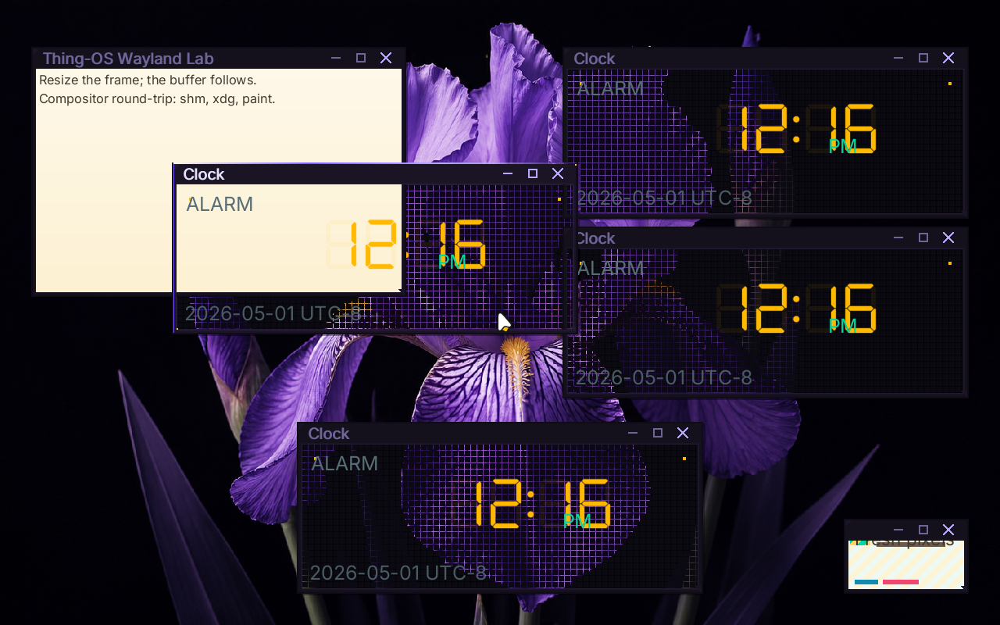

# ✅ Scenario: Alt+Tab cycles through multiple windows

> Last run: 2026-05-01 13:12:24

## Steps

| # | Step | Result | Duration | Before | After | Artifacts |
|---|------|--------|----------|--------|-------|-----------|
| 1 | Given the machine is booted | ✅ | 10945ms | <a href="./01/before.png"></a> | <a href="./01/after.png"></a> | [📜](./01/serial.log) |
| 2 | When I wait for the shell prompt | ✅ | 1138ms | <a href="./02/before.png"></a> | <a href="./02/after.png"></a> | [📜](./02/serial.log) [console_interactive.png](./02/console_interactive.png) |
| 3 | And I type "clock &" on the serial console | ✅ | 280ms | <a href="./03/before.png"></a> | <a href="./03/after.png"></a> | [📜](./03/serial.log) |
| 4 | And I wait for 2 seconds | ✅ | 2239ms | <a href="./04/before.png"></a> | <a href="./04/after.png"></a> | [📜](./04/serial.log) |
| 5 | And I type "clock &" on the serial console | ✅ | 591ms | <a href="./05/before.png"></a> | <a href="./05/after.png"></a> | [📜](./05/serial.log) |
| 6 | And I wait for 2 seconds | ✅ | 1505ms | <a href="./06/before.png"></a> | <a href="./06/after.png"></a> | [📜](./06/serial.log) |
| 7 | And I type "clock &" on the serial console | ✅ | 676ms | <a href="./07/before.png"></a> | <a href="./07/after.png"></a> | [📜](./07/serial.log) |
| 8 | And I wait for 5 seconds | ✅ | 4556ms | <a href="./08/before.png"></a> | <a href="./08/after.png"></a> | [📜](./08/serial.log) |
| 9 | Then the serial output should contain "First frame rendered" within 60s | ✅ | 463ms | <a href="./09/before.png"></a> | <a href="./09/after.png"></a> |  |
| 10 | And the serial output should contain "bloom: registered bristle pointer sink" within 60s | ✅ | 5559ms | <a href="./10/before.png"></a> | - |  |
| 11 | When I press alt+tab | ✅ | 6835ms | - | - | [📜](./11/serial.log) |
| 12 | Then the latest output should contain "bloom: focus cycled from None" within 10s | ✅ | 15158ms | - | - | [📜](./12/serial.log) |
| 13 | When I press alt+tab | ✅ | 6875ms | - | - | [📜](./13/serial.log) |
| 14 | Then the latest output should contain "bloom: focus cycled from Some" within 10s | ✅ | 15157ms | - | - | [📜](./14/serial.log) |
| 15 | When I press shift+alt+tab | ✅ | 1755ms | - | <a href="./15/after.png"></a> | [📜](./15/serial.log) |
| 16 | Then the latest output should contain "bloom: focus cycled from Some" within 10s | ✅ | 490ms | <a href="./16/before.png"></a> | <a href="./16/after.png"></a> |  |
| 17 | And the output contains "forward=false" | ✅ | 488ms | <a href="./17/before.png"></a> | <a href="./17/after.png"></a> |  |

<details>
<summary>📜 Full Serial Log</summary>

```
[=3h00BdsDxe: loading Boot0002 "UEFI QEMU DVD-ROM QM00005 " from PciRoot(0x0)/Pci(0x1F,0x2)/Sata(0x2,0xFFFF,0x0)
BdsDxe: starting Boot0002 "UEFI QEMU DVD-ROM QM00005 " from PciRoot(0x0)/Pci(0x1F,0x2)/Sata(0x2,0xFFFF,0x0)
[33390141972] [INFO ] [kernel::boot_progress] [CPU0] boot_progress: milestone="Framebuffer Initialized"
[33631387845] [INFO ] [kernel::boot_progress] [CPU0] boot_progress: milestone="Memory Map OK"
[33650482470] [INFO ] [kernel] [CPU0] Initializing global allocator...
[33680980443] [INFO ] [kernel::boot_progress] [CPU0] boot_progress: milestone="Global Allocator"
[33714922494] [INFO ] [kernel::boot_progress] [CPU0] boot_progress: milestone="Display Registry"
[33733423053] [INFO ] [kernel] [CPU0] Initializing SIMD...
[33735123741] [INFO ] [kernel::boot_progress] [CPU0] boot_progress: milestone="SIMD Ready"
[33771985533] [WARN ] [kernel::entropy] [CPU0] ENTROPY: no hardware RNG available, using timer fallback (weak entropy)
[33773678730] [INFO ] [kernel::boot_progress] [CPU0] boot_progress: milestone="SIMD Ready"
[33792778932] [INFO ] [kernel] [CPU0] Initializing tasking...
[33806500332] [INFO ] [kernel::sched] [CPU0] SCHED: 1 per-CPU scheduler(s) allocated
[33807075357] [INFO ] [kernel::sched] [CPU0] SCHED: per-CPU preemption initialized (1 independent preemption domains, no global preemption lock)
[33841675098] [INFO ] [kernel::sched] [CPU0] Scheduler initialized
[33842731131] [INFO ] [kernel::boot_progress] [CPU0] boot_progress: milestone="Tasking Initialized"
[33926626041] [INFO ] [kernel::boot_progress] [CPU0] boot_progress: milestone="VFS Root Ready"
[34004556003] [INFO ] [kernel::boot_progress] [CPU0] boot_progress: milestone="PCI Bus Scanned"
[34025029335] [INFO ] [kernel::boot_progress] [CPU0] boot_progress: milestone="Legacy Devices"
[34094970162] [INFO ] [kernel::boot_progress] [CPU0] boot_progress: milestone="BSP Timer OK"
[34192170969] [INFO ] [kernel::boot_progress] [CPU0] boot_progress: milestone="SMP Bring-up"
[34217173782] [INFO ] [kernel::boot_progress] [CPU0] boot_progress: milestone="Boot Info OK"
[34238754099] [INFO ] [kernel::boot_progress] [CPU0] boot_progress: milestone="Modules Scanned"
[34335543462] [INFO ] [kernel::boot_progress] [CPU0] boot_progress: hint="Press F12 for a terminal"
[34381998519] [INFO ] [kernel::boot_progress] [CPU0] boot_progress: milestone="Spawning Sprout"
[34510018125] [INFO ] [kernel::boot_progress] [CPU0] boot_progress: milestone="Entering Scheduler"
[34749771243] [INFO ] [kernel] [CPU0] [kernel:start] scheduler-entry total elapsed_ticks=887855595 elapsed_us=443927
[34750446126] [INFO ] [kernel] [CPU0] Entering scheduler loop.
[34824840171] [INFO ] [sprout] [CPU0] SPROUT: ENTERING MAIN (arg0=6291456)
[34829592963] [INFO ] [sprout] [CPU0] SPROUT: v0.4.1 [REBUILT] starting (Supervisor Mode)...
[34864746939] [INFO ] [sprout::supervisor] [CPU0] SPROUT: Initializing Supervisor...
[34899186366] [INFO ] [sprout::supervisor] [CPU0] SPROUT: Supervisor session started (FULL PIPELINE MODE)
[34907350929] [INFO ] [sprout::supervisor] [CPU0] SPROUT: Launching serial shell...
[34908756465] [INFO ] [sprout::pipelines] [CPU0] SPROUT: Setting up serial shell on /dev/console...
[35037500586] [INFO ] [sprout::pipelines] [CPU0] SPROUT: Spawned serial shell '/bin/sh' (PID=6)
[35042819625] [INFO ] [sprout::supervisor] [CPU0] SPROUT: Serial shell launched; yielding 50ms so the prompt can take the foreground
[35046367620] [INFO ] [sh] [CPU3] SH: starting v0.1.0-debug

        .-.
       /   \        THING-OS
      |     |       "People, places, things."
       \   /        
        `-'        
       /   \        v0.1  ��  
      |     |       2026-04-16
       \   /
        `-'

--------------------------------------------------------------
 sprout has taken root. the system is awake.

  try:
    ls /bin       browse available shoots
    ps            observe living processes
    cat /version  inspect the genome

--------------------------------------------------------------
THING-OS [BOOT] / > [?25h[35197498248] [INFO ] [sprout::supervisor] [CPU0] SPROUT: Continuing supervisor startup
[35199191148] [INFO ] [sprout::supervisor] [CPU0] SPROUT: Spawning cambium for driver discovery...
[35230121916] [INFO ] [sprout::pipelines] [CPU0] SPROUT: Skipping early /hosts mount; mesocarp is disabled in init
[35232194118] [INFO ] [sprout::supervisor] [CPU0] SPROUT: Starting full pipeline (graphics + input)
[35233645227] [INFO ] [sprout::supervisor] [CPU0] SPROUT: Entering supervisor service loop (tick=100ms)
[35236376571] [INFO ] [cambium] [CPU1] CAMBIUM: main started
[35259234285] [INFO ] [cambium] [CPU1] CAMBIUM: starting device discovery manager (daemon mode)
[35267972289] [INFO ] [sprout::pipelines] [CPU0] SPROUT: Spawned bristle (PID=8)
[35270964069] [INFO ] [sprout::supervisor] [CPU0] SPROUT: Starting display pipeline setup
[35272491177] [INFO ] [sprout::pipelines] [CPU0] SPROUT: Probing /dev/fb0 for boot framebuffer metadata
[35278758009] [INFO ] [sprout::pipelines] [CPU0] SPROUT: /dev/fb0 ready width=1920 height=1080 stride=7680 format=2
[35282543142] [INFO ] [sprout::pipelines] [CPU0] SPROUT: Selected display driver '/drivers/display_virtio_gpu'
[35285031672] [INFO ] [sprout::pipelines] [CPU0] SPROUT: Creating display request port
[35308586544] [INFO ] [sprout::pipelines] [CPU0] SPROUT: Creating display response port
[35311366134] [INFO ] [sprout::pipelines] [CPU0] SPROUT: Creating display bootstrap memfd
[35315922741] [INFO ] [sprout::pipelines] [CPU0] SPROUT: Mapping display bootstrap memfd
[35322316194] [INFO ] [sprout::pipelines] [CPU0] SPROUT: Launching display driver '/drivers/display_virtio_gpu' (boot_fd=3, bind_id=322371585)
[35328452247] [INFO ] [bristle] [CPU2] bristle: published pid 8 to /run/bristle/pid
[35339615949] [INFO ] [bristle] [CPU2] bristle: published device handles kbd_in=1 mouse_in=3
[35350023159] [INFO ] [bristle] [CPU2] bristle: online (kbd_tok=Some(WaitToken(2)), mouse_tok=Some(WaitToken(3)))
[35380502586] [INFO ] [sprout::supervisor] [CPU0] SPROUT: Display pipeline initialized (backend=virtio_gpu)
[35387349360] [INFO ] [display_virtio_gpu] [CPU3] display_virtio_gpu: starting v0.4.1 (boot_arg=3)
[35471138637] [INFO ] [virtio_gpu] [CPU3] virtio_gpu: caps from sysfs - common BAR2 off=0x1000, notify BAR2 off=0x3000 mult=4
[35483400348] [INFO ] [virtio_gpu] [CPU3] virtio_gpu: device features=0x30000002 virgl=false
[35493590880] [INFO ] [virtio_gpu] [CPU3] virtio_gpu: cursor queue (queue 1) configured
[35494603683] [INFO ] [display_virtio_gpu] [CPU3] display_virtio_gpu: GPU initialized successfully
[35495276718] [INFO ] [display_virtio_gpu] [CPU3] display_virtio_gpu: composition paths: gpu_opaque_copy=enabled cpu_alpha_blend=enabled
[35504016801] [INFO ] [display_virtio_gpu] [CPU3] display_virtio_gpu: host scanout 1280x800 enabled=true (bootfb was 1920x1080)
[35546328807] [INFO ] [cambium::catalog] [CPU1] DEVD CATALOG: registered driver '/drivers/ahci_disk' name='ahci_disk' class=Block kind='dev.storage.Ahci' start='thingos_driver_start_safe'
[35712222546] [INFO ] [cambium::catalog] [CPU1] DEVD CATALOG: registered driver '/drivers/ata_disk' name='ata_disk' class=Block kind='dev.storage.Ide' start='thingos_driver_start_safe'
[35757775647] [INFO ] [display_virtio_gpu] [CPU3] display_virtio_gpu: cursor DMA buffer ready (16 pages at phys=0x2723000)
[35819295171] [INFO ] [sprout::supervisor] [CPU0] SPROUT: Mounted /dev/display/card0 successfully
[35828254275] [INFO ] [display_virtio_gpu] [CPU3] display_virtio_gpu: Sovereign registration COMPLETE. Assigned: /dev/display/card0
[35832789135] [INFO ] [display_virtio_gpu] [CPU3] display_virtio_gpu: VFS provider loop online
[35835778605] [INFO ] [sprout::supervisor] [CPU0] SPROUT: Display service is ready at /dev/display/card0
[35874261093] [INFO ] [cambium::catalog] [CPU1] DEVD CATALOG: registered driver '/drivers/chime' name='chime' class=Audio kind='dev.sound.Chime' start='thingos_driver_start_safe'
[36049358103] [INFO ] [cambium::catalog] [CPU1] DEVD CATALOG: registered driver '/drivers/display_bootfb' name='display_bootfb' class=Display kind='dev.display.Gpu' start='thingos_driver_start_safe'
[36221680539] [INFO ] [sprout::supervisor] [CPU0] SPROUT: Spawned bloom (PID=10)
[36245829543] [INFO ] [bloom] [CPU1] bloom: ENTERING MAIN
[36246905211] [INFO ] [bloom] [CPU1] bloom: compositor service starting
[36261765342] [INFO ] [cambium::catalog] [CPU1] DEVD CATALOG: registered driver '/drivers/display_virtio_gpu' name='display_virtio_gpu' class=Display kind='dev.display.Gpu' start='thingos_driver_start_safe'
[36477937914] [INFO ] [cambium::catalog] [CPU1] DEVD CATALOG: registered driver '/drivers/hdaudio' name='hdaudio' class=Audio kind='dev.sound.Hda' start='thingos_driver_start_safe'
[36565230867] [INFO ] [bloom] [CPU1] bloom: connected to /dev/display/card0 on try 0
[36586331133] [INFO ] [bloom] [CPU1] bloom: output0 1280x800 @ 60000mHz
[36587152932] [INFO ] [bloom] [CPU1] bloom: display driver does not support VBLANK
[36587932689] [INFO ] [bloom] [CPU1] bloom: display driver supports linear dmabuf import
[36588744126] [INFO ] [bloom] [CPU1] bloom: display driver supports GPU blit (hardware transfer/flush)
[36590542659] [INFO ] [bloom] [CPU1] bloom: display driver supports direct scanout (zero-copy path to display)
[36591354558] [INFO ] [bloom] [CPU1] bloom: display driver supports partial flush (damage regions)
[36591976806] [INFO ] [bloom] [CPU1] bloom: display driver supports resource cache (pre-allocated buffer pool)
[36592644462] [INFO ] [bloom] [CPU1] bloom: creating service port...
[36881653611] [INFO ] [bloom::render] [CPU1] bloom: pistil background renderer loaded from /lib/libpistil.so
[36882515934] [INFO ] [bloom::render] [CPU1] bloom: pistil font text renderer loaded with default /share/fonts/Inter-Regular.ttf
[36883243749] [INFO ] [bloom::render] [CPU1] bloom: pistil symbol renderer loaded with /share/fonts/NotoSansSymbol2-Regular.ttf
[36890153916] [INFO ] [bloom] [CPU1] bloom: initial theme configured Facet Frame
ec[37193741970] [INFO ] [cambium::catalog] [CPU1] DEVD CATALOG: registered driver '/drivers/hwrng' name='hwrng' class=Other kind='dev.rng.HwRng' start='_RNvCs7wlZbVUrQWf_5hwrng20thingos_driver_start'
ho BD[37347279288] [INFO ] [bloom] [CPU1] bloom: initial wallpaper configured /share/wallpapers/flower.png
D_[37470035031] [INFO ] [cambium::catalog] [CPU1] DEVD CATALOG: registered driver '/drivers/pci_stubd' name='pci_stubd' class=Other kind='drv.PciStubd' start='thingos_driver_start_safe'
CON[37554966966] [INFO ] [bloom::render] [CPU1] bloom: cursor ready buffer=2 size=48x48 hotspot=11,6
[37565201883] [INFO ] [bloom] [CPU1] bloom: watching wallpaper config /session/desktop/wallpaper
[37567206600] [INFO ] [bloom] [CPU1] bloom: watching theme config /session/desktop/theme
S[37609427097] [INFO ] [bloom] [CPU1] bloom: Wayland server thread spawned
[37611151941] [INFO ] [bloom::loop_types] [CPU1] bloom: service loop started
[37611969846] [INFO ] [bloom::loop_types] [CPU1] bloom: output0 1280x800 @ 60000mHz ready
[37612996344] [INFO ] [bloom::wayland] [CPU2] wayland-server: starting
O[37627563072] [INFO ] [bloom::wayland] [CPU2] wayland-server: listening on /run/wayland-0
[37628653623] [INFO ] [bloom::wayland] [CPU2] wayland-server: advertising globals wl_compositor wl_shm xdg_wm_base wl_seat wl_output wl_subcompositor wl_data_device_manager zwp_linux_dmabuf_v1
L[37693092393] [INFO ] [cambium::catalog] [CPU1] DEVD CATALOG: registered driver '/drivers/ps2_kbd' name='ps2_kbd' class=Input kind='drv.Ps2Keyboard' start='thingos_driver_start_safe'
E_REA[37847467020] [INFO ] [cambium::catalog] [CPU1] DEVD CATALOG: registered driver '/drivers/ps2_mouse' name='ps2_mouse' class=Input kind='drv.Ps2Mouse' start='thingos_driver_start_safe'
D[37890446649] [INFO ] [display_virtio_gpu] [CPU3] display_virtio_gpu: first commit copied buffer=1 rect=1280x800 src_px=0xff0b0a10 dst_px=0xff0b0a10 damage=1280x800+0,0 res_id=1 gpu_planes=0 cpu_planes=2
[37892403417] [INFO ] [display_virtio_gpu] [CPU3] display_virtio_gpu: cursor plane blended buffer=2 at 638,399 src_px=0x10202020 dst_before=0xff0b0a10 dst_after=0xff0c0b11
Y[37931346783] [INFO ] [bloom::loop_types] [CPU1] First frame rendered
_30[38005492107] [INFO ] [cambium::catalog] [CPU1] DEVD CATALOG: registered driver '/drivers/rtc_cmos' name='rtc_cmos' class=Other kind='dev.rtc.Cmos' start='thingos_driver_start_safe'
408[38152990029] [INFO ] [cambium::catalog] [CPU1] DEVD CATALOG: registered driver '/drivers/rtl8168d' name='rtl8168d' class=Net kind='dev.net.Nic' start='thingos_driver_start_safe'
49_[38253676230] [INFO ] [bloom::services::input_service] [CPU1] bloom: registered bristle pointer sink
[38261448060] [INFO ] [bristle] [CPU2] bristle: bloom sink registered (handle=5 mask=0x03)
177[38333684235] [INFO ] [cambium::catalog] [CPU1] DEVD CATALOG: registered driver '/drivers/virtio_netd' name='virtio_netd' class=Net kind='dev.net.Nic' start='thingos_driver_start_safe'
766[38486457801] [INFO ] [cambium::catalog] [CPU1] DEVD CATALOG: registered driver '/drivers/virtio_sound' name='virtio_sound' class=Audio kind='dev.sound.Virtio' start='thingos_driver_start_safe'
63[38551267689] [INFO ] [sprout::supervisor] [CPU0] SPROUT: Spawned wayland_hello (PID=12)
[38564159205] [INFO ] [wayland_hello] [CPU3] wayland_hello: connected to /run/wayland-0
[38576586774] [INFO ] [sprout::supervisor] [CPU0] SPROUT: Spawned clock (PID=13)
[38578128699] [INFO ] [clock] [CPU1] clock: running at low scheduler priority tid=13
[38581881030] [INFO ] [clock] [CPU1] clock: connected to /run/wayland-0
562206379[38859472509] [INFO ] [clock] [CPU1] clock: pistil DSEG7 text renderer loaded with /share/fonts/DSEG7Classic-Regular.ttf
[38860670970] [INFO ] [clock] [CPU1] clock: pistil generic text renderer loaded with /share/fonts/Inter-Regular.ttf
[38868394851] [INFO ] [wayland_hello] [CPU3] wayland_hello: pistil text renderer loaded with default /share/fonts/Inter-Regular.ttf
0[38916877197] [INFO ] [wayland_hello] [CPU3] wayland_hello: using zwp_linux_dmabuf_v1 buffers
[38918291016] [INFO ] [wayland_hello] [CPU3] wayland_hello: bound wp_presentation
1[38928049578] [INFO ] [wayland_hello] [CPU3] wayland_hello: wl_region smoke test: create+add+set_opaque+destroy
[38937621030] [INFO ] [cambium::catalog] [CPU1] DEVD CATALOG: registered driver '/drivers/xhci' name='xhci' class=Block kind='dev.usb.Xhci' start='thingos_driver_start_safe'
[38939310366] [INFO ] [cambium::catalog] [CPU1] DEVD CATALOG: 15 driver(s) found

[38991713805] [INFO ] [ahci_disk] [CPU2] AHCI: Starting AHCI VFS driver
[39019519341] [INFO ] [ahci_disk] [CPU2] AHCI: Claimed device /sys/devices/pci-0000:00:1f.2
BDD_CONSOLE_READY_3040849_1777666356220637901
[39036865989] [INFO ] [ahci_disk] [CPU2] AHCI: Mounted atapi2 at /dev/storage/atapi2
[39037784676] [INFO ] [ahci_disk] [CPU2] AHCI: Provider loop online at /dev/storage/atapi2
[?25l[39060761289] [INFO ] [ps2_kbd] [CPU2] ps2_kbd: bristle pid=8
[?25hTHING-OS [OK] / > [?25h[39102291129] [INFO ] [ps2_mouse] [CPU3] ps2_mouse: bristle pid=8
[39146092227] [INFO ] [rtc_cmos] [CPU1] RTC: claimed /sys/devices/isa-0070 (handle=2)
[39150987876] [INFO ] [ps2_mouse] [CPU3] ps2_mouse: sample rate set to 60 Hz
[39165734025] [INFO ] [rtc_cmos] [CPU1] RTC: 2026-05-01 20:12:35 = 1777666355 unix_secs
[39167182659] [INFO ] [kernel::time] [CPU1] System clock anchored: unix_secs=1777666355, mono_ns=19583444562, offset=1777666335416555438ns
[39167925357] [INFO ] [rtc_cmos] [CPU1] RTC: System clock anchored to 1777666355 unix_secs
[39174100977] [INFO ] [bloom::services::wayland_cmd] [CPU1] bloom: registered titlebar drag zone surface=1 height=28 frame=6
[39182607717] [INFO ] [bloom::services::wallpaper] [CPU1] bloom: preparing background /share/wallpapers/flower.png
[39187222833] [INFO ] [bloom::wayland::dispatch] [CPU2] wayland-server: xdg_toplevel obj=12 assigned to xdg_surface=11
[39189211380] [INFO ] [kernel::time] [CPU0] System clock tick: utc=2026-05-01 20:12:35.010276414 unix_secs=1777666355.010276414
[39294957339] [INFO ] [bloom::wayland::dispatch] [CPU2] wayland-server: imported dmabuf wl_buffer=111 480x320 format=0x34325241
clock &
[2] 19
THING-OS [OK] / > [?25h[41122287657] [INFO ] [clock] [CPU1] clock: running at low scheduler priority tid=19
[41125480473] [INFO ] [clock] [CPU1] clock: connected to /run/wayland-0
[41486878719] [INFO ] [clock] [CPU1] clock: pistil DSEG7 text renderer loaded with /share/fonts/DSEG7Classic-Regular.ttf
[41487927162] [INFO ] [clock] [CPU1] clock: pistil generic text renderer loaded with /share/fonts/Inter-Regular.ttf
[42144808167] [INFO ] [bloom::services::wayland_cmd] [CPU1] bloom: registered titlebar drag zone surface=2 height=28 frame=6
[42152191158] [INFO ] [bloom::wayland::dispatch] [CPU2] wayland-server: xdg_toplevel obj=12 assigned to xdg_surface=11
[42853231872] [INFO ] [bloom::services::wayland_cmd] [CPU1] bloom: registered titlebar drag zone surface=3 height=28 frame=6
[42860960010] [INFO ] [bloom::wayland::dispatch] [CPU2] wayland-server: xdg_toplevel obj=12 assigned to xdg_surface=11
[43473155814] [INFO ] [bloom::services::wayland_cmd] [CPU1] bloom: registered titlebar drag zone surface=4 height=28 frame=6
[43483904310] [INFO ] [bloom::wayland::dispatch] [CPU2] wayland-server: xdg_popup obj=23 assigned to xdg_surface=21
[43513801881] [INFO ] [bloom::wayland::dispatch] [CPU2] wayland-server: imported dmabuf wl_buffer=121 160x96 format=0x34325241
[44406028128] [INFO ] [bloom::render] [CPU1] bloom: flat window overlays ready size=1280x800
[45206118507] [INFO ] [kernel::time] [CPU0] System clock tick: utc=2026-05-01 20:12:38.019500643 unix_secs=1777666358.019500643
[47171317281] [INFO ] [wayland_hello] [CPU3] wayland_hello: frame callback done object=1000 data=23565
[47174177259] [INFO ] [wayland_hello] [CPU3] wayland_hello: wp_presentation_feedback.presented object=1001 tv=23.569334068 refresh_ns=16666666 seq=0
[47582193714] [INFO ] [wayland_hello] [CPU3] wayland_hello: frame callback done object=1002 data=23786
[47583243378] [INFO ] [wayland_hello] [CPU3] wayland_hello: wp_presentation_feedback.presented object=1003 tv=23.788878432 refresh_ns=16666666 seq=1
clock [51224081766] [INFO ] [kernel::time] [CPU0] System clock tick: utc=2026-05-01 20:12:41.028548999 unix_secs=1777666361.028548999
&
[3] 20
THING-OS [OK] / > [?25h[51335688657] [INFO ] [clock] [CPU2] clock: running at low scheduler priority tid=20
[51339547512] [INFO ] [clock] [CPU2] clock: connected to /run/wayland-0
[51670477320] [INFO ] [clock] [CPU2] clock: pistil DSEG7 text renderer loaded with /share/fonts/DSEG7Classic-Regular.ttf
[51671564703] [INFO ] [clock] [CPU2] clock: pistil generic text renderer loaded with /share/fonts/Inter-Regular.ttf
[51732949983] [INFO ] [bloom::services::wayland_cmd] [CPU1] bloom: registered titlebar drag zone surface=5 height=28 frame=6
[51738327663] [INFO ] [bloom::wayland::dispatch] [CPU2] wayland-server: xdg_toplevel obj=12 assigned to xdg_surface=11
[57242476434] [INFO ] [kernel::time] [CPU0] System clock tick: utc=2026-05-01 20:12:44.037747356 unix_secs=1777666364.037747356
clock &
[4] 21
[61313882256] [INFO ] [clock] [CPU3] clock: running at low scheduler priority tid=21
[61317742233] [INFO ] [clock] [CPU3] clock: connected to /run/wayland-0
[61590058101] [INFO ] [clock] [CPU3] clock: pistil DSEG7 text renderer loaded with /share/fonts/DSEG7Classic-Regular.ttf
[61591072521] [INFO ] [clock] [CPU3] clock: pistil generic text renderer loaded with /share/fonts/Inter-Regular.ttf
THING-OS [OK] / > [?25h[61655434467] [INFO ] [bloom::services::wayland_cmd] [CPU1] bloom: registered titlebar drag zone surface=6 height=28 frame=6
[61661284641] [INFO ] [bloom::wayland::dispatch] [CPU2] wayland-server: xdg_toplevel obj=12 assigned to xdg_surface=11
[63260947728] [INFO ] [kernel::time] [CPU0] System clock tick: utc=2026-05-01 20:12:47.046971535 unix_secs=1777666367.046971535
[69279298836] [INFO ] [kernel::time] [CPU0] System clock tick: utc=2026-05-01 20:12:50.056151363 unix_secs=1777666370.056151363
[74014781874] [INFO ] [clock] [CPU1] clock: tick local=2026-05-01 12:12:52 UTC-8 system_unix=1777666372.423272713
[74150945385] [INFO ] [clock] [CPU3] clock: tick local=2026-05-01 12:12:52 UTC-8 system_unix=1777666372.491432909
[74182326999] [INFO ] [clock] [CPU2] clock: tick local=2026-05-01 12:12:52 UTC-8 system_unix=1777666372.506251724
[74708275389] [INFO ] [clock] [CPU1] clock: tick local=2026-05-01 12:12:52 UTC-8 system_unix=1777666372.770021500
[75297563385] [INFO ] [kernel::time] [CPU0] System clock tick: utc=2026-05-01 20:12:53.065308140 unix_secs=1777666373.065308140
[81315980163] [INFO ] [kernel::time] [CPU0] System clock tick: utc=2026-05-01 20:12:56.074489551 unix_secs=1777666376.074489551
[87334366713] [INFO ] [kernel::time] [CPU0] System clock tick: utc=2026-05-01 20:12:59.083679790 unix_secs=1777666379.083679790
[93352726104] [INFO ] [kernel::time] [CPU0] System clock tick: utc=2026-05-01 20:13:02.092864403 unix_secs=1777666382.092864403
[99371107209] [INFO ] [kernel::time] [CPU0] System clock tick: utc=2026-05-01 20:13:05.102049362 unix_secs=1777666385.102049362
[105389731854] [INFO ] [kernel::time] [CPU0] System clock tick: utc=2026-05-01 20:13:08.111350547 unix_secs=1777666388.111350547
[111408500544] [INFO ] [kernel::time] [CPU0] System clock tick: utc=2026-05-01 20:13:11.120688626 unix_secs=1777666391.120688626
[117426191817] [INFO ] [kernel::time] [CPU0] System clock tick: utc=2026-05-01 20:13:14.129593200 unix_secs=1777666394.129593200
[123444885135] [INFO ] [kernel::time] [CPU0] System clock tick: utc=2026-05-01 20:13:17.138905638 unix_secs=1777666397.138905638
[129462706296] [INFO ] [kernel::time] [CPU0] System clock tick: utc=2026-05-01 20:13:20.147872880 unix_secs=1777666400.147872880
[135481329324] [INFO ] [kernel::time] [CPU0] System clock tick: utc=2026-05-01 20:13:23.157150965 unix_secs=1777666403.157150965
[141499798836] [INFO ] [kernel::time] [CPU0] System clock tick: utc=2026-05-01 20:13:26.166349058 unix_secs=1777666406.166349058
[147518403879] [INFO ] [kernel::time] [CPU0] System clock tick: utc=2026-05-01 20:13:29.175683804 unix_secs=1777666409.175683804
[148418406510] [INFO ] [clock] [CPU1] clock: tick local=2026-05-01 12:13:29 UTC-8 system_unix=1777666409.625427752
[148552520820] [INFO ] [clock] [CPU3] clock: tick local=2026-05-01 12:13:29 UTC-8 system_unix=1777666409.692643670
[148586730732] [INFO ] [clock] [CPU2] clock: tick local=2026-05-01 12:13:29 UTC-8 system_unix=1777666409.709660071
[149110552635] [INFO ] [clock] [CPU1] clock: tick local=2026-05-01 12:13:29 UTC-8 system_unix=1777666409.971505732
[152576614212] [INFO ] [ps2_kbd] [CPU2] ps2_kbd: read scancode 0x38
[152580189366] [INFO ] [ps2_kbd] [CPU2] ps2_kbd: edge detected: Down { key: LeftAlt, mods: Mods(4), repeat: false }
[152583910479] [INFO ] [ps2_kbd] [CPU2] ps2_kbd: sent LeftAlt to bristle (pid=8)
[152590909482] [INFO ] [bristle] [CPU2] bristle: KeyDown received: LeftAlt
[152601797139] [INFO ] [bloom::input] [CPU1] bloom: KeyDown received: LeftAlt (raw=0x00e2, mods=Mods(4), repeat=false)
[153536364168] [INFO ] [kernel::time] [CPU0] System clock tick: utc=2026-05-01 20:13:32.184684656 unix_secs=1777666412.184684656
[155932714146] [INFO ] [ps2_kbd] [CPU2] ps2_kbd: read scancode 0x0f
[155934630819] [INFO ] [ps2_kbd] [CPU2] ps2_kbd: edge detected: Down { key: Tab, mods: Mods(4), repeat: false }
[155936553168] [INFO ] [ps2_kbd] [CPU2] ps2_kbd: sent Tab to bristle (pid=8)
[155940515115] [INFO ] [bristle] [CPU2] bristle: KeyDown received: Tab
[155944849830] [INFO ] [bloom::input] [CPU1] bloom: KeyDown received: Tab (raw=0x002b, mods=Mods(4), repeat=false)
[155947808181] [INFO ] [bloom::input] [CPU1] bloom: focus cycled from None to Some(6) (forward=true)
[156106371630] [INFO ] [ps2_kbd] [CPU2] ps2_kbd: read scancode 0x8f
[156107848380] [INFO ] [ps2_kbd] [CPU2] ps2_kbd: edge detected: Up { key: Tab, mods: Mods(4) }
[156109612527] [INFO ] [ps2_kbd] [CPU2] ps2_kbd: sent Tab to bristle (pid=8)
[156111323082] [INFO ] [ps2_kbd] [CPU2] ps2_kbd: read scancode 0xb8
[156112483230] [INFO ] [ps2_kbd] [CPU2] ps2_kbd: edge detected: Up { key: LeftAlt, mods: Mods(0) }
[156113985852] [INFO ] [ps2_kbd] [CPU2] ps2_kbd: sent LeftAlt to bristle (pid=8)
[159554558097] [INFO ] [kernel::time] [CPU0] System clock tick: utc=2026-05-01 20:13:35.193781835 unix_secs=1777666415.193781835
[165573198450] [INFO ] [kernel::time] [CPU0] System clock tick: utc=2026-05-01 20:13:38.203076502 unix_secs=1777666418.203076502
[171591682119] [INFO ] [kernel::time] [CPU0] System clock tick: utc=2026-05-01 20:13:41.212326422 unix_secs=1777666421.212326422
[177609757941] [INFO ] [kernel::time] [CPU0] System clock tick: utc=2026-05-01 20:13:44.221358162 unix_secs=1777666424.221358162
[183627863628] [INFO ] [kernel::time] [CPU0] System clock tick: utc=2026-05-01 20:13:47.230424948 unix_secs=1777666427.230424948
[189646454052] [INFO ] [kernel::time] [CPU0] System clock tick: utc=2026-05-01 20:13:50.239721942 unix_secs=1777666430.239721942
[195665203701] [INFO ] [kernel::time] [CPU0] System clock tick: utc=2026-05-01 20:13:53.249118992 unix_secs=1777666433.249118992
[201683459406] [INFO ] [kernel::time] [CPU0] System clock tick: utc=2026-05-01 20:13:56.258211881 unix_secs=1777666436.258211881
[207701497212] [INFO ] [kernel::time] [CPU0] System clock tick: utc=2026-05-01 20:13:59.267236674 unix_secs=1777666439.267236674
[213719837298] [INFO ] [kernel::time] [CPU0] System clock tick: utc=2026-05-01 20:14:02.276429718 unix_secs=1777666442.276429718
[219738568962] [INFO ] [kernel::time] [CPU0] System clock tick: utc=2026-05-01 20:14:05.285712407 unix_secs=1777666445.285712407
[222817159884] [INFO ] [clock] [CPU1] clock: tick local=2026-05-01 12:14:06 UTC-8 system_unix=1777666446.824923553
[222985467045] [INFO ] [clock] [CPU2] clock: tick local=2026-05-01 12:14:06 UTC-8 system_unix=1777666446.909044117
[223154164002] [INFO ] [clock] [CPU3] clock: tick local=2026-05-01 12:14:06 UTC-8 system_unix=1777666446.993464486
[223546597758] [INFO ] [clock] [CPU1] clock: tick local=2026-05-01 12:14:07 UTC-8 system_unix=1777666447.189553456
[225756545652] [INFO ] [kernel::time] [CPU0] System clock tick: utc=2026-05-01 20:14:08.294760531 unix_secs=1777666448.294760531
[231774794427] [INFO ] [kernel::time] [CPU0] System clock tick: utc=2026-05-01 20:14:11.303901930 unix_secs=1777666451.303901930
[237793193748] [INFO ] [kernel::time] [CPU0] System clock tick: utc=2026-05-01 20:14:14.313089843 unix_secs=1777666454.313089843
[243811439553] [INFO ] [kernel::time] [CPU0] System clock tick: utc=2026-05-01 20:14:17.322225005 unix_secs=1777666457.322225005
[249830427066] [INFO ] [kernel::time] [CPU0] System clock tick: utc=2026-05-01 20:14:20.331692543 unix_secs=1777666460.331692543
[255848167608] [INFO ] [kernel::time] [CPU0] System clock tick: utc=2026-05-01 20:14:23.340604658 unix_secs=1777666463.340604658
[261866974644] [INFO ] [kernel::time] [CPU0] System clock tick: utc=2026-05-01 20:14:26.349971727 unix_secs=1777666466.349971727
[267885093729] [INFO ] [kernel::time] [CPU0] System clock tick: utc=2026-05-01 20:14:29.359033563 unix_secs=1777666469.359033563
[273903700158] [INFO ] [kernel::time] [CPU0] System clock tick: utc=2026-05-01 20:14:32.368333065 unix_secs=1777666472.368333065
[279922329324] [INFO ] [kernel::time] [CPU0] System clock tick: utc=2026-05-01 20:14:35.377627386 unix_secs=1777666475.377627386
[285940094022] [INFO ] [kernel::time] [CPU0] System clock tick: utc=2026-05-01 20:14:38.386529915 unix_secs=1777666478.386529915
[291958396488] [INFO ] [kernel::time] [CPU0] System clock tick: utc=2026-05-01 20:14:41.395693226 unix_secs=1777666481.395693226
[297221851311] [INFO ] [clock] [CPU1] clock: tick local=2026-05-01 12:14:44 UTC-8 system_unix=1777666484.027101874
[297387616086] [INFO ] [clock] [CPU2] clock: tick local=2026-05-01 12:14:44 UTC-8 system_unix=1777666484.110138338
[297589593972] [INFO ] [clock] [CPU3] clock: tick local=2026-05-01 12:14:44 UTC-8 system_unix=1777666484.211104016
[297949062642] [INFO ] [clock] [CPU1] clock: tick local=2026-05-01 12:14:44 UTC-8 system_unix=1777666484.390696237
[297976762776] [INFO ] [kernel::time] [CPU0] System clock tick: utc=2026-05-01 20:14:44.404906449 unix_secs=1777666484.404906449
[303995003631] [INFO ] [kernel::time] [CPU0] System clock tick: utc=2026-05-01 20:14:47.414020475 unix_secs=1777666487.414020475
[310013494758] [INFO ] [kernel::time] [CPU0] System clock tick: utc=2026-05-01 20:14:50.423239803 unix_secs=1777666490.423239803
[316031975127] [INFO ] [kernel::time] [CPU0] System clock tick: utc=2026-05-01 20:14:53.432454149 unix_secs=1777666493.432454149
[322050039102] [INFO ] [kernel::time] [CPU0] System clock tick: utc=2026-05-01 20:14:56.441533227 unix_secs=1777666496.441533227
[324872177685] [INFO ] [ps2_kbd] [CPU2] ps2_kbd: read scancode 0x38
[324873552993] [INFO ] [ps2_kbd] [CPU2] ps2_kbd: edge detected: Down { key: LeftAlt, mods: Mods(4), repeat: false }
[324875506428] [INFO ] [ps2_kbd] [CPU2] ps2_kbd: sent LeftAlt to bristle (pid=8)
[324879661227] [INFO ] [bristle] [CPU2] bristle: KeyDown received: LeftAlt
[324884198958] [INFO ] [bloom::input] [CPU1] bloom: KeyDown received: LeftAlt (raw=0x00e2, mods=Mods(4), repeat=false)
[328068347046] [INFO ] [kernel::time] [CPU0] System clock tick: utc=2026-05-01 20:14:59.450678850 unix_secs=1777666499.450678850
[328369303878] [INFO ] [ps2_kbd] [CPU2] ps2_kbd: read scancode 0x0f
[328370320872] [INFO ] [ps2_kbd] [CPU2] ps2_kbd: edge detected: Down { key: Tab, mods: Mods(4), repeat: false }
[328371922197] [INFO ] [ps2_kbd] [CPU2] ps2_kbd: sent Tab to bristle (pid=8)
[328378026009] [INFO ] [bristle] [CPU2] bristle: KeyDown received: Tab
[328383491733] [INFO ] [bloom::input] [CPU1] bloom: KeyDown received: Tab (raw=0x002b, mods=Mods(4), repeat=false)
[328385225817] [INFO ] [bloom::input] [CPU1] bloom: focus cycled from Some(6) to Some(5) (forward=true)
[328543338420] [INFO ] [ps2_kbd] [CPU2] ps2_kbd: read scancode 0x8f
[328544424714] [INFO ] [ps2_kbd] [CPU2] ps2_kbd: edge detected: Up { key: Tab, mods: Mods(4) }
[328546132068] [INFO ] [ps2_kbd] [CPU2] ps2_kbd: sent Tab to bristle (pid=8)
[328547945913] [INFO ] [ps2_kbd] [CPU2] ps2_kbd: read scancode 0xb8
[328548703692] [INFO ] [ps2_kbd] [CPU2] ps2_kbd: edge detected: Up { key: LeftAlt, mods: Mods(0) }
[328549746723] [INFO ] [ps2_kbd] [CPU2] ps2_kbd: sent LeftAlt to bristle (pid=8)
[334087027725] [INFO ] [kernel::time] [CPU0] System clock tick: utc=2026-05-01 20:15:02.459986421 unix_secs=1777666502.459986421
[340105504200] [INFO ] [kernel::time] [CPU0] System clock tick: utc=2026-05-01 20:15:05.469227579 unix_secs=1777666505.469227579
[346123582992] [INFO ] [kernel::time] [CPU0] System clock tick: utc=2026-05-01 20:15:08.478264846 unix_secs=1777666508.478264846
[352141803354] [INFO ] [kernel::time] [CPU0] System clock tick: utc=2026-05-01 20:15:11.487403919 unix_secs=1777666511.487403919
[358160206404] [INFO ] [kernel::time] [CPU0] System clock tick: utc=2026-05-01 20:15:14.496608199 unix_secs=1777666514.496608199
[364178498376] [INFO ] [kernel::time] [CPU0] System clock tick: utc=2026-05-01 20:15:17.505753492 unix_secs=1777666517.505753492
[370196921820] [INFO ] [kernel::time] [CPU0] System clock tick: utc=2026-05-01 20:15:20.514965511 unix_secs=1777666520.514965511
[371624202378] [INFO ] [clock] [CPU1] clock: tick local=2026-05-01 12:15:21 UTC-8 system_unix=1777666521.228425280
[371789655930] [INFO ] [clock] [CPU2] clock: tick local=2026-05-01 12:15:21 UTC-8 system_unix=1777666521.311161808
[371992252401] [INFO ] [clock] [CPU3] clock: tick local=2026-05-01 12:15:21 UTC-8 system_unix=1777666521.412451810
[372350109747] [INFO ] [clock] [CPU1] clock: tick local=2026-05-01 12:15:21 UTC-8 system_unix=1777666521.591396867
[376215171816] [INFO ] [kernel::time] [CPU0] System clock tick: utc=2026-05-01 20:15:23.524103429 unix_secs=1777666523.524103429
[382233539424] [INFO ] [kernel::time] [CPU0] System clock tick: utc=2026-05-01 20:15:26.533285896 unix_secs=1777666526.533285896
[388251949371] [INFO ] [kernel::time] [CPU0] System clock tick: utc=2026-05-01 20:15:29.542477158 unix_secs=1777666529.542477158
[394270422315] [INFO ] [kernel::time] [CPU0] System clock tick: utc=2026-05-01 20:15:32.551712244 unix_secs=1777666532.551712244
[400288770981] [INFO ] [kernel::time] [CPU0] System clock tick: utc=2026-05-01 20:15:35.560873658 unix_secs=1777666535.560873658
[406307034870] [INFO ] [kernel::time] [CPU0] System clock tick: utc=2026-05-01 20:15:38.570022300 unix_secs=1777666538.570022300
[412325444982] [INFO ] [kernel::time] [CPU0] System clock tick: utc=2026-05-01 20:15:41.579204619 unix_secs=1777666541.579204619
[418343698014] [INFO ] [kernel::time] [CPU0] System clock tick: utc=2026-05-01 20:15:44.588359185 unix_secs=1777666544.588359185
[424362150267] [INFO ] [kernel::time] [CPU0] System clock tick: utc=2026-05-01 20:15:47.597572739 unix_secs=1777666547.597572739
[430380657366] [INFO ] [kernel::time] [CPU0] System clock tick: utc=2026-05-01 20:15:50.606811801 unix_secs=1777666550.606811801
[436398793446] [INFO ] [kernel::time] [CPU0] System clock tick: utc=2026-05-01 20:15:53.615900219 unix_secs=1777666553.615900219
[442417288599] [INFO ] [kernel::time] [CPU0] System clock tick: utc=2026-05-01 20:15:56.625127071 unix_secs=1777666556.625127071
[446028079068] [INFO ] [clock] [CPU1] clock: tick local=2026-05-01 12:15:58 UTC-8 system_unix=1777666558.430209020
[446192220408] [INFO ] [clock] [CPU2] clock: tick local=2026-05-01 12:15:58 UTC-8 system_unix=1777666558.512433041
[446395610067] [INFO ] [clock] [CPU3] clock: tick local=2026-05-01 12:15:58 UTC-8 system_unix=1777666558.614133184
[446754517011] [INFO ] [clock] [CPU1] clock: tick local=2026-05-01 12:15:58 UTC-8 system_unix=1777666558.793562285
[448435603869] [INFO ] [kernel::time] [CPU0] System clock tick: utc=2026-05-01 20:15:59.634303483 unix_secs=1777666559.634303483
[454453856868] [INFO ] [kernel::time] [CPU0] System clock tick: utc=2026-05-01 20:16:02.643425759 unix_secs=1777666562.643425759
[460472279883] [INFO ] [kernel::time] [CPU0] System clock tick: utc=2026-05-01 20:16:05.652638619 unix_secs=1777666565.652638619
[466490500674] [INFO ] [kernel::time] [CPU0] System clock tick: utc=2026-05-01 20:16:08.661761472 unix_secs=1777666568.661761472
[472509038265] [INFO ] [kernel::time] [CPU0] System clock tick: utc=2026-05-01 20:16:11.671009494 unix_secs=1777666571.671009494
[478527206124] [INFO ] [kernel::time] [CPU0] System clock tick: utc=2026-05-01 20:16:14.680108653 unix_secs=1777666574.680108653
[484545793842] [INFO ] [kernel::time] [CPU0] System clock tick: utc=2026-05-01 20:16:17.689396440 unix_secs=1777666577.689396440
[490563901674] [INFO ] [kernel::time] [CPU0] System clock tick: utc=2026-05-01 20:16:20.698470519 unix_secs=1777666580.698470519
[496582471077] [INFO ] [kernel::time] [CPU0] System clock tick: utc=2026-05-01 20:16:23.707702355 unix_secs=1777666583.707702355
[497292724269] [INFO ] [ps2_kbd] [CPU2] ps2_kbd: read scancode 0x2a
[497294531877] [INFO ] [ps2_kbd] [CPU2] ps2_kbd: edge detected: Down { key: LeftShift, mods: Mods(1), repeat: false }
[497296793631] [INFO ] [ps2_kbd] [CPU2] ps2_kbd: sent LeftShift to bristle (pid=8)
[497301085809] [INFO ] [bristle] [CPU2] bristle: KeyDown received: LeftShift
[497305020366] [INFO ] [bloom::input] [CPU1] bloom: KeyDown received: LeftShift (raw=0x00e1, mods=Mods(1), repeat=false)
[500596824618] [INFO ] [ps2_kbd] [CPU2] ps2_kbd: read scancode 0x38
[500597791056] [INFO ] [ps2_kbd] [CPU2] ps2_kbd: edge detected: Down { key: LeftAlt, mods: Mods(5), repeat: false }
[500599481679] [INFO ] [ps2_kbd] [CPU2] ps2_kbd: sent LeftAlt to bristle (pid=8)
[500601165339] [INFO ] [ps2_kbd] [CPU2] ps2_kbd: read scancode 0x0f
[500601849594] [INFO ] [ps2_kbd] [CPU2] ps2_kbd: edge detected: Down { key: Tab, mods: Mods(5), repeat: false }
[500602930641] [INFO ] [ps2_kbd] [CPU2] ps2_kbd: sent Tab to bristle (pid=8)
[500608424151] [INFO ] [bristle] [CPU2] bristle: KeyDown received: LeftAlt
[500612229348] [INFO ] [bristle] [CPU2] bristle: KeyDown received: Tab
[500612620365] [INFO ] [bloom::input] [CPU1] bloom: KeyDown received: LeftAlt (raw=0x00e2, mods=Mods(5), repeat=false)
[500641980564] [INFO ] [bloom::input] [CPU1] bloom: KeyDown received: Tab (raw=0x002b, mods=Mods(5), repeat=false)
[500643147609] [INFO ] [bloom::input] [CPU1] bloom: focus cycled from Some(5) to Some(6) (forward=false)
[5007749932
```
</details>
