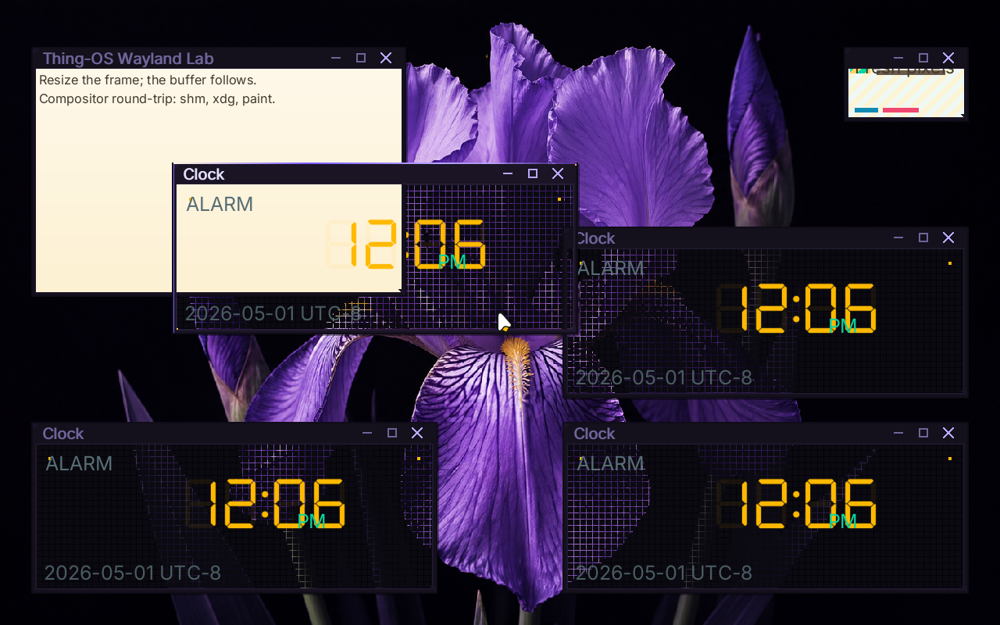

# ✅ Scenario: Alt+Tab cycles through multiple windows

> Last run: 2026-05-01 13:05:42

## Steps

| # | Step | Result | Duration | Before | After | Artifacts |
|---|------|--------|----------|--------|-------|-----------|
| 1 | Given the machine is booted | ✅ | 11260ms | <a href="./01/before.png"></a> | <a href="./01/after.png"></a> | [📜](./01/serial.log) |
| 2 | When I wait for the shell prompt | ✅ | 1145ms | <a href="./02/before.png"></a> | <a href="./02/after.png"></a> | [📜](./02/serial.log) [console_interactive.png](./02/console_interactive.png) |
| 3 | And I type "clock &" on the serial console | ✅ | 280ms | <a href="./03/before.png"></a> | <a href="./03/after.png"></a> | [📜](./03/serial.log) |
| 4 | And I wait for 2 seconds | ✅ | 2265ms | <a href="./04/before.png"></a> | <a href="./04/after.png"></a> | [📜](./04/serial.log) |
| 5 | And I type "clock &" on the serial console | ✅ | 601ms | <a href="./05/before.png"></a> | <a href="./05/after.png"></a> | [📜](./05/serial.log) |
| 6 | And I wait for 2 seconds | ✅ | 1505ms | <a href="./06/before.png"></a> | <a href="./06/after.png"></a> | [📜](./06/serial.log) |
| 7 | And I type "clock &" on the serial console | ✅ | 654ms | <a href="./07/before.png"></a> | <a href="./07/after.png"></a> | [📜](./07/serial.log) |
| 8 | And I wait for 5 seconds | ✅ | 4521ms | <a href="./08/before.png"></a> | <a href="./08/after.png"></a> | [📜](./08/serial.log) |
| 9 | Then the serial output should contain "First frame rendered" within 60s | ✅ | 470ms | <a href="./09/before.png"></a> | <a href="./09/after.png"></a> | [📜](./09/serial.log) |
| 10 | And the serial output should contain "bloom: registered bristle pointer sink" within 60s | ✅ | 5559ms | <a href="./10/before.png"></a> | - |  |
| 11 | When I press alt+tab | ✅ | 722ms | - | <a href="./11/after.png"></a> | [📜](./11/serial.log) |
| 12 | Then the latest output should contain "bloom: focus cycled from None" within 10s | ✅ | 5558ms | <a href="./12/before.png"></a> | - |  |
| 13 | When I press alt+tab | ✅ | 766ms | - | <a href="./13/after.png"></a> | [📜](./13/serial.log) |
| 14 | Then the latest output should contain "bloom: focus cycled from Some" within 10s | ✅ | 5559ms | <a href="./14/before.png"></a> | - |  |
| 15 | When I press shift+alt+tab | ✅ | 1799ms | - | <a href="./15/after.png"></a> | [📜](./15/serial.log) |
| 16 | Then the latest output should contain "bloom: focus cycled from Some" within 10s | ✅ | 502ms | <a href="./16/before.png"></a> | <a href="./16/after.png"></a> | [📜](./16/serial.log) |
| 17 | And the output contains "forward=false" | ✅ | 491ms | <a href="./17/before.png"></a> | <a href="./17/after.png"></a> |  |

<details>
<summary>📜 Full Serial Log</summary>

```
[=3h00BdsDxe: loading Boot0002 "UEFI QEMU DVD-ROM QM00005 " from PciRoot(0x0)/Pci(0x1F,0x2)/Sata(0x2,0xFFFF,0x0)
BdsDxe: starting Boot0002 "UEFI QEMU DVD-ROM QM00005 " from PciRoot(0x0)/Pci(0x1F,0x2)/Sata(0x2,0xFFFF,0x0)
[34360946499] [INFO ] [kernel::boot_progress] [CPU0] boot_progress: milestone="Framebuffer Initialized"
[34610380365] [INFO ] [kernel::boot_progress] [CPU0] boot_progress: milestone="Memory Map OK"
[34630030776] [INFO ] [kernel] [CPU0] Initializing global allocator...
[34660188090] [INFO ] [kernel::boot_progress] [CPU0] boot_progress: milestone="Global Allocator"
[34692355302] [INFO ] [kernel::boot_progress] [CPU0] boot_progress: milestone="Display Registry"
[34711528269] [INFO ] [kernel] [CPU0] Initializing SIMD...
[34713259515] [INFO ] [kernel::boot_progress] [CPU0] boot_progress: milestone="SIMD Ready"
[34750635810] [WARN ] [kernel::entropy] [CPU0] ENTROPY: no hardware RNG available, using timer fallback (weak entropy)
[34752265119] [INFO ] [kernel::boot_progress] [CPU0] boot_progress: milestone="SIMD Ready"
[34772476860] [INFO ] [kernel] [CPU0] Initializing tasking...
[34788104604] [INFO ] [kernel::sched] [CPU0] SCHED: 1 per-CPU scheduler(s) allocated
[34788724608] [INFO ] [kernel::sched] [CPU0] SCHED: per-CPU preemption initialized (1 independent preemption domains, no global preemption lock)
[34823045037] [INFO ] [kernel::sched] [CPU0] Scheduler initialized
[34824021309] [INFO ] [kernel::boot_progress] [CPU0] boot_progress: milestone="Tasking Initialized"
[34912527144] [INFO ] [kernel::boot_progress] [CPU0] boot_progress: milestone="VFS Root Ready"
[34997604213] [INFO ] [kernel::boot_progress] [CPU0] boot_progress: milestone="PCI Bus Scanned"
[35019220599] [INFO ] [kernel::boot_progress] [CPU0] boot_progress: milestone="Legacy Devices"
[35093573493] [INFO ] [kernel::boot_progress] [CPU0] boot_progress: milestone="BSP Timer OK"
[35193400077] [INFO ] [kernel::boot_progress] [CPU0] boot_progress: milestone="SMP Bring-up"
[35219546439] [INFO ] [kernel::boot_progress] [CPU0] boot_progress: milestone="Boot Info OK"
[35241554799] [INFO ] [kernel::boot_progress] [CPU0] boot_progress: milestone="Modules Scanned"
[35338027824] [INFO ] [kernel::boot_progress] [CPU0] boot_progress: hint="Press F12 for a terminal"
[35385366126] [INFO ] [kernel::boot_progress] [CPU0] boot_progress: milestone="Spawning Sprout"
[35514549774] [INFO ] [kernel::boot_progress] [CPU0] boot_progress: milestone="Entering Scheduler"
[35762016378] [INFO ] [kernel] [CPU0] [kernel:start] scheduler-entry total elapsed_ticks=917203914 elapsed_us=458601
[35762816133] [INFO ] [kernel] [CPU0] Entering scheduler loop.
[35836600503] [INFO ] [sprout] [CPU0] SPROUT: ENTERING MAIN (arg0=6291456)
[35839893210] [INFO ] [sprout] [CPU0] SPROUT: v0.4.1 [REBUILT] starting (Supervisor Mode)...
[35876400153] [INFO ] [sprout::supervisor] [CPU0] SPROUT: Initializing Supervisor...
[35914173933] [INFO ] [sprout::supervisor] [CPU0] SPROUT: Supervisor session started (FULL PIPELINE MODE)
[35922646617] [INFO ] [sprout::supervisor] [CPU0] SPROUT: Launching serial shell...
[35924127492] [INFO ] [sprout::pipelines] [CPU0] SPROUT: Setting up serial shell on /dev/console...
[36016143075] [INFO ] [sprout::pipelines] [CPU0] SPROUT: Spawned serial shell '/bin/sh' (PID=6)
[36019396149] [INFO ] [sprout::supervisor] [CPU0] SPROUT: Serial shell launched; yielding 50ms so the prompt can take the foreground
[36026966712] [INFO ] [sh] [CPU3] SH: starting v0.1.0-debug

        .-.
       /   \        THING-OS
      |     |       "People, places, things."
       \   /        
        `-'        
       /   \        v0.1  ��  
      |     |       2026-04-16
       \   /
        `-'

--------------------------------------------------------------
 sprout has taken root. the system is awake.

  try:
    ls /bin       browse available shoots
    ps            observe living processes
    cat /version  inspect the genome

--------------------------------------------------------------
THING-OS [BOOT] / > [?25h[36181030083] [INFO ] [sprout::supervisor] [CPU0] SPROUT: Continuing supervisor startup
[36182779842] [INFO ] [sprout::supervisor] [CPU0] SPROUT: Spawning cambium for driver discovery...
[36217094001] [INFO ] [sprout::pipelines] [CPU0] SPROUT: Skipping early /hosts mount; mesocarp is disabled in init
[36220264971] [INFO ] [sprout::supervisor] [CPU0] SPROUT: Starting full pipeline (graphics + input)
[36221879595] [INFO ] [sprout::supervisor] [CPU0] SPROUT: Entering supervisor service loop (tick=100ms)
[36223818081] [INFO ] [cambium] [CPU1] CAMBIUM: main started
[36249081693] [INFO ] [cambium] [CPU1] CAMBIUM: starting device discovery manager (daemon mode)
[36287875437] [INFO ] [sprout::pipelines] [CPU0] SPROUT: Spawned bristle (PID=8)
[36292000107] [INFO ] [sprout::supervisor] [CPU0] SPROUT: Starting display pipeline setup
[36293496657] [INFO ] [sprout::pipelines] [CPU0] SPROUT: Probing /dev/fb0 for boot framebuffer metadata
[36300715209] [INFO ] [sprout::pipelines] [CPU0] SPROUT: /dev/fb0 ready width=1920 height=1080 stride=7680 format=2
[36304097874] [INFO ] [sprout::pipelines] [CPU0] SPROUT: Selected display driver '/drivers/display_virtio_gpu'
[36306632373] [INFO ] [sprout::pipelines] [CPU0] SPROUT: Creating display request port
[36317171913] [INFO ] [sprout::pipelines] [CPU0] SPROUT: Creating display response port
[36319708425] [INFO ] [sprout::pipelines] [CPU0] SPROUT: Creating display bootstrap memfd
[36322553025] [INFO ] [bristle] [CPU2] bristle: published pid 8 to /run/bristle/pid
[36325335090] [INFO ] [sprout::pipelines] [CPU0] SPROUT: Mapping display bootstrap memfd
[36331296177] [INFO ] [sprout::pipelines] [CPU0] SPROUT: Launching display driver '/drivers/display_virtio_gpu' (boot_fd=3, bind_id=322371585)
[36342572310] [INFO ] [bristle] [CPU2] bristle: published device handles kbd_in=1 mouse_in=3
[36353234115] [INFO ] [bristle] [CPU2] bristle: online (kbd_tok=Some(WaitToken(2)), mouse_tok=Some(WaitToken(3)))
[36390983211] [INFO ] [sprout::supervisor] [CPU0] SPROUT: Display pipeline initialized (backend=virtio_gpu)
[36399050259] [INFO ] [display_virtio_gpu] [CPU3] display_virtio_gpu: starting v0.4.1 (boot_arg=3)
[36487971300] [INFO ] [virtio_gpu] [CPU3] virtio_gpu: caps from sysfs - common BAR2 off=0x1000, notify BAR2 off=0x3000 mult=4
[36498633666] [INFO ] [virtio_gpu] [CPU3] virtio_gpu: device features=0x30000002 virgl=false
[36508866273] [INFO ] [virtio_gpu] [CPU3] virtio_gpu: cursor queue (queue 1) configured
[36509926101] [INFO ] [display_virtio_gpu] [CPU3] display_virtio_gpu: GPU initialized successfully
[36510613656] [INFO ] [display_virtio_gpu] [CPU3] display_virtio_gpu: composition paths: gpu_opaque_copy=enabled cpu_alpha_blend=enabled
[36519381987] [INFO ] [display_virtio_gpu] [CPU3] display_virtio_gpu: host scanout 1280x800 enabled=true (bootfb was 1920x1080)
[36549298467] [INFO ] [cambium::catalog] [CPU1] DEVD CATALOG: registered driver '/drivers/ahci_disk' name='ahci_disk' class=Block kind='dev.storage.Ahci' start='thingos_driver_start_safe'
[36713514321] [INFO ] [cambium::catalog] [CPU1] DEVD CATALOG: registered driver '/drivers/ata_disk' name='ata_disk' class=Block kind='dev.storage.Ide' start='thingos_driver_start_safe'
[36783435051] [INFO ] [display_virtio_gpu] [CPU3] display_virtio_gpu: cursor DMA buffer ready (16 pages at phys=0x2723000)
[36848403240] [INFO ] [sprout::supervisor] [CPU0] SPROUT: Mounted /dev/display/card0 successfully
[36857632119] [INFO ] [display_virtio_gpu] [CPU3] display_virtio_gpu: Sovereign registration COMPLETE. Assigned: /dev/display/card0
[36863351349] [INFO ] [display_virtio_gpu] [CPU3] display_virtio_gpu: VFS provider loop online
[36868532316] [INFO ] [sprout::supervisor] [CPU0] SPROUT: Display service is ready at /dev/display/card0
[36883161876] [INFO ] [cambium::catalog] [CPU1] DEVD CATALOG: registered driver '/drivers/chime' name='chime' class=Audio kind='dev.sound.Chime' start='thingos_driver_start_safe'
[37051521441] [INFO ] [cambium::catalog] [CPU1] DEVD CATALOG: registered driver '/drivers/display_bootfb' name='display_bootfb' class=Display kind='dev.display.Gpu' start='thingos_driver_start_safe'
[37230399459] [INFO ] [cambium::catalog] [CPU1] DEVD CATALOG: registered driver '/drivers/display_virtio_gpu' name='display_virtio_gpu' class=Display kind='dev.display.Gpu' start='thingos_driver_start_safe'
[37284395247] [INFO ] [sprout::supervisor] [CPU0] SPROUT: Spawned bloom (PID=10)
[37433051997] [INFO ] [bloom] [CPU1] bloom: ENTERING MAIN
[37434186174] [INFO ] [bloom] [CPU1] bloom: compositor service starting
[37448901303] [INFO ] [cambium::catalog] [CPU1] DEVD CATALOG: registered driver '/drivers/hdaudio' name='hdaudio' class=Audio kind='dev.sound.Hda' start='thingos_driver_start_safe'
[37679615457] [INFO ] [bloom] [CPU1] bloom: connected to /dev/display/card0 on try 0
[37697912406] [INFO ] [bloom] [CPU1] bloom: output0 1280x800 @ 60000mHz
[37698841653] [INFO ] [bloom] [CPU1] bloom: display driver does not support VBLANK
[37699491258] [INFO ] [bloom] [CPU1] bloom: display driver supports linear dmabuf import
[37700174985] [INFO ] [bloom] [CPU1] bloom: display driver supports GPU blit (hardware transfer/flush)
[37701279660] [INFO ] [bloom] [CPU1] bloom: display driver supports direct scanout (zero-copy path to display)
[37702156404] [INFO ] [bloom] [CPU1] bloom: display driver supports partial flush (damage regions)
[37702990479] [INFO ] [bloom] [CPU1] bloom: display driver supports resource cache (pre-allocated buffer pool)
[37703706183] [INFO ] [bloom] [CPU1] bloom: creating service port...
[38007318294] [INFO ] [bloom::render] [CPU1] bloom: pistil background renderer loaded from /lib/libpistil.so
[38008422738] [INFO ] [bloom::render] [CPU1] bloom: pistil font text renderer loaded with default /share/fonts/Inter-Regular.ttf
[38009314398] [INFO ] [bloom::render] [CPU1] bloom: pistil symbol renderer loaded with /share/fonts/NotoSansSymbol2-Regular.ttf
[38016787446] [INFO ] [bloom] [CPU1] bloom: initial theme configured Facet Frame
ec[38236492437] [INFO ] [cambium::catalog] [CPU1] DEVD CATALOG: registered driver '/drivers/hwrng' name='hwrng' class=Other kind='dev.rng.HwRng' start='_RNvCs7wlZbVUrQWf_5hwrng20thingos_driver_start'
ho BD[38391826242] [INFO ] [cambium::catalog] [CPU1] DEVD CATALOG: registered driver '/drivers/pci_stubd' name='pci_stubd' class=Other kind='drv.PciStubd' start='thingos_driver_start_safe'
D_CO[38553725430] [INFO ] [cambium::catalog] [CPU1] DEVD CATALOG: registered driver '/drivers/ps2_kbd' name='ps2_kbd' class=Input kind='drv.Ps2Keyboard' start='thingos_driver_start_safe'
NSOLE_[38751670584] [INFO ] [cambium::catalog] [CPU1] DEVD CATALOG: registered driver '/drivers/ps2_mouse' name='ps2_mouse' class=Input kind='drv.Ps2Mouse' start='thingos_driver_start_safe'
RE[38844870207] [INFO ] [bloom] [CPU1] bloom: initial wallpaper configured /share/wallpapers/flower.png
ADY[38963227281] [INFO ] [cambium::catalog] [CPU1] DEVD CATALOG: registered driver '/drivers/rtc_cmos' name='rtc_cmos' class=Other kind='dev.rtc.Cmos' start='thingos_driver_start_safe'
_303182[39242589111] [INFO ] [cambium::catalog] [CPU1] DEVD CATALOG: registered driver '/drivers/rtl8168d' name='rtl8168d' class=Net kind='dev.net.Nic' start='thingos_driver_start_safe'
5_177[39410260494] [INFO ] [bloom::render] [CPU1] bloom: cursor ready buffer=2 size=48x48 hotspot=11,6
[39420167523] [INFO ] [bloom] [CPU1] bloom: watching wallpaper config /session/desktop/wallpaper
[39422196132] [INFO ] [bloom] [CPU1] bloom: watching theme config /session/desktop/theme
[39468176088] [INFO ] [bloom] [CPU1] bloom: Wayland server thread spawned
76[39469969176] [INFO ] [bloom::loop_types] [CPU1] bloom: service loop started
[39470959539] [INFO ] [bloom::loop_types] [CPU1] bloom: output0 1280x800 @ 60000mHz ready
[39472629867] [INFO ] [bloom::wayland] [CPU2] wayland-server: starting
[39489774291] [INFO ] [cambium::catalog] [CPU1] DEVD CATALOG: registered driver '/drivers/virtio_netd' name='virtio_netd' class=Net kind='dev.net.Nic' start='thingos_driver_start_safe'
[39492238104] [INFO ] [bloom::wayland] [CPU2] wayland-server: listening on /run/wayland-0
[39493089735] [INFO ] [bloom::wayland] [CPU2] wayland-server: advertising globals wl_compositor wl_shm xdg_wm_base wl_seat wl_output wl_subcompositor wl_data_device_manager zwp_linux_dmabuf_v1
6595[39631272846] [INFO ] [sprout::supervisor] [CPU0] SPROUT: Spawned wayland_hello (PID=12)
[39643207956] [INFO ] [wayland_hello] [CPU3] wayland_hello: connected to /run/wayland-0
[39650605302] [INFO ] [cambium::catalog] [CPU1] DEVD CATALOG: registered driver '/drivers/virtio_sound' name='virtio_sound' class=Audio kind='dev.sound.Virtio' start='thingos_driver_start_safe'
[39665684256] [INFO ] [sprout::supervisor] [CPU0] SPROUT: Spawned clock (PID=13)
[39748131291] [INFO ] [clock] [CPU1] clock: running at low scheduler priority tid=13
[39751555206] [INFO ] [clock] [CPU1] clock: connected to /run/wayland-0
417318253[39959113326] [INFO ] [wayland_hello] [CPU3] wayland_hello: pistil text renderer loaded with default /share/fonts/Inter-Regular.ttf
[40016099409] [INFO ] [wayland_hello] [CPU3] wayland_hello: using zwp_linux_dmabuf_v1 buffers
[40017622194] [INFO ] [wayland_hello] [CPU3] wayland_hello: bound wp_presentation
[40022794086] [INFO ] [wayland_hello] [CPU3] wayland_hello: wl_region smoke test: create+add+set_opaque+destroy
2
[?25l[40091594862] [INFO ] [cambium::catalog] [CPU1] DEVD CATALOG: registered driver '/drivers/xhci' name='xhci' class=Block kind='dev.usb.Xhci' start='thingos_driver_start_safe'
[40093322379] [INFO ] [cambium::catalog] [CPU1] DEVD CATALOG: 15 driver(s) found
BDD_CONSOLE_READY_3031825_1777665954173182532
[40164747843] [INFO ] [clock] [CPU1] clock: pistil DSEG7 text renderer loaded with /share/fonts/DSEG7Classic-Regular.ttf
[40166026824] [INFO ] [clock] [CPU1] clock: pistil generic text renderer loaded with /share/fonts/Inter-Regular.ttf
[40177993086] [INFO ] [display_virtio_gpu] [CPU3] display_virtio_gpu: first commit copied buffer=1 rect=1280x800 src_px=0xff0b0a10 dst_px=0xff0b0a10 damage=1280x800+0,0 res_id=1 gpu_planes=0 cpu_planes=2
[40179528147] [INFO ] [display_virtio_gpu] [CPU3] display_virtio_gpu: cursor plane blended buffer=2 at 638,399 src_px=0x10202020 dst_before=0xff0b0a10 dst_after=0xff0c0b11
[40188217146] [INFO ] [bloom::loop_types] [CPU1] First frame rendered
[?25hTHING-OS [OK] / > [?25h[40255120158] [INFO ] [rtc_cmos] [CPU1] RTC: claimed /sys/devices/isa-0070 (handle=1)
[40257433623] [INFO ] [ahci_disk] [CPU3] AHCI: Starting AHCI VFS driver
[40280243454] [INFO ] [rtc_cmos] [CPU1] RTC: 2026-05-01 20:05:53 = 1777665953 unix_secs
[40281547482] [INFO ] [kernel::time] [CPU1] System clock anchored: unix_secs=1777665953, mono_ns=20140619911, offset=1777665932859380089ns
[40281637407] [INFO ] [ahci_disk] [CPU3] AHCI: Claimed device /sys/devices/pci-0000:00:1f.2
[40282494318] [INFO ] [rtc_cmos] [CPU1] RTC: System clock anchored to 1777665953 unix_secs
[40297374843] [INFO ] [ahci_disk] [CPU3] AHCI: Mounted atapi2 at /dev/storage/atapi2
[40298268384] [INFO ] [ahci_disk] [CPU3] AHCI: Provider loop online at /dev/storage/atapi2
[40308365790] [INFO ] [bloom::services::wayland_cmd] [CPU1] bloom: registered titlebar drag zone surface=1 height=28 frame=6
[40308884517] [INFO ] [kernel::time] [CPU0] System clock tick: utc=2026-05-01 20:05:53.012520497 unix_secs=1777665953.012520497
[40317931335] [INFO ] [bloom::services::input_service] [CPU1] bloom: registered bristle pointer sink
[40329345837] [INFO ] [bristle] [CPU2] bristle: bloom sink registered (handle=5 mask=0x03)
[40339220031] [INFO ] [bloom::wayland::dispatch] [CPU2] wayland-server: xdg_toplevel obj=12 assigned to xdg_surface=11
[40421806194] [INFO ] [bloom::wayland::dispatch] [CPU2] wayland-server: imported dmabuf wl_buffer=111 480x320 format=0x34325241
[40429470906] [INFO ] [ps2_kbd] [CPU2] ps2_kbd: bristle pid=8
[40518631230] [INFO ] [ps2_mouse] [CPU3] ps2_mouse: bristle pid=8
c[41341156824] [INFO ] [bloom::services::wayland_cmd] [CPU1] bloom: registered titlebar drag zone surface=2 height=28 frame=6
[41353074774] [INFO ] [bloom::wayland::dispatch] [CPU2] wayland-server: xdg_toplevel obj=12 assigned to xdg_surface=11
[41357138922] [INFO ] [bloom::services::wallpaper] [CPU1] bloom: preparing background /share/wallpapers/flower.png
[41531553921] [INFO ] [ps2_kbd] [CPU2] ps2_kbd: read scancode 0x47
[41534146467] [INFO ] [ps2_kbd] [CPU2] ps2_kbd: edge detected: Down { key: Unknown, mods: Mods(0), repeat: false }
[41537042316] [INFO ] [ps2_kbd] [CPU2] ps2_kbd: sent Unknown to bristle (pid=8)
[41542069569] [INFO ] [bristle] [CPU2] bristle: KeyDown received: Unknown
lock &
[2] 19
THING-OS [OK] / > [?25h[42230576619] [INFO ] [clock] [CPU1] clock: running at low scheduler priority tid=19
[42235818504] [INFO ] [clock] [CPU1] clock: connected to /run/wayland-0
[43448924706] [INFO ] [clock] [CPU1] clock: pistil DSEG7 text renderer loaded with /share/fonts/DSEG7Classic-Regular.ttf
[43450469898] [INFO ] [clock] [CPU1] clock: pistil generic text renderer loaded with /share/fonts/Inter-Regular.ttf
[45860222463] [INFO ] [bloom::input] [CPU1] bloom: KeyDown received: Unknown (raw=0xffff, mods=Mods(0), repeat=false)
[45908887299] [INFO ] [bloom::services::wayland_cmd] [CPU1] bloom: registered titlebar drag zone surface=3 height=28 frame=6
[45918136737] [INFO ] [bloom::wayland::dispatch] [CPU2] wayland-server: xdg_popup obj=23 assigned to xdg_surface=21
[45950690511] [INFO ] [bloom::wayland::dispatch] [CPU2] wayland-server: imported dmabuf wl_buffer=121 160x96 format=0x34325241
[46321252098] [INFO ] [kernel::time] [CPU0] System clock tick: utc=2026-05-01 20:05:56.019882338 unix_secs=1777665956.019882338
[46532971122] [INFO ] [bloom::render] [CPU1] bloom: flat window overlays ready size=1280x800
[48220396125] [INFO ] [bloom::services::wayland_cmd] [CPU1] bloom: registered titlebar drag zone surface=4 height=28 frame=6
[48227560887] [INFO ] [bloom::wayland::dispatch] [CPU2] wayland-server: xdg_toplevel obj=12 assigned to xdg_surface=11
[48240420954] [INFO ] [wayland_hello] [CPU3] wayland_hello: frame callback done object=1000 data=24067
[48242265489] [INFO ] [wayland_hello] [CPU3] wayland_hello: wp_presentation_feedback.presented object=1001 tv=24.117199557 refresh_ns=16666666 seq=0
[48513168462] [INFO ] [wayland_hello] [CPU3] wayland_hello: frame callback done object=1002 data=24250
[48514304718] [INFO ] [wayland_hello] [CPU3] wayland_hello: wp_presentation_feedback.presented object=1003 tv=24.254512276 refresh_ns=16666666 seq=1
cl[52338006237] [INFO ] [kernel::time] [CPU0] System clock tick: utc=2026-05-01 20:05:59.028346577 unix_secs=1777665959.028346577
ock &
[3] 20
THING-OS [OK] / > [?25h[52636683759] [INFO ] [clock] [CPU2] clock: running at low scheduler priority tid=20
[52640752428] [INFO ] [clock] [CPU2] clock: connected to /run/wayland-0
[52973573499] [INFO ] [clock] [CPU2] clock: pistil DSEG7 text renderer loaded with /share/fonts/DSEG7Classic-Regular.ttf
[52974738432] [INFO ] [clock] [CPU2] clock: pistil generic text renderer loaded with /share/fonts/Inter-Regular.ttf
[53015814522] [INFO ] [bloom::services::wayland_cmd] [CPU1] bloom: registered titlebar drag zone surface=5 height=28 frame=6
[53022389508] [INFO ] [bloom::wayland::dispatch] [CPU2] wayland-server: xdg_toplevel obj=12 assigned to xdg_surface=11
[58350266898] [INFO ] [kernel::time] [CPU0] System clock tick: utc=2026-05-01 20:06:02.034479581 unix_secs=1777665962.034479581
clock &
[4] 21
THING-OS [OK] / > [?25h[62870211096] [INFO ] [clock] [CPU3] clock: running at low scheduler priority tid=21
[62874639795] [INFO ] [clock] [CPU3] clock: connected to /run/wayland-0
[63181668693] [INFO ] [clock] [CPU3] clock: pistil DSEG7 text renderer loaded with /share/fonts/DSEG7Classic-Regular.ttf
[63182775117] [INFO ] [clock] [CPU3] clock: pistil generic text renderer loaded with /share/fonts/Inter-Regular.ttf
[63267833871] [INFO ] [bloom::services::wayland_cmd] [CPU1] bloom: registered titlebar drag zone surface=6 height=28 frame=6
[63275720805] [INFO ] [bloom::wayland::dispatch] [CPU2] wayland-server: xdg_toplevel obj=12 assigned to xdg_surface=11
[64365055920] [INFO ] [kernel::time] [CPU0] System clock tick: utc=2026-05-01 20:06:05.041865660 unix_secs=1777665965.041865660
[70379688753] [INFO ] [kernel::time] [CPU0] System clock tick: utc=2026-05-01 20:06:08.049183446 unix_secs=1777665968.049183446
[73752530610] [INFO ] [ps2_mouse] [CPU3] ps2_mouse: sample rate set to 60 Hz
[74230454166] [INFO ] [clock] [CPU2] clock: tick local=2026-05-01 12:06:09 UTC-8 system_unix=1777665969.973553465
[74363718165] [INFO ] [clock] [CPU1] clock: tick local=2026-05-01 12:06:10 UTC-8 system_unix=1777665970.040536799
[74482194732] [INFO ] [clock] [CPU3] clock: tick local=2026-05-01 12:06:10 UTC-8 system_unix=1777665970.099744756
[74616668643] [INFO ] [clock] [CPU1] clock: tick local=2026-05-01 12:06:10 UTC-8 system_unix=1777665970.165685719
[76394587137] [INFO ] [kernel::time] [CPU0] System clock tick: utc=2026-05-01 20:06:11.056612591 unix_secs=1777665971.056612591
[82409251947] [INFO ] [kernel::time] [CPU0] System clock tick: utc=2026-05-01 20:06:14.063950556 unix_secs=1777665974.063950556
[88423947744] [INFO ] [kernel::time] [CPU0] System clock tick: utc=2026-05-01 20:06:17.071289875 unix_secs=1777665977.071289875
[94438455738] [INFO ] [kernel::time] [CPU0] System clock tick: utc=2026-05-01 20:06:20.078556610 unix_secs=1777665980.078556610
[100453264131] [INFO ] [kernel::time] [CPU0] System clock tick: utc=2026-05-01 20:06:23.085957193 unix_secs=1777665983.085957193
[106468036554] [INFO ] [kernel::time] [CPU0] System clock tick: utc=2026-05-01 20:06:26.093320700 unix_secs=1777665986.093320700
[112482637707] [INFO ] [kernel::time] [CPU0] System clock tick: utc=2026-05-01 20:06:29.100643403 unix_secs=1777665989.100643403
[118497172827] [INFO ] [kernel::time] [CPU0] System clock tick: utc=2026-05-01 20:06:32.107925450 unix_secs=1777665992.107925450
[124512021975] [INFO ] [kernel::time] [CPU0] System clock tick: utc=2026-05-01 20:06:35.115315638 unix_secs=1777665995.115315638
[130526575740] [INFO ] [kernel::time] [CPU0] System clock tick: utc=2026-05-01 20:06:38.122619812 unix_secs=1777665998.122619812
[136541354367] [INFO ] [kernel::time] [CPU0] System clock tick: utc=2026-05-01 20:06:41.130017111 unix_secs=1777666001.130017111
[142556098146] [INFO ] [kernel::time] [CPU0] System clock tick: utc=2026-05-01 20:06:44.137377913 unix_secs=1777666004.137377913
[148570799124] [INFO ] [kernel::time] [CPU0] System clock tick: utc=2026-05-01 20:06:47.144721340 unix_secs=1777666007.144721340
[148576236699] [INFO ] [clock] [CPU2] clock: tick local=2026-05-01 12:06:47 UTC-8 system_unix=1777666007.147271827
[148712075589] [INFO ] [clock] [CPU1] clock: tick local=2026-05-01 12:06:47 UTC-8 system_unix=1777666007.215195463
[148817292096] [INFO ] [clock] [CPU3] clock: tick local=2026-05-01 12:06:47 UTC-8 system_unix=1777666007.267800829
[148945270353] [INFO ] [clock] [CPU1] clock: tick local=2026-05-01 12:06:47 UTC-8 system_unix=1777666007.331700396
[154090856271] [INFO ] [ps2_kbd] [CPU2] ps2_kbd: read scancode 0x38
[154092160893] [INFO ] [ps2_kbd] [CPU2] ps2_kbd: edge detected: Down { key: LeftAlt, mods: Mods(4), repeat: false }
[154096080105] [INFO ] [ps2_kbd] [CPU2] ps2_kbd: sent LeftAlt to bristle (pid=8)
[154098624273] [INFO ] [ps2_kbd] [CPU2] ps2_kbd: read scancode 0x0f
[154099448778] [INFO ] [ps2_kbd] [CPU2] ps2_kbd: edge detected: Down { key: Tab, mods: Mods(4), repeat: false }
[154100758548] [INFO ] [ps2_kbd] [CPU2] ps2_kbd: sent Tab to bristle (pid=8)
[154106089137] [INFO ] [bristle] [CPU2] bristle: KeyDown received: LeftAlt
[154111869120] [INFO ] [bristle] [CPU2] bristle: KeyDown received: Tab
[154113520143] [INFO ] [bloom::input] [CPU1] bloom: KeyDown received: LeftAlt (raw=0x00e2, mods=Mods(4), repeat=false)
[154116772953] [INFO ] [bloom::input] [CPU1] bloom: KeyDown received: Tab (raw=0x002b, mods=Mods(4), repeat=false)
[154120334082] [INFO ] [bloom::input] [CPU1] bloom: focus cycled from None to Some(6) (forward=true)
[154266922326] [INFO ] [ps2_kbd] [CPU2] ps2_kbd: read scancode 0x8f
[154268483721] [INFO ] [ps2_kbd] [CPU2] ps2_kbd: edge detected: Up { key: Tab, mods: Mods(4) }
[154270365612] [INFO ] [ps2_kbd] [CPU2] ps2_kbd: sent Tab to bristle (pid=8)
[154272238098] [INFO ] [ps2_kbd] [CPU2] ps2_kbd: read scancode 0xb8
[154273148271] [INFO ] [ps2_kbd] [CPU2] ps2_kbd: edge detected: Up { key: LeftAlt, mods: Mods(0) }
[154275361746] [INFO ] [ps2_kbd] [CPU2] ps2_kbd: sent LeftAlt to bristle (pid=8)
[154585428360] [INFO ] [kernel::time] [CPU0] System clock tick: utc=2026-05-01 20:06:50.152039258 unix_secs=1777666010.152039258
[160600152768] [INFO ] [kernel::time] [CPU0] System clock tick: utc=2026-05-01 20:06:53.159396512 unix_secs=1777666013.159396512
[166615225854] [INFO ] [kernel::time] [CPU0] System clock tick: utc=2026-05-01 20:06:56.166893521 unix_secs=1777666016.166893521
[172629675207] [INFO ] [kernel::time] [CPU0] System clock tick: utc=2026-05-01 20:06:59.174142304 unix_secs=1777666019.174142304
[178646160231] [INFO ] [kernel::time] [CPU0] System clock tick: utc=2026-05-01 20:07:02.182366748 unix_secs=1777666022.182366748
[184659078021] [INFO ] [kernel::time] [CPU0] System clock tick: utc=2026-05-01 20:07:05.188860128 unix_secs=1777666025.188860128
[190673558460] [INFO ] [kernel::time] [CPU0] System clock tick: utc=2026-05-01 20:07:08.196096949 unix_secs=1777666028.196096949
[196688224755] [INFO ] [kernel::time] [CPU0] System clock tick: utc=2026-05-01 20:07:11.203419487 unix_secs=1777666031.203419487
[202702918572] [INFO ] [kernel::time] [CPU0] System clock tick: utc=2026-05-01 20:07:14.210778902 unix_secs=1777666034.210778902
[208717658556] [INFO ] [kernel::time] [CPU0] System clock tick: utc=2026-05-01 20:07:17.218161533 unix_secs=1777666037.218161533
[214732368576] [INFO ] [kernel::time] [CPU0] System clock tick: utc=2026-05-01 20:07:20.225479666 unix_secs=1777666040.225479666
[220746915576] [INFO ] [kernel::time] [CPU0] System clock tick: utc=2026-05-01 20:07:23.232776233 unix_secs=1777666043.232776233
[222991266465] [INFO ] [clock] [CPU2] clock: tick local=2026-05-01 12:07:24 UTC-8 system_unix=1777666044.354765541
[223293370707] [INFO ] [clock] [CPU1] clock: tick local=2026-05-01 12:07:24 UTC-8 system_unix=1777666044.505675316
[223360298304] [INFO ] [clock] [CPU1] clock: tick local=2026-05-01 12:07:24 UTC-8 system_unix=1777666044.539126806
[223467035154] [INFO ] [clock] [CPU3] clock: tick local=2026-05-01 12:07:24 UTC-8 system_unix=1777666044.592665923
[226208022117] [INFO ] [ps2_kbd] [CPU2] ps2_kbd: read scancode 0x38
[226209136791] [INFO ] [ps2_kbd] [CPU2] ps2_kbd: edge detected: Down { key: LeftAlt, mods: Mods(4), repeat: false }
[226211038548] [INFO ] [ps2_kbd] [CPU2] ps2_kbd: sent LeftAlt to bristle (pid=8)
[226212899286] [INFO ] [ps2_kbd] [CPU2] ps2_kbd: read scancode 0x0f
[226213642116] [INFO ] [ps2_kbd] [CPU2] ps2_kbd: edge detected: Down { key: Tab, mods: Mods(4), repeat: false }
[226214810712] [INFO ] [ps2_kbd] [CPU2] ps2_kbd: sent Tab to bristle (pid=8)
[226220121600] [INFO ] [bristle] [CPU2] bristle: KeyDown received: LeftAlt
[226224778956] [INFO ] [bristle] [CPU2] bristle: KeyDown received: Tab
[226225144068] [INFO ] [bloom::input] [CPU1] bloom: KeyDown received: LeftAlt (raw=0x00e2, mods=Mods(4), repeat=false)
[226254190734] [INFO ] [bloom::input] [CPU1] bloom: KeyDown received: Tab (raw=0x002b, mods=Mods(4), repeat=false)
[226255701969] [INFO ] [bloom::input] [CPU1] bloom: focus cycled from Some(6) to Some(5) (forward=true)
[226383893835] [INFO ] [ps2_kbd] [CPU2] ps2_kbd: read scancode 0x8f
[226385303496] [INFO ] [ps2_kbd] [CPU2] ps2_kbd: edge detected: Up { key: Tab, mods: Mods(4) }
[226388099421] [INFO ] [ps2_kbd] [CPU2] ps2_kbd: sent Tab to bristle (pid=8)
[226390847925] [INFO ] [ps2_kbd] [CPU2] ps2_kbd: read scancode 0xb8
[226391957814] [INFO ] [ps2_kbd] [CPU2] ps2_kbd: edge detected: Up { key: LeftAlt, mods: Mods(0) }
[226393698300] [INFO ] [ps2_kbd] [CPU2] ps2_kbd: sent LeftAlt to bristle (pid=8)
[226761525738] [INFO ] [kernel::time] [CPU0] System clock tick: utc=2026-05-01 20:07:26.240090834 unix_secs=1777666046.240090834
[232776766728] [INFO ] [kernel::time] [CPU0] System clock tick: utc=2026-05-01 20:07:29.247716477 unix_secs=1777666049.247716477
[238790893638] [INFO ] [kernel::time] [CPU0] System clock tick: utc=2026-05-01 20:07:32.254787572 unix_secs=1777666052.254787572
[244805586993] [INFO ] [kernel::time] [CPU0] System clock tick: utc=2026-05-01 20:07:35.262121792 unix_secs=1777666055.262121792
[250820263914] [INFO ] [kernel::time] [CPU0] System clock tick: utc=2026-05-01 20:07:38.269463882 unix_secs=1777666058.269463882
[256834929582] [INFO ] [kernel::time] [CPU0] System clock tick: utc=2026-05-01 20:07:41.276800528 unix_secs=1777666061.276800528
[262849735401] [INFO ] [kernel::time] [CPU0] System clock tick: utc=2026-05-01 20:07:44.284184974 unix_secs=1777666064.284184974
[268864529373] [INFO ] [kernel::time] [CPU0] System clock tick: utc=2026-05-01 20:07:47.291550313 unix_secs=1777666067.291550313
[274879057200] [INFO ] [kernel::time] [CPU0] System clock tick: utc=2026-05-01 20:07:50.298850477 unix_secs=1777666070.298850477
[280893846684] [INFO ] [kernel::time] [CPU0] System clock tick: utc=2026-05-01 20:07:53.306233801 unix_secs=1777666073.306233801
[286908576504] [INFO ] [kernel::time] [CPU0] System clock tick: utc=2026-05-01 20:07:56.313595840 unix_secs=1777666076.313595840
[292923098787] [INFO ] [kernel::time] [CPU0] System clock tick: utc=2026-05-01 20:07:59.320859852 unix_secs=1777666079.320859852
[297380856729] [INFO ] [clock] [CPU2] clock: tick local=2026-05-01 12:08:01 UTC-8 system_unix=1777666081.549579813
[297642786903] [INFO ] [clock] [CPU1] clock: tick local=2026-05-01 12:08:01 UTC-8 system_unix=1777666081.680502379
[297743877486] [INFO ] [clock] [CPU1] clock: tick local=2026-05-01 12:08:01 UTC-8 system_unix=1777666081.730918674
[297982072839] [INFO ] [clock] [CPU3] clock: tick local=2026-05-01 12:08:01 UTC-8 system_unix=1777666081.850184370
[298618583472] [INFO ] [ps2_kbd] [CPU2] ps2_kbd: read scancode 0x2a
[298619670921] [INFO ] [ps2_kbd] [CPU2] ps2_kbd: edge detected: Down { key: LeftShift, mods: Mods(1), repeat: false }
[298621356132] [INFO ] [ps2_kbd] [CPU2] ps2_kbd: sent LeftShift to bristle (pid=8)
[298625269734] [INFO ] [bristle] [CPU2] bristle: KeyDown received: LeftShift
[298632022194] [INFO ] [bloom::input] [CPU1] bloom: KeyDown received: LeftShift (raw=0x00e1, mods=Mods(1), repeat=false)
[298937814780] [INFO ] [kernel::time] [CPU0] System clock tick: utc=2026-05-01 20:08:02.328224465 unix_secs=1777666082.328224465
[302004126930] [INFO ] [ps2_kbd] [CPU2] ps2_kbd: read scancode 0x38
[302005159665] [INFO ] [ps2_kbd] [CPU2] ps2_kbd: edge detected: Down { key: LeftAlt, mods: Mods(5), repeat: false }
[302007009150] [INFO ] [ps2_kbd] [CPU2] ps2_kbd: sent LeftAlt to bristle (pid=8)
[302008878897] [INFO ] [ps2_kbd] [CPU2] ps2_kbd: read scancode 0x0f
[302009666805] [INFO ] [ps2_kbd] [CPU2] ps2_kbd: edge detected: Down { key: Tab, mods: Mods(5), repeat: false }
[302010814809] [INFO ] [ps2_kbd] [CPU2] ps2_kbd: sent Tab to bristle (pid=8)
[302018805561] [INFO ] [bristle] [CPU2] bristle: KeyDown received: LeftAlt
[302025473079] [INFO ] [bristle] [CPU2] bristle: KeyDown received: Tab
[302025404505] [INFO ] [bloom::input] [CPU1] bloom: KeyDown received: LeftAlt (raw=0x00e2, mods=Mods(5), repeat=false)
[302063907981] [INFO ] [bloom::input] [CPU1] bloom: KeyDown received: Tab (raw=0x002b, mods=Mods(5), repeat=false)
[302065221051] [INFO ] [bloom::input] [CPU1] bloom: focus cycled from Some(5) to Some(6) (forward=false)
[302183672505] [INFO ] [ps2_kbd] [CPU2] ps2_kbd: read scancode 0x8f
[302185106619] [INFO ] [ps2_kbd] [CPU2] ps2_kbd: edge detected: Up { key: Tab, mods: Mods(5) }
[302187718173] [INFO ] [ps2_kbd] [CPU2] ps2_kbd: sent Tab to bristle (pid=8)
[302196849438] [INFO ] [ps2_kbd] [CPU2] ps2_kbd: read scancode 0xb8
[302197876629] [INFO ] [ps2_kbd] [CPU2] ps2_kbd: edge detected: Up { key: LeftAlt, mods: Mods(1) }
[302200193856] [INFO ] [ps2_kbd] [CPU2] ps2_kbd: sent LeftAlt to bristle (pid=8)
[302202100629] [INFO ] [ps2_kbd] [CPU2] ps2_kbd: read scancode 0xaa
[302203215369] [INFO ] [ps2_kbd] [CPU2] ps2_kbd: edge detected: Up { key: LeftShift, mods: Mods(0) }
[302204271567] [INFO ] [ps2_kbd] [CPU2] ps2_kbd: sent LeftShift to bristle (pid=8)
[304952366631] [
```
</details>
