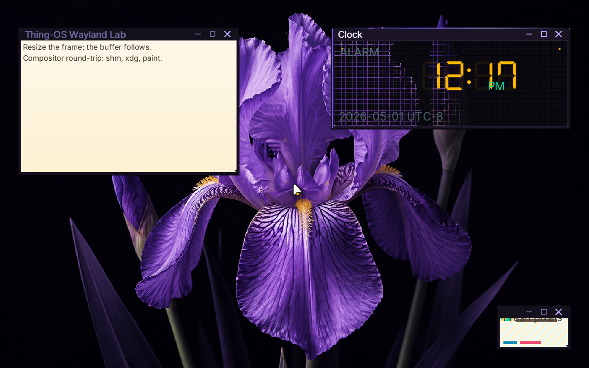

# ✅ Scenario: POSIX behavior - grep -v for inverted match

> Last run: 2026-05-01 13:12:24

## Steps

| # | Step | Result | Duration | Before | After | Artifacts |
|---|------|--------|----------|--------|-------|-----------|
| 1 | Given the machine is booted | ✅ | 11153ms | <a href="./01/before.png"></a> | <a href="./01/after.png"></a> | [📜](./01/serial.log) |
| 2 | When I wait for the shell prompt | ✅ | 1091ms | <a href="./02/before.png"></a> | <a href="./02/after.png"></a> | [📜](./02/serial.log) [console_interactive.png](./02/console_interactive.png) |
| 3 | And I type "echo -e 'a\nb\nc' | grep -v b" on the serial console | ✅ | 1100ms | <a href="./03/before.png"></a> | <a href="./03/after.png"></a> | [📜](./03/serial.log) |
| 4 | Then the command output should contain "a" | ✅ | 485ms | <a href="./04/before.png"></a> | <a href="./04/after.png"></a> | [📜](./04/serial.log) |
| 5 | And the command output should contain "c" | ✅ | 508ms | <a href="./05/before.png"></a> | <a href="./05/after.png"></a> |  |
| 6 | And the command output should not contain "b" | ✅ | 491ms | <a href="./06/before.png"></a> | <a href="./06/after.png"></a> | [📜](./06/serial.log) |

<details>
<summary>📜 Full Serial Log</summary>

```
[=3h00BdsDxe: loading Boot0002 "UEFI QEMU DVD-ROM QM00005 " from PciRoot(0x0)/Pci(0x1F,0x2)/Sata(0x2,0xFFFF,0x0)
BdsDxe: starting Boot0002 "UEFI QEMU DVD-ROM QM00005 " from PciRoot(0x0)/Pci(0x1F,0x2)/Sata(0x2,0xFFFF,0x0)
[33815348919] [INFO ] [kernel::boot_progress] [CPU0] boot_progress: milestone="Framebuffer Initialized"
[34081476363] [INFO ] [kernel::boot_progress] [CPU0] boot_progress: milestone="Memory Map OK"
[34103367408] [INFO ] [kernel] [CPU0] Initializing global allocator...
[34137185544] [INFO ] [kernel::boot_progress] [CPU0] boot_progress: milestone="Global Allocator"
[34174962888] [INFO ] [kernel::boot_progress] [CPU0] boot_progress: milestone="Display Registry"
[34199454696] [INFO ] [kernel] [CPU0] Initializing SIMD...
[34202919333] [INFO ] [kernel::boot_progress] [CPU0] boot_progress: milestone="SIMD Ready"
[34257792063] [WARN ] [kernel::entropy] [CPU0] ENTROPY: no hardware RNG available, using timer fallback (weak entropy)
[34260243732] [INFO ] [kernel::boot_progress] [CPU0] boot_progress: milestone="SIMD Ready"
[34281922752] [INFO ] [kernel] [CPU0] Initializing tasking...
[34298835120] [INFO ] [kernel::sched] [CPU0] SCHED: 1 per-CPU scheduler(s) allocated
[34299709620] [INFO ] [kernel::sched] [CPU0] SCHED: per-CPU preemption initialized (1 independent preemption domains, no global preemption lock)
[34343529363] [INFO ] [kernel::sched] [CPU0] Scheduler initialized
[34344725646] [INFO ] [kernel::boot_progress] [CPU0] boot_progress: milestone="Tasking Initialized"
[34439113170] [INFO ] [kernel::boot_progress] [CPU0] boot_progress: milestone="VFS Root Ready"
[34522312605] [INFO ] [kernel::boot_progress] [CPU0] boot_progress: milestone="PCI Bus Scanned"
[34544638557] [INFO ] [kernel::boot_progress] [CPU0] boot_progress: milestone="Legacy Devices"
[34618657029] [INFO ] [kernel::boot_progress] [CPU0] boot_progress: milestone="BSP Timer OK"
[34718389332] [INFO ] [kernel::boot_progress] [CPU0] boot_progress: milestone="SMP Bring-up"
[34745013501] [INFO ] [kernel::boot_progress] [CPU0] boot_progress: milestone="Boot Info OK"
[34768066839] [INFO ] [kernel::boot_progress] [CPU0] boot_progress: milestone="Modules Scanned"
[34866765516] [INFO ] [kernel::boot_progress] [CPU0] boot_progress: hint="Press F12 for a terminal"
[34919271420] [INFO ] [kernel::boot_progress] [CPU0] boot_progress: milestone="Spawning Sprout"
[35052170472] [INFO ] [kernel::boot_progress] [CPU0] boot_progress: milestone="Entering Scheduler"
[35296505343] [INFO ] [kernel] [CPU0] [kernel:start] scheduler-entry total elapsed_ticks=929987058 elapsed_us=464993
[35297461122] [INFO ] [kernel] [CPU0] Entering scheduler loop.
[35405217276] [INFO ] [sprout] [CPU0] SPROUT: ENTERING MAIN (arg0=6291456)
[35409605088] [INFO ] [sprout] [CPU0] SPROUT: v0.4.1 [REBUILT] starting (Supervisor Mode)...
[35454292731] [INFO ] [sprout::supervisor] [CPU0] SPROUT: Initializing Supervisor...
[35494034235] [INFO ] [sprout::supervisor] [CPU0] SPROUT: Supervisor session started (FULL PIPELINE MODE)
[35502987366] [INFO ] [sprout::supervisor] [CPU0] SPROUT: Launching serial shell...
[35504438079] [INFO ] [sprout::pipelines] [CPU0] SPROUT: Setting up serial shell on /dev/console...
[35595158610] [INFO ] [sprout::pipelines] [CPU0] SPROUT: Spawned serial shell '/bin/sh' (PID=6)
[35598565167] [INFO ] [sprout::supervisor] [CPU0] SPROUT: Serial shell launched; yielding 50ms so the prompt can take the foreground
[35604772764] [INFO ] [sh] [CPU3] SH: starting v0.1.0-debug

        .-.
       /   \        THING-OS
      |     |       "People, places, things."
       \   /        
        `-'        
       /   \        v0.1  ���  
      |     |       2026-04-16
       \   /
        `-'

--------------------------------------------------------------
 sprout has taken root. the system is awake.

  try:
    ls /bin       browse available shoots
    ps            observe living processes
    cat /version  inspect the genome

--------------------------------------------------------------
THING-OS [BOOT] / > [?25h[35759655624] [INFO ] [sprout::supervisor] [CPU0] SPROUT: Continuing supervisor startup
[35762071455] [INFO ] [sprout::supervisor] [CPU0] SPROUT: Spawning cambium for driver discovery...
[35795073666] [INFO ] [sprout::pipelines] [CPU0] SPROUT: Skipping early /hosts mount; mesocarp is disabled in init
[35797529757] [INFO ] [sprout::supervisor] [CPU0] SPROUT: Starting full pipeline (graphics + input)
[35799133854] [INFO ] [sprout::supervisor] [CPU0] SPROUT: Entering supervisor service loop (tick=100ms)
[35800964892] [INFO ] [cambium] [CPU1] CAMBIUM: main started
[35825570220] [INFO ] [cambium] [CPU1] CAMBIUM: starting device discovery manager (daemon mode)
[35834089632] [INFO ] [sprout::pipelines] [CPU0] SPROUT: Spawned bristle (PID=8)
[35837864436] [INFO ] [sprout::supervisor] [CPU0] SPROUT: Starting display pipeline setup
[35839478433] [INFO ] [sprout::pipelines] [CPU0] SPROUT: Probing /dev/fb0 for boot framebuffer metadata
[35852072388] [INFO ] [sprout::pipelines] [CPU0] SPROUT: /dev/fb0 ready width=1920 height=1080 stride=7680 format=2
[35856610878] [INFO ] [sprout::pipelines] [CPU0] SPROUT: Selected display driver '/drivers/display_virtio_gpu'
[35858578503] [INFO ] [sprout::pipelines] [CPU0] SPROUT: Creating display request port
[35868804345] [INFO ] [sprout::pipelines] [CPU0] SPROUT: Creating display response port
[35871529947] [INFO ] [sprout::pipelines] [CPU0] SPROUT: Creating display bootstrap memfd
[35876982768] [INFO ] [sprout::pipelines] [CPU0] SPROUT: Mapping display bootstrap memfd
[35881729785] [INFO ] [sprout::pipelines] [CPU0] SPROUT: Launching display driver '/drivers/display_virtio_gpu' (boot_fd=3, bind_id=322371585)
[35897991624] [INFO ] [bristle] [CPU2] bristle: published pid 8 to /run/bristle/pid
[35914137072] [INFO ] [bristle] [CPU2] bristle: published device handles kbd_in=1 mouse_in=3
[35928177648] [INFO ] [bristle] [CPU2] bristle: online (kbd_tok=Some(WaitToken(2)), mouse_tok=Some(WaitToken(3)))
[35948264154] [INFO ] [sprout::supervisor] [CPU0] SPROUT: Display pipeline initialized (backend=virtio_gpu)
[35953175412] [INFO ] [display_virtio_gpu] [CPU3] display_virtio_gpu: starting v0.4.1 (boot_arg=3)
[36038718276] [INFO ] [virtio_gpu] [CPU3] virtio_gpu: caps from sysfs - common BAR2 off=0x1000, notify BAR2 off=0x3000 mult=4
[36052408359] [INFO ] [virtio_gpu] [CPU3] virtio_gpu: device features=0x30000002 virgl=false
[36063307269] [INFO ] [virtio_gpu] [CPU3] virtio_gpu: cursor queue (queue 1) configured
[36064339146] [INFO ] [display_virtio_gpu] [CPU3] display_virtio_gpu: GPU initialized successfully
[36065058546] [INFO ] [display_virtio_gpu] [CPU3] display_virtio_gpu: composition paths: gpu_opaque_copy=enabled cpu_alpha_blend=enabled
[36074435166] [INFO ] [display_virtio_gpu] [CPU3] display_virtio_gpu: host scanout 1280x800 enabled=true (bootfb was 1920x1080)
[36108459519] [INFO ] [cambium::catalog] [CPU1] DEVD CATALOG: registered driver '/drivers/ahci_disk' name='ahci_disk' class=Block kind='dev.storage.Ahci' start='thingos_driver_start_safe'
[36274448694] [INFO ] [cambium::catalog] [CPU1] DEVD CATALOG: registered driver '/drivers/ata_disk' name='ata_disk' class=Block kind='dev.storage.Ide' start='thingos_driver_start_safe'
[36328898661] [INFO ] [display_virtio_gpu] [CPU3] display_virtio_gpu: cursor DMA buffer ready (16 pages at phys=0x2723000)
[36391497318] [INFO ] [sprout::supervisor] [CPU0] SPROUT: Mounted /dev/display/card0 successfully
[36400187637] [INFO ] [display_virtio_gpu] [CPU3] display_virtio_gpu: Sovereign registration COMPLETE. Assigned: /dev/display/card0
[36406047084] [INFO ] [display_virtio_gpu] [CPU3] display_virtio_gpu: VFS provider loop online
[36407995965] [INFO ] [sprout::supervisor] [CPU0] SPROUT: Display service is ready at /dev/display/card0
[36433933305] [INFO ] [cambium::catalog] [CPU1] DEVD CATALOG: registered driver '/drivers/chime' name='chime' class=Audio kind='dev.sound.Chime' start='thingos_driver_start_safe'
[36604210962] [INFO ] [cambium::catalog] [CPU1] DEVD CATALOG: registered driver '/drivers/display_bootfb' name='display_bootfb' class=Display kind='dev.display.Gpu' start='thingos_driver_start_safe'
[36802667385] [INFO ] [cambium::catalog] [CPU1] DEVD CATALOG: registered driver '/drivers/display_virtio_gpu' name='display_virtio_gpu' class=Display kind='dev.display.Gpu' start='thingos_driver_start_safe'
[36835032366] [INFO ] [sprout::supervisor] [CPU0] SPROUT: Spawned bloom (PID=10)
[36914187651] [INFO ] [bloom] [CPU1] bloom: ENTERING MAIN
[36915394197] [INFO ] [bloom] [CPU1] bloom: compositor service starting
[37072704075] [INFO ] [cambium::catalog] [CPU1] DEVD CATALOG: registered driver '/drivers/hdaudio' name='hdaudio' class=Audio kind='dev.sound.Hda' start='thingos_driver_start_safe'
[37163271651] [INFO ] [bloom] [CPU1] bloom: connected to /dev/display/card0 on try 0
[37185586845] [INFO ] [bloom] [CPU1] bloom: output0 1280x800 @ 60000mHz
[37187698251] [INFO ] [bloom] [CPU1] bloom: display driver does not support VBLANK
[37188699768] [INFO ] [bloom] [CPU1] bloom: display driver supports linear dmabuf import
[37189419102] [INFO ] [bloom] [CPU1] bloom: display driver supports GPU blit (hardware transfer/flush)
[37190306802] [INFO ] [bloom] [CPU1] bloom: display driver supports direct scanout (zero-copy path to display)
[37192329669] [INFO ] [bloom] [CPU1] bloom: display driver supports partial flush (damage regions)
[37193153580] [INFO ] [bloom] [CPU1] bloom: display driver supports resource cache (pre-allocated buffer pool)
[37194097314] [INFO ] [bloom] [CPU1] bloom: creating service port...
echo [37504805811] [INFO ] [bloom::render] [CPU1] bloom: pistil background renderer loaded from /lib/libpistil.so
[37505997573] [INFO ] [bloom::render] [CPU1] bloom: pistil font text renderer loaded with default /share/fonts/Inter-Regular.ttf
[37506904743] [INFO ] [bloom::render] [CPU1] bloom: pistil symbol renderer loaded with /share/fonts/NotoSansSymbol2-Regular.ttf
[37514121348] [INFO ] [bloom] [CPU1] bloom: initial theme configured Facet Frame
BDD_CONSO[37816600833] [INFO ] [cambium::catalog] [CPU1] DEVD CATALOG: registered driver '/drivers/hwrng' name='hwrng' class=Other kind='dev.rng.HwRng' start='_RNvCs7wlZbVUrQWf_5hwrng20thingos_driver_start'
LE_R[37977452238] [INFO ] [cambium::catalog] [CPU1] DEVD CATALOG: registered driver '/drivers/pci_stubd' name='pci_stubd' class=Other kind='drv.PciStubd' start='thingos_driver_start_safe'
EAD[38072516163] [INFO ] [bloom] [CPU1] bloom: initial wallpaper configured /share/wallpapers/flower.png
Y_304[38274116034] [INFO ] [bloom::render] [CPU1] bloom: cursor ready buffer=2 size=48x48 hotspot=11,6
[38284677783] [INFO ] [bloom] [CPU1] bloom: watching wallpaper config /session/desktop/wallpaper
[38286842418] [INFO ] [bloom] [CPU1] bloom: watching theme config /session/desktop/theme
08[38333386839] [INFO ] [bloom] [CPU1] bloom: Wayland server thread spawned
[38335291962] [INFO ] [bloom::loop_types] [CPU1] bloom: service loop started
[38336112441] [INFO ] [bloom::loop_types] [CPU1] bloom: output0 1280x800 @ 60000mHz ready
[38338738713] [INFO ] [bloom::wayland] [CPU2] wayland-server: starting
[38351077809] [INFO ] [cambium::catalog] [CPU1] DEVD CATALOG: registered driver '/drivers/ps2_kbd' name='ps2_kbd' class=Input kind='drv.Ps2Keyboard' start='thingos_driver_start_safe'
[38355162252] [INFO ] [bloom::wayland] [CPU2] wayland-server: listening on /run/wayland-0
[38356158093] [INFO ] [bloom::wayland] [CPU2] wayland-server: advertising globals wl_compositor wl_shm xdg_wm_base wl_seat wl_output wl_subcompositor wl_data_device_manager zwp_linux_dmabuf_v1
49_17[38511921591] [INFO ] [cambium::catalog] [CPU1] DEVD CATALOG: registered driver '/drivers/ps2_mouse' name='ps2_mouse' class=Input kind='drv.Ps2Mouse' start='thingos_driver_start_safe'
[38624620386] [INFO ] [display_virtio_gpu] [CPU3] display_virtio_gpu: first commit copied buffer=1 rect=1280x800 src_px=0xff0b0a10 dst_px=0xff0b0a10 damage=1280x800+0,0 res_id=1 gpu_planes=0 cpu_planes=2
[38626052850] [INFO ] [display_virtio_gpu] [CPU3] display_virtio_gpu: cursor plane blended buffer=2 at 638,399 src_px=0x10202020 dst_before=0xff0b0a10 dst_after=0xff0c0b11
7766[38677325346] [INFO ] [cambium::catalog] [CPU1] DEVD CATALOG: registered driver '/drivers/rtc_cmos' name='rtc_cmos' class=Other kind='dev.rtc.Cmos' start='thingos_driver_start_safe'
66434[38832284139] [INFO ] [cambium::catalog] [CPU1] DEVD CATALOG: registered driver '/drivers/rtl8168d' name='rtl8168d' class=Net kind='dev.net.Nic' start='thingos_driver_start_safe'
238[38994817422] [INFO ] [cambium::catalog] [CPU1] DEVD CATALOG: registered driver '/drivers/virtio_netd' name='virtio_netd' class=Net kind='dev.net.Nic' start='thingos_driver_start_safe'
45153[39157408851] [INFO ] [cambium::catalog] [CPU1] DEVD CATALOG: registered driver '/drivers/virtio_sound' name='virtio_sound' class=Audio kind='dev.sound.Virtio' start='thingos_driver_start_safe'

[39179048799] [INFO ] [sprout::supervisor] [CPU0] SPROUT: Spawned wayland_hello (PID=12)
[39206606967] [INFO ] [sprout::supervisor] [CPU0] SPROUT: Spawned clock (PID=14)
[39211461927] [INFO ] [wayland_hello] [CPU3] wayland_hello: connected to /run/wayland-0
[39233935851] [INFO ] [clock] [CPU2] clock: running at low scheduler priority tid=14
[39237833943] [INFO ] [clock] [CPU2] clock: connected to /run/wayland-0
[39272945448] [INFO ] [bloom::loop_types] [CPU1] First frame rendered
BDD_CONSOLE_READY_3040849_1777666643423845153
[39305994882] [INFO ] [bloom::services::input_service] [CPU1] bloom: registered bristle pointer sink
[39314729520] [INFO ] [bristle] [CPU2] bristle: bloom sink registered (handle=5 mask=0x03)
[39383176305] [INFO ] [cambium::catalog] [CPU1] DEVD CATALOG: registered driver '/drivers/xhci' name='xhci' class=Block kind='dev.usb.Xhci' start='thingos_driver_start_safe'
[39385085751] [INFO ] [cambium::catalog] [CPU1] DEVD CATALOG: 15 driver(s) found
[39474160341] [INFO ] [ahci_disk] [CPU3] AHCI: Starting AHCI VFS driver
[39501182985] [INFO ] [ahci_disk] [CPU3] AHCI: Claimed device /sys/devices/pci-0000:00:1f.2
[39521903388] [INFO ] [ahci_disk] [CPU3] AHCI: Mounted atapi2 at /dev/storage/atapi2
[39522928005] [INFO ] [ahci_disk] [CPU3] AHCI: Provider loop online at /dev/storage/atapi2
[39540827436] [INFO ] [rtc_cmos] [CPU1] RTC: claimed /sys/devices/isa-0070 (handle=2)
[39561073464] [INFO ] [rtc_cmos] [CPU1] RTC: 2026-05-01 20:17:23 = 1777666643 unix_secs
[39562348254] [INFO ] [kernel::time] [CPU1] System clock anchored: unix_secs=1777666643, mono_ns=19781008582, offset=1777666623218991418ns
[39562701750] [INFO ] [ps2_kbd] [CPU2] ps2_kbd: bristle pid=8
[39563125833] [INFO ] [rtc_cmos] [CPU1] RTC: System clock anchored to 1777666643 unix_secs
[39579690480] [INFO ] [kernel::time] [CPU0] System clock tick: utc=2026-05-01 20:17:23.008077245 unix_secs=1777666643.008077245
[39591063171] [INFO ] [wayland_hello] [CPU3] wayland_hello: pistil text renderer loaded with default /share/fonts/Inter-Regular.ttf
[39593708715] [INFO ] [clock] [CPU2] clock: pistil DSEG7 text renderer loaded with /share/fonts/DSEG7Classic-Regular.ttf
[39594750195] [INFO ] [clock] [CPU2] clock: pistil generic text renderer loaded with /share/fonts/Inter-Regular.ttf
[39650983350] [INFO ] [wayland_hello] [CPU3] wayland_hello: using zwp_linux_dmabuf_v1 buffers
[39652661037] [INFO ] [wayland_hello] [CPU3] wayland_hello: bound wp_presentation
[39657741057] [INFO ] [wayland_hello] [CPU3] wayland_hello: wl_region smoke test: create+add+set_opaque+destroy
[39665872620] [INFO ] [ps2_mouse] [CPU3] ps2_mouse: bristle pid=8
[?25l[?25hTHING-OS [OK] / > [39726966939] [INFO ] [bloom::services::wayland_cmd] [CPU1] bloom: registered titlebar drag zone surface=1 height=28 frame=6
[?25h[39741870234] [INFO ] [bloom::wayland::dispatch] [CPU2] wayland-server: xdg_toplevel obj=12 assigned to xdg_surface=11
[39765913737] [INFO ] [ps2_mouse] [CPU3] ps2_mouse: sample rate set to 60 Hz
[39851389578] [INFO ] [bloom::wayland::dispatch] [CPU2] wayland-server: imported dmabuf wl_buffer=111 480x320 format=0x34325241
[40236491658] [INFO ] [bloom::services::wallpaper] [CPU1] bloom: preparing background /share/wallpapers/flower.png
echo -e 'a\nb\nc' | grep -v b
[?25la
c
[?25hTHING-OS [OK] / > [43161119034] [INFO ] [bloom::services::wayland_cmd] [CPU1] bloom: registered titlebar drag zone surface=2 height=28 frame=6
[?25h[43167438237] [INFO ] [bloom::wayland::dispatch] [CPU2] wayland-server: xdg_toplevel obj=12 assigned to xdg_surface=11
[44067470073] [INFO ] [bloom::services::wayland_cmd] [CPU1] bloom: registered titlebar drag zone surface=3 height=28 frame=6
[44090937594] [INFO ] [bloom::wayland::dispatch] [CPU2] wayland-server: xdg_popup obj=23 assigned to xdg_surface=21
[44131832349] [INFO ] [bloom::wayland::dispatch] [CPU2] wayland-server: imported dmabuf wl_buffer=121 160x96 format=0x34325241
[44697720045] [INFO ] [bloom::render] [CPU1] bloom: flat window overlays ready size=1280x800
[45596016609] [INFO ] [kernel::time] [CPU0] System clock tick: utc=2026-05-01 20:17:26.016909104 unix_secs=1777666646.016909104
[46467907695] [INFO ] [wayland_hello] [CPU3] wayland_hello: frame callback done object=1000 data=23226
[46470645078] [INFO ] [wayland_hello] [CPU3] wayland_hello: wp_presentation_feedback.presented object=1001 tv=23.230292035 refresh_ns=16666666 seq=0
[46840002825] [INFO ] [wayland_hello] [CPU3] wayland_hello: frame callback done object=1002 data=23413
[46840952532] [INFO ] [wayland_hello] [CPU3] wayland_hello: wp_presentation_feedback.presented object=1003 tv=23.417219199 refresh_ns=16666666 seq=1
[51613662111] [
```
</details>
