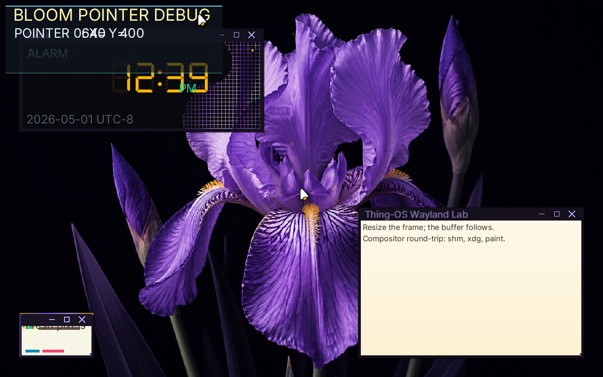
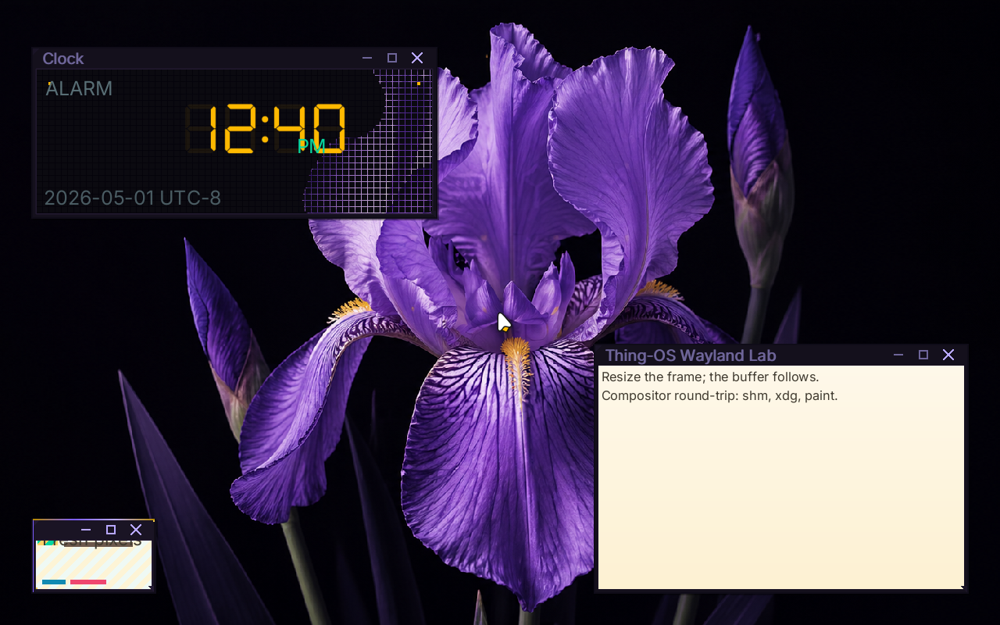

# ✅ Scenario: Alt F7 toggles the pointer debug overlay

> Last run: 2026-05-01 13:23:52

## Steps

| # | Step | Result | Duration | Before | After | Artifacts |
|---|------|--------|----------|--------|-------|-----------|
| 1 | Given the machine is booted | ✅ | 11112ms | <a href="./01/before.png"></a> | <a href="./01/after.png"></a> | [📜](./01/serial.log) |
| 2 | Then the serial output should contain "bloom: registered bristle pointer sink" within 60s | ✅ | 1077ms | <a href="./02/before.png"></a> | <a href="./02/after.png"></a> | [📜](./02/serial.log) |
| 3 | And the serial output should contain "ps2_kbd: bristle pid=" within 60s | ✅ | 5561ms | <a href="./03/before.png"></a> | - | [📜](./03/serial.log) |
| 4 | When I press Alt+F7 | ✅ | 1748ms | - | <a href="./04/after.png"></a> | [📜](./04/serial.log) |
| 5 | Then the serial output should contain "bloom: pointer debug overlay enabled" within 60s | ✅ | 5559ms | <a href="./05/before.png"></a> | - |  |
| 6 | And the serial output should contain "bloom: pointer debug overlay ready" within 60s | ✅ | 15157ms | - | - | [📜](./06/serial.log) |
| 7 | When I press Alt+F7 | ✅ | 775ms | - | <a href="./07/after.png"></a> | [📜](./07/serial.log) |
| 8 | Then the serial output should contain "bloom: pointer debug overlay disabled" within 60s | ✅ | 487ms | <a href="./08/before.png"></a> | <a href="./08/after.png"></a> | [📜](./08/serial.log) |

<details>
<summary>📜 Full Serial Log</summary>

```
[=3h00BdsDxe: loading Boot0002 "UEFI QEMU DVD-ROM QM00005 " from PciRoot(0x0)/Pci(0x1F,0x2)/Sata(0x2,0xFFFF,0x0)
BdsDxe: starting Boot0002 "UEFI QEMU DVD-ROM QM00005 " from PciRoot(0x0)/Pci(0x1F,0x2)/Sata(0x2,0xFFFF,0x0)
[33671654709] [INFO ] [kernel::boot_progress] [CPU0] boot_progress: milestone="Framebuffer Initialized"
[34016406765] [INFO ] [kernel::boot_progress] [CPU0] boot_progress: milestone="Memory Map OK"
[34036512312] [INFO ] [kernel] [CPU0] Initializing global allocator...
[34068545973] [INFO ] [kernel::boot_progress] [CPU0] boot_progress: milestone="Global Allocator"
[34100962632] [INFO ] [kernel::boot_progress] [CPU0] boot_progress: milestone="Display Registry"
[34120928754] [INFO ] [kernel] [CPU0] Initializing SIMD...
[34122979869] [INFO ] [kernel::boot_progress] [CPU0] boot_progress: milestone="SIMD Ready"
[34162260066] [WARN ] [kernel::entropy] [CPU0] ENTROPY: no hardware RNG available, using timer fallback (weak entropy)
[34164134235] [INFO ] [kernel::boot_progress] [CPU0] boot_progress: milestone="SIMD Ready"
[34184333436] [INFO ] [kernel] [CPU0] Initializing tasking...
[34199991375] [INFO ] [kernel::sched] [CPU0] SCHED: 1 per-CPU scheduler(s) allocated
[34200771825] [INFO ] [kernel::sched] [CPU0] SCHED: per-CPU preemption initialized (1 independent preemption domains, no global preemption lock)
[34237474722] [INFO ] [kernel::sched] [CPU0] Scheduler initialized
[34238742945] [INFO ] [kernel::boot_progress] [CPU0] boot_progress: milestone="Tasking Initialized"
[34351018911] [INFO ] [kernel::boot_progress] [CPU0] boot_progress: milestone="VFS Root Ready"
[34436245998] [INFO ] [kernel::boot_progress] [CPU0] boot_progress: milestone="PCI Bus Scanned"
[34459457604] [INFO ] [kernel::boot_progress] [CPU0] boot_progress: milestone="Legacy Devices"
[34532264679] [INFO ] [kernel::boot_progress] [CPU0] boot_progress: milestone="BSP Timer OK"
[34632366384] [INFO ] [kernel::boot_progress] [CPU0] boot_progress: milestone="SMP Bring-up"
[34658526705] [INFO ] [kernel::boot_progress] [CPU0] boot_progress: milestone="Boot Info OK"
[34681516914] [INFO ] [kernel::boot_progress] [CPU0] boot_progress: milestone="Modules Scanned"
[34782819159] [INFO ] [kernel::boot_progress] [CPU0] boot_progress: hint="Press F12 for a terminal"
[34832138979] [INFO ] [kernel::boot_progress] [CPU0] boot_progress: milestone="Spawning Sprout"
[34975308456] [INFO ] [kernel::boot_progress] [CPU0] boot_progress: milestone="Entering Scheduler"
[35226188382] [INFO ] [kernel] [CPU0] [kernel:start] scheduler-entry total elapsed_ticks=961845984 elapsed_us=480922
[35227005792] [INFO ] [kernel] [CPU0] Entering scheduler loop.
[35350289733] [INFO ] [sprout] [CPU0] SPROUT: ENTERING MAIN (arg0=6291456)
[35353975140] [INFO ] [sprout] [CPU0] SPROUT: v0.4.1 [REBUILT] starting (Supervisor Mode)...
[35392893195] [INFO ] [sprout::supervisor] [CPU0] SPROUT: Initializing Supervisor...
[35463828543] [INFO ] [sprout::supervisor] [CPU0] SPROUT: Supervisor session started (FULL PIPELINE MODE)
[35472766164] [INFO ] [sprout::supervisor] [CPU0] SPROUT: Launching serial shell...
[35474331222] [INFO ] [sprout::pipelines] [CPU0] SPROUT: Setting up serial shell on /dev/console...
[35570913378] [INFO ] [sprout::pipelines] [CPU0] SPROUT: Spawned serial shell '/bin/sh' (PID=6)
[35576382963] [INFO ] [sprout::supervisor] [CPU0] SPROUT: Serial shell launched; yielding 50ms so the prompt can take the foreground
[35579965806] [INFO ] [sh] [CPU3] SH: starting v0.1.0-debug

        .-.
       /   \        THING-OS
      |     |       "People, places, things."
       \   /        
        `-'        
       /   \        v0.1  ���  
      |     |       2026-04-16
       \   /
        `-'

--------------------------------------------------------------
 sprout has taken root. the system is awake.

  try:
    ls /bin       browse available shoots
    ps            observe living processes
    cat /version  inspect the genome

--------------------------------------------------------------
THING-OS [BOOT] / > [?25h[35736415572] [INFO ] [sprout::supervisor] [CPU0] SPROUT: Continuing supervisor startup
[35738206515] [INFO ] [sprout::supervisor] [CPU0] SPROUT: Spawning cambium for driver discovery...
[35772773883] [INFO ] [sprout::pipelines] [CPU0] SPROUT: Skipping early /hosts mount; mesocarp is disabled in init
[35775036396] [INFO ] [sprout::supervisor] [CPU0] SPROUT: Starting full pipeline (graphics + input)
[35775868656] [INFO ] [cambium] [CPU1] CAMBIUM: main started
[35776820475] [INFO ] [sprout::supervisor] [CPU0] SPROUT: Entering supervisor service loop (tick=100ms)
[35809721838] [INFO ] [cambium] [CPU1] CAMBIUM: starting device discovery manager (daemon mode)
[35820009654] [INFO ] [sprout::pipelines] [CPU0] SPROUT: Spawned bristle (PID=8)
[35828888238] [INFO ] [sprout::supervisor] [CPU0] SPROUT: Starting display pipeline setup
[35831313342] [INFO ] [sprout::pipelines] [CPU0] SPROUT: Probing /dev/fb0 for boot framebuffer metadata
[35839724679] [INFO ] [sprout::pipelines] [CPU0] SPROUT: /dev/fb0 ready width=1920 height=1080 stride=7680 format=2
[35844511857] [INFO ] [sprout::pipelines] [CPU0] SPROUT: Selected display driver '/drivers/display_virtio_gpu'
[35847295770] [INFO ] [sprout::pipelines] [CPU0] SPROUT: Creating display request port
[35859252495] [INFO ] [sprout::pipelines] [CPU0] SPROUT: Creating display response port
[35863027761] [INFO ] [sprout::pipelines] [CPU0] SPROUT: Creating display bootstrap memfd
[35868107550] [INFO ] [sprout::pipelines] [CPU0] SPROUT: Mapping display bootstrap memfd
[35875294917] [INFO ] [sprout::pipelines] [CPU0] SPROUT: Launching display driver '/drivers/display_virtio_gpu' (boot_fd=3, bind_id=322371585)
[35913399918] [INFO ] [bristle] [CPU2] bristle: published pid 8 to /run/bristle/pid
[35937546282] [INFO ] [bristle] [CPU2] bristle: published device handles kbd_in=1 mouse_in=3
[35943069228] [INFO ] [sprout::supervisor] [CPU0] SPROUT: Display pipeline initialized (backend=virtio_gpu)
[35948610555] [INFO ] [display_virtio_gpu] [CPU3] display_virtio_gpu: starting v0.4.1 (boot_arg=3)
[35955274971] [INFO ] [bristle] [CPU2] bristle: online (kbd_tok=Some(WaitToken(2)), mouse_tok=Some(WaitToken(3)))
[36051399978] [INFO ] [virtio_gpu] [CPU3] virtio_gpu: caps from sysfs - common BAR2 off=0x1000, notify BAR2 off=0x3000 mult=4
[36067664358] [INFO ] [virtio_gpu] [CPU3] virtio_gpu: device features=0x30000002 virgl=false
[36079353750] [INFO ] [virtio_gpu] [CPU3] virtio_gpu: cursor queue (queue 1) configured
[36080942502] [INFO ] [display_virtio_gpu] [CPU3] display_virtio_gpu: GPU initialized successfully
[36082325664] [INFO ] [display_virtio_gpu] [CPU3] display_virtio_gpu: composition paths: gpu_opaque_copy=enabled cpu_alpha_blend=enabled
[36094850220] [INFO ] [display_virtio_gpu] [CPU3] display_virtio_gpu: host scanout 1280x800 enabled=true (bootfb was 1920x1080)
[36109343919] [INFO ] [cambium::catalog] [CPU1] DEVD CATALOG: registered driver '/drivers/ahci_disk' name='ahci_disk' class=Block kind='dev.storage.Ahci' start='thingos_driver_start_safe'
[36289900977] [INFO ] [cambium::catalog] [CPU1] DEVD CATALOG: registered driver '/drivers/ata_disk' name='ata_disk' class=Block kind='dev.storage.Ide' start='thingos_driver_start_safe'
[36360710265] [INFO ] [display_virtio_gpu] [CPU3] display_virtio_gpu: cursor DMA buffer ready (16 pages at phys=0x2723000)
[36454517517] [INFO ] [sprout::supervisor] [CPU0] SPROUT: Mounted /dev/display/card0 successfully
[36468620793] [INFO ] [display_virtio_gpu] [CPU3] display_virtio_gpu: Sovereign registration COMPLETE. Assigned: /dev/display/card0
[36477312399] [INFO ] [display_virtio_gpu] [CPU3] display_virtio_gpu: VFS provider loop online
[36481204716] [INFO ] [sprout::supervisor] [CPU0] SPROUT: Display service is ready at /dev/display/card0
[36482833332] [INFO ] [cambium::catalog] [CPU1] DEVD CATALOG: registered driver '/drivers/chime' name='chime' class=Audio kind='dev.sound.Chime' start='thingos_driver_start_safe'
[36675161160] [INFO ] [cambium::catalog] [CPU1] DEVD CATALOG: registered driver '/drivers/display_bootfb' name='display_bootfb' class=Display kind='dev.display.Gpu' start='thingos_driver_start_safe'
[36996043029] [INFO ] [cambium::catalog] [CPU1] DEVD CATALOG: registered driver '/drivers/display_virtio_gpu' name='display_virtio_gpu' class=Display kind='dev.display.Gpu' start='thingos_driver_start_safe'
[37048941534] [INFO ] [sprout::supervisor] [CPU0] SPROUT: Spawned bloom (PID=10)
[37111829469] [INFO ] [bloom] [CPU1] bloom: ENTERING MAIN
[37113643149] [INFO ] [bloom] [CPU1] bloom: compositor service starting
[37305801720] [INFO ] [bloom] [CPU1] bloom: connected to /dev/display/card0 on try 0
[37330271055] [INFO ] [bloom] [CPU1] bloom: output0 1280x800 @ 60000mHz
[37331390151] [INFO ] [bloom] [CPU1] bloom: display driver does not support VBLANK
[37332289005] [INFO ] [bloom] [CPU1] bloom: display driver supports linear dmabuf import
[37333002795] [INFO ] [bloom] [CPU1] bloom: display driver supports GPU blit (hardware transfer/flush)
[37333681671] [INFO ] [bloom] [CPU1] bloom: display driver supports direct scanout (zero-copy path to display)
[37334383449] [INFO ] [bloom] [CPU1] bloom: display driver supports partial flush (damage regions)
[37335030843] [INFO ] [bloom] [CPU1] bloom: display driver supports resource cache (pre-allocated buffer pool)
[37336931808] [INFO ] [bloom] [CPU1] bloom: creating service port...
[37608532830] [INFO ] [cambium::catalog] [CPU1] DEVD CATALOG: registered driver '/drivers/hdaudio' name='hdaudio' class=Audio kind='dev.sound.Hda' start='thingos_driver_start_safe'
[37763249931] [INFO ] [cambium::catalog] [CPU1] DEVD CATALOG: registered driver '/drivers/hwrng' name='hwrng' class=Other kind='dev.rng.HwRng' start='_RNvCs7wlZbVUrQWf_5hwrng20thingos_driver_start'
[37977961296] [INFO ] [bloom::render] [CPU1] bloom: pistil background renderer loaded from /lib/libpistil.so
[37979136129] [INFO ] [bloom::render] [CPU1] bloom: pistil font text renderer loaded with default /share/fonts/Inter-Regular.ttf
[37980104415] [INFO ] [bloom::render] [CPU1] bloom: pistil symbol renderer loaded with /share/fonts/NotoSansSymbol2-Regular.ttf
[37988710617] [INFO ] [bloom] [CPU1] bloom: initial theme configured Facet Frame
[38231727567] [INFO ] [cambium::catalog] [CPU1] DEVD CATALOG: registered driver '/drivers/pci_stubd' name='pci_stubd' class=Other kind='drv.PciStubd' start='thingos_driver_start_safe'
[38401442442] [INFO ] [cambium::catalog] [CPU1] DEVD CATALOG: registered driver '/drivers/ps2_kbd' name='ps2_kbd' class=Input kind='drv.Ps2Keyboard' start='thingos_driver_start_safe'
[38558168946] [INFO ] [cambium::catalog] [CPU1] DEVD CATALOG: registered driver '/drivers/ps2_mouse' name='ps2_mouse' class=Input kind='drv.Ps2Mouse' start='thingos_driver_start_safe'
[38799338259] [INFO ] [cambium::catalog] [CPU1] DEVD CATALOG: registered driver '/drivers/rtc_cmos' name='rtc_cmos' class=Other kind='dev.rtc.Cmos' start='thingos_driver_start_safe'
[38978703522] [INFO ] [cambium::catalog] [CPU1] DEVD CATALOG: registered driver '/drivers/rtl8168d' name='rtl8168d' class=Net kind='dev.net.Nic' start='thingos_driver_start_safe'
[39083384604] [INFO ] [bloom] [CPU1] bloom: initial wallpaper configured /share/wallpapers/flower.png
[39291006876] [INFO ] [bloom::render] [CPU1] bloom: cursor ready buffer=2 size=48x48 hotspot=11,6
[39302142594] [INFO ] [bloom] [CPU1] bloom: watching wallpaper config /session/desktop/wallpaper
[39305190111] [INFO ] [bloom] [CPU1] bloom: watching theme config /session/desktop/theme
[39353300151] [INFO ] [bloom] [CPU1] bloom: Wayland server thread spawned
[39356813661] [INFO ] [bloom::loop_types] [CPU1] bloom: service loop started
[39357974403] [INFO ] [bloom::loop_types] [CPU1] bloom: output0 1280x800 @ 60000mHz ready
[39360534246] [INFO ] [bloom::wayland] [CPU2] wayland-server: starting
[39373860405] [INFO ] [cambium::catalog] [CPU1] DEVD CATALOG: registered driver '/drivers/virtio_netd' name='virtio_netd' class=Net kind='dev.net.Nic' start='thingos_driver_start_safe'
[39390876294] [INFO ] [bloom::wayland] [CPU2] wayland-server: listening on /run/wayland-0
[39392201706] [INFO ] [bloom::wayland] [CPU2] wayland-server: advertising globals wl_compositor wl_shm xdg_wm_base wl_seat wl_output wl_subcompositor wl_data_device_manager zwp_linux_dmabuf_v1
[39392928498] [INFO ] [sprout::supervisor] [CPU0] SPROUT: Spawned wayland_hello (PID=12)
[39410657484] [INFO ] [wayland_hello] [CPU3] wayland_hello: connected to /run/wayland-0
[39420232665] [INFO ] [sprout::supervisor] [CPU0] SPROUT: Spawned clock (PID=13)
[39493065051] [INFO ] [clock] [CPU1] clock: running at low scheduler priority tid=13
[39498323898] [INFO ] [clock] [CPU1] clock: connected to /run/wayland-0
[39813276096] [INFO ] [clock] [CPU1] clock: pistil DSEG7 text renderer loaded with /share/fonts/DSEG7Classic-Regular.ttf
[39814969326] [INFO ] [clock] [CPU1] clock: pistil generic text renderer loaded with /share/fonts/Inter-Regular.ttf
[39824622981] [INFO ] [display_virtio_gpu] [CPU3] display_virtio_gpu: first commit copied buffer=1 rect=1280x800 src_px=0xff0b0a10 dst_px=0xff0b0a10 damage=1280x800+0,0 res_id=1 gpu_planes=0 cpu_planes=2
[39825981327] [INFO ] [display_virtio_gpu] [CPU3] display_virtio_gpu: cursor plane blended buffer=2 at 638,399 src_px=0x10202020 dst_before=0xff0b0a10 dst_after=0xff0c0b11
[39922226520] [INFO ] [bloom::loop_types] [CPU1] First frame rendered
[39939445062] [INFO ] [cambium::catalog] [CPU1] DEVD CATALOG: registered driver '/drivers/virtio_sound' name='virtio_sound' class=Audio kind='dev.sound.Virtio' start='thingos_driver_start_safe'
[40205909007] [INFO ] [cambium::catalog] [CPU1] DEVD CATALOG: registered driver '/drivers/xhci' name='xhci' class=Block kind='dev.usb.Xhci' start='thingos_driver_start_safe'
[40208706219] [INFO ] [cambium::catalog] [CPU1] DEVD CATALOG: 15 driver(s) found
[40224830019] [INFO ] [wayland_hello] [CPU3] wayland_hello: pistil text renderer loaded with default /share/fonts/Inter-Regular.ttf
[40234304220] [INFO ] [bloom::services::input_service] [CPU1] bloom: registered bristle pointer sink
[40247984865] [INFO ] [bristle] [CPU2] bristle: bloom sink registered (handle=5 mask=0x03)
[40391051448] [INFO ] [ahci_disk] [CPU2] AHCI: Starting AHCI VFS driver
[40438574847] [INFO ] [ahci_disk] [CPU2] AHCI: Claimed device /sys/devices/pci-0000:00:1f.2
[40454918625] [INFO ] [bloom::services::wayland_cmd] [CPU1] bloom: registered titlebar drag zone surface=1 height=28 frame=6
[40466240826] [INFO ] [ahci_disk] [CPU2] AHCI: Mounted atapi2 at /dev/storage/atapi2
[40467356226] [INFO ] [ahci_disk] [CPU2] AHCI: Provider loop online at /dev/storage/atapi2
[40480881441] [INFO ] [bloom::wayland::dispatch] [CPU2] wayland-server: xdg_toplevel obj=12 assigned to xdg_surface=11
[40485739272] [INFO ] [rtc_cmos] [CPU3] RTC: claimed /sys/devices/isa-0070 (handle=2)
[40517071848] [INFO ] [rtc_cmos] [CPU3] RTC: 2026-05-01 20:38:37 = 1777667917 unix_secs
[40517234340] [INFO ] [ps2_kbd] [CPU1] ps2_kbd: bristle pid=8
[40519011291] [INFO ] [kernel::time] [CPU3] System clock anchored: unix_secs=1777667917, mono_ns=20259251760, offset=1777667896740748240ns
[40520511768] [INFO ] [rtc_cmos] [CPU3] RTC: System clock anchored to 1777667917 unix_secs
[40527386988] [INFO ] [kernel::time] [CPU0] System clock tick: utc=2026-05-01 20:38:37.003251952 unix_secs=1777667917.003251952
[40607176962] [INFO ] [ps2_mouse] [CPU2] ps2_mouse: bristle pid=8
[40678612656] [INFO ] [ps2_mouse] [CPU2] ps2_mouse: sample rate set to 60 Hz
[40905523692] [INFO ] [bloom::services::wallpaper] [CPU1] bloom: preparing background /share/wallpapers/flower.png
[40988319801] [INFO ] [wayland_hello] [CPU3] wayland_hello: using zwp_linux_dmabuf_v1 buffers
[40992136020] [INFO ] [wayland_hello] [CPU3] wayland_hello: bound wp_presentation
[41000411991] [INFO ] [wayland_hello] [CPU3] wayland_hello: wl_region smoke test: create+add+set_opaque+destroy
[44807199492] [INFO ] [bloom::services::wayland_cmd] [CPU1] bloom: registered titlebar drag zone surface=2 height=28 frame=6
[44821380978] [INFO ] [bloom::wayland::dispatch] [CPU2] wayland-server: xdg_toplevel obj=12 assigned to xdg_surface=11
[44878288092] [INFO ] [bloom::wayland::dispatch] [CPU2] wayland-server: imported dmabuf wl_buffer=111 480x320 format=0x34325241
[46369249938] [INFO ] [bloom::render] [CPU1] bloom: flat window overlays ready size=1280x800
[46551352947] [INFO ] [kernel::time] [CPU0] System clock tick: utc=2026-05-01 20:38:40.016316011 unix_secs=1777667920.016316011
[47603670180] [INFO ] [bloom::services::wayland_cmd] [CPU1] bloom: registered titlebar drag zone surface=3 height=28 frame=6
[47631006621] [INFO ] [bloom::wayland::dispatch] [CPU2] wayland-server: xdg_popup obj=23 assigned to xdg_surface=21
[47890075728] [INFO ] [bloom::wayland::dispatch] [CPU2] wayland-server: imported dmabuf wl_buffer=121 160x96 format=0x34325241
[47897418459] [INFO ] [wayland_hello] [CPU3] wayland_hello: frame callback done object=1000 data=23936
[47899905141] [INFO ] [wayland_hello] [CPU3] wayland_hello: wp_presentation_feedback.presented object=1001 tv=23.939123950 refresh_ns=16666666 seq=0
[48112274562] [INFO ] [wayland_hello] [CPU3] wayland_hello: frame callback done object=1002 data=24045
[48114609147] [INFO ] [wayland_hello] [CPU3] wayland_hello: wp_presentation_feedback.presented object=1003 tv=24.048327765 refresh_ns=16666666 seq=1
[52577166378] [INFO ] [kernel::time] [CPU0] System clock tick: utc=2026-05-01 20:38:43.029269422 unix_secs=1777667923.029269422
[58603030266] [INFO ] [kernel::time] [CPU0] System clock tick: utc=2026-05-01 20:38:46.042211068 unix_secs=1777667926.042211068
[64629409581] [INFO ] [kernel::time] [CPU0] System clock tick: utc=2026-05-01 20:38:49.055383367 unix_secs=1777667929.055383367
[70654805496] [INFO ] [kernel::time] [CPU0] System clock tick: utc=2026-05-01 20:38:52.068117971 unix_secs=1777667932.068117971
[74242034097] [INFO ] [clock] [CPU1] clock: tick local=2026-05-01 12:38:53 UTC-8 system_unix=1777667933.860692227
[76681120758] [INFO ] [kernel::time] [CPU0] System clock tick: utc=2026-05-01 20:38:55.081256132 unix_secs=1777667935.081256132
[82706908878] [INFO ] [kernel::time] [CPU0] System clock tick: utc=2026-05-01 20:38:58.094159729 unix_secs=1777667938.094159729
[88733031222] [INFO ] [kernel::time] [CPU0] System clock tick: utc=2026-05-01 20:39:01.107190079 unix_secs=1777667941.107190079
[94758922335] [INFO ] [kernel::time] [CPU0] System clock tick: utc=2026-05-01 20:39:04.120150238 unix_secs=1777667944.120150238
[100785060057] [INFO ] [kernel::time] [CPU0] System clock tick: utc=2026-05-01 20:39:07.133227696 unix_secs=1777667947.133227696
[106810856361] [INFO ] [kernel::time] [CPU0] System clock tick: utc=2026-05-01 20:39:10.146144196 unix_secs=1777667950.146144196
[109517299848] [INFO ] [ps2_kbd] [CPU1] ps2_kbd: read scancode 0x38
[109519845501] [INFO ] [ps2_kbd] [CPU1] ps2_kbd: edge detected: Down { key: LeftAlt, mods: Mods(4), repeat: false }
[109522262058] [INFO ] [ps2_kbd] [CPU1] ps2_kbd: sent LeftAlt to bristle (pid=8)
[109527763323] [INFO ] [bristle] [CPU2] bristle: KeyDown received: LeftAlt
[109535733681] [INFO ] [bloom::input] [CPU1] bloom: KeyDown received: LeftAlt (raw=0x00e2, mods=Mods(4), repeat=false)
[112817719674] [INFO ] [ps2_kbd] [CPU1] ps2_kbd: read scancode 0x41
[112818869625] [INFO ] [ps2_kbd] [CPU1] ps2_kbd: edge detected: Down { key: F7, mods: Mods(4), repeat: false }
[112821077721] [INFO ] [ps2_kbd] [CPU1] ps2_kbd: sent F7 to bristle (pid=8)
[112824244764] [INFO ] [bristle] [CPU2] bristle: KeyDown received: F7
[112836678306] [INFO ] [kernel::time] [CPU0] System clock tick: utc=2026-05-01 20:39:13.159039790 unix_secs=1777667953.159039790
[112853753463] [INFO ] [bloom::input] [CPU1] bloom: KeyDown received: F7 (raw=0x0040, mods=Mods(4), repeat=false)
[112854827184] [INFO ] [bloom::input] [CPU1] bloom: pointer debug overlay enabled
[112920286116] [INFO ] [bloom::render] [CPU1] bloom: pointer debug overlay ready buffer=10 size=460x144
[112994969142] [INFO ] [ps2_kbd] [CPU1] ps2_kbd: read scancode 0xc1
[112996555023] [INFO ] [ps2_kbd] [CPU1] ps2_kbd: edge detected: Up { key: F7, mods: Mods(4) }
[112998606864] [INFO ] [ps2_kbd] [CPU1] ps2_kbd: sent F7 to bristle (pid=8)
[113000773941] [INFO ] [ps2_kbd] [CPU1] ps2_kbd: read scancode 0xb8
[113001677943] [INFO ] [ps2_kbd] [CPU1] ps2_kbd: edge detected: Up { key: LeftAlt, mods: Mods(0) }
[113002742655] [INFO ] [ps2_kbd] [CPU1] ps2_kbd: sent LeftAlt to bristle (pid=8)
[118862560872] [INFO ] [kernel::time] [CPU0] System clock tick: utc=2026-05-01 20:39:16.171973170 unix_secs=1777667956.171973170
[124888621110] [INFO ] [kernel::time] [CPU0] System clock tick: utc=2026-05-01 20:39:19.185003850 unix_secs=1777667959.185003850
[130914683262] [INFO ] [kernel::time] [CPU0] System clock tick: utc=2026-05-01 20:39:22.198039727 unix_secs=1777667962.198039727
[136940459139] [INFO ] [kernel::time] [CPU0] System clock tick: utc=2026-05-01 20:39:25.210936147 unix_secs=1777667965.210936147
[142966444962] [INFO ] [kernel::time] [CPU0] System clock tick: utc=2026-05-01 20:39:28.223918449 unix_secs=1777667968.223918449
[148767050520] [INFO ] [clock] [CPU1] clock: tick local=2026-05-01 12:39:31 UTC-8 system_unix=1777667971.123997455
[148992551862] [INFO ] [kernel::time] [CPU0] System clock tick: utc=2026-05-01 20:39:31.236962411 unix_secs=1777667971.236962411
[155018538015] [INFO ] [kernel::time] [CPU0] System clock tick: utc=2026-05-01 20:39:34.249954283 unix_secs=1777667974.249954283
[161044409328] [INFO ] [kernel::time] [CPU0] System clock tick: utc=2026-05-01 20:39:37.262873539 unix_secs=1777667977.262873539
[167070230118] [INFO ] [kernel::time] [CPU0] System clock tick: utc=2026-05-01 20:39:40.275816439 unix_secs=1777667980.275816439
[173096277882] [INFO ] [kernel::time] [CPU0] System clock tick: utc=2026-05-01 20:39:43.288829810 unix_secs=1777667983.288829810
[179122204206] [INFO ] [kernel::time] [CPU0] System clock tick: utc=2026-05-01 20:39:46.301798318 unix_secs=1777667986.301798318
[185148253356] [INFO ] [kernel::time] [CPU0] System clock tick: utc=2026-05-01 20:39:49.314812960 unix_secs=1777667989.314812960
[191174263929] [INFO ] [kernel::time] [CPU0] System clock tick: utc=2026-05-01 20:39:52.327825804 unix_secs=1777667992.327825804
[197200085247] [INFO ] [kernel::time] [CPU0] System clock tick: utc=2026-05-01 20:39:55.340737849 unix_secs=1777667995.340737849
[203226350085] [INFO ] [kernel::time] [CPU0] System clock tick: utc=2026-05-01 20:39:58.353826064 unix_secs=1777667998.353826064
[209251894170] [INFO ] [kernel::time] [CPU0] System clock tick: utc=2026-05-01 20:40:01.366661087 unix_secs=1777668001.366661087
[215277981732] [INFO ] [kernel::time] [CPU0] System clock tick: utc=2026-05-01 20:40:04.379705314 unix_secs=1777668004.379705314
[221303975970] [INFO ] [kernel::time] [CPU0] System clock tick: utc=2026-05-01 20:40:07.392679663 unix_secs=1777668007.392679663
[223298049414] [INFO ] [clock] [CPU1] clock: tick local=2026-05-01 12:40:08 UTC-8 system_unix=1777668008.389452352
[227329911105] [INFO ] [kernel::time] [CPU0] System clock tick: utc=2026-05-01 20:40:10.405646702 unix_secs=1777668010.405646702
[233356073544] [INFO ] [kernel::time] [CPU0] System clock tick: utc=2026-05-01 20:40:13.418717197 unix_secs=1777668013.418717197
[239381962149] [INFO ] [kernel::time] [CPU0] System clock tick: utc=2026-05-01 20:40:16.431675227 unix_secs=1777668016.431675227
[245407823397] [INFO ] [kernel::time] [CPU0] System clock tick: utc=2026-05-01 20:40:19.444602122 unix_secs=1777668019.444602122
[251433877134] [INFO ] [kernel::time] [CPU0] System clock tick: utc=2026-05-01 20:40:22.457626235 unix_secs=1777668022.457626235
[257459797089] [INFO ] [kernel::time] [CPU0] System clock tick: utc=2026-05-01 20:40:25.470585305 unix_secs=1777668025.470585305
[263485761957] [INFO ] [kernel::time] [CPU0] System clock tick: utc=2026-05-01 20:40:28.483580956 unix_secs=1777668028.483580956
[269511601227] [INFO ] [kernel::time] [CPU0] System clock tick: utc=2026-05-01 20:40:31.496504518 unix_secs=1777668031.496504518
[275537749509] [INFO ] [kernel::time] [CPU0] System clock tick: utc=2026-05-01 20:40:34.509548233 unix_secs=1777668034.509548233
[281563663095] [INFO ] [kernel::time] [CPU0] System clock tick: utc=2026-05-01 20:40:37.522490522 unix_secs=1777668037.522490522
[284938321932] [INFO ] [ps2_kbd] [CPU1] ps2_kbd: read scancode 0x38
[284939366844] [INFO ] [ps2_kbd] [CPU1] ps2_kbd: edge detected: Down { key: LeftAlt, mods: Mods(4), repeat: false }
[284941517124] [INFO ] [ps2_kbd] [CPU1] ps2_kbd: sent LeftAlt to bristle (pid=8)
[284944017006] [INFO ] [ps2_kbd] [CPU1] ps2_kbd: read scancode 0x41
[284944531608] [INFO ] [bristle] [CPU2] bristle: KeyDown received: LeftAlt
[284945242263] [INFO ] [ps2_kbd] [CPU1] ps2_kbd: edge detected: Down { key: F7, mods: Mods(4), repeat: false }
[284950346472] [INFO ] [bloom::input] [CPU1] bloom: KeyDown received: LeftAlt (raw=0x00e2, mods=Mods(4), repeat=false)
[284957567070] [INFO ] [ps2_kbd] [CPU1] ps2_kbd: sent F7 to bristle (pid=8)
[284960500011] [INFO ] [bristle] [CPU2] bristle: KeyDown received: F7
[284970420669] [INFO ] [bloom::input] [CPU1] bloom: KeyDown received: F7 (raw=0x0040, mods=Mods(4), repeat=false)
[284972424660] [INFO ] [bloom::input] [CPU1] bloom: pointer debug overlay disabled
[285118128966] [INFO ] [ps2_kbd] [CPU1] ps2_kbd: read scancode 0xc1
[285119218593] [INFO ] [ps2_kbd] [CPU1] ps2_kbd: edge detected: Up { key: F7, mods: Mods(4) }
[285121152723] [INFO ] [ps2_kbd] [CPU1] ps2_kbd: sent F7 to bristle (pid=8)
[285123433056] [INFO ] [ps2_kbd] [CPU1] ps2_kbd: read scancode 0xb8
[285124223307] [INFO ] [ps2_kbd] [CPU1] ps2_kbd: edge detected: Up { key: LeftAlt, mods: Mods(0) }
[285125400615] [INFO ] [ps2_kbd] [CPU1] ps2_kbd: sent LeftAlt to bristle (pid=8)
[287589478671] [
```
</details>
