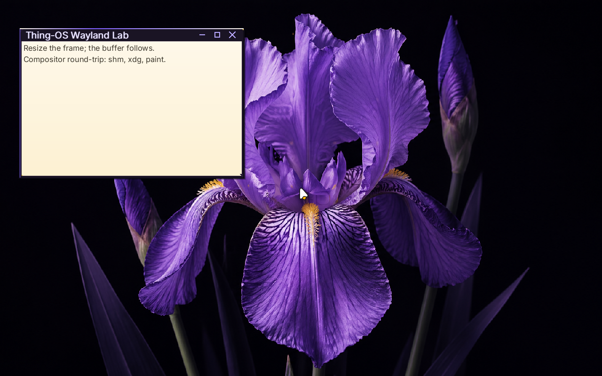
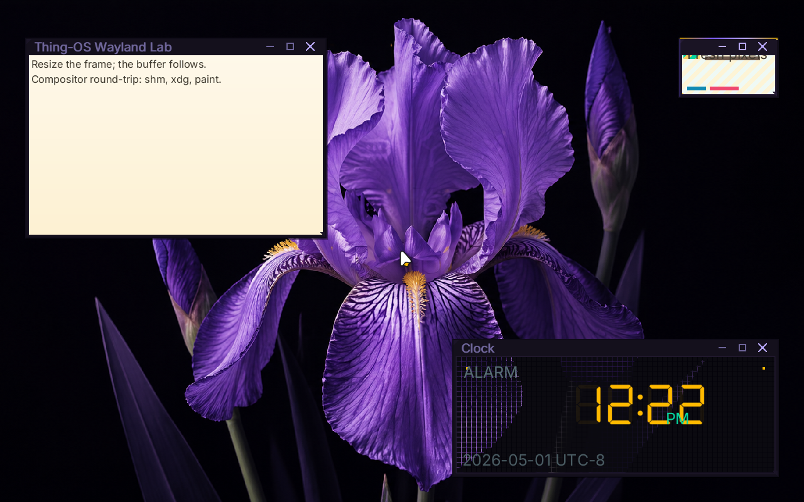

# ✅ Scenario: bloom compositor reacts to wallpaper watch path

> Last run: 2026-05-01 13:12:24

## Steps

| # | Step | Result | Duration | Before | After | Artifacts |
|---|------|--------|----------|--------|-------|-----------|
| 1 | Given the machine is booted | ✅ | 11161ms | <a href="./01/before.png"></a> | <a href="./01/after.png"></a> | [📜](./01/serial.log) |
| 2 | Then the serial output should contain "bloom: service loop started" within 60s | ✅ | 618ms | <a href="./02/before.png"></a> | <a href="./02/after.png"></a> | [📜](./02/serial.log) |
| 3 | When I wait for the shell prompt | ✅ | 1008ms | <a href="./03/before.png"></a> | <a href="./03/after.png"></a> | [📜](./03/serial.log) [console_interactive.png](./03/console_interactive.png) |
| 4 | And I type "echo /share/wallpapers/flower.png > /session/desktop/wallpaper" on the serial console | ✅ | 1650ms | <a href="./04/before.png"></a> | <a href="./04/after.png"></a> | [📜](./04/serial.log) |
| 5 | Then the serial output should contain "bloom: reacting to wallpaper change" within 60s | ✅ | 524ms | <a href="./05/before.png"></a> | <a href="./05/after.png"></a> |  |

<details>
<summary>📜 Full Serial Log</summary>

```
[=3h00BdsDxe: loading Boot0002 "UEFI QEMU DVD-ROM QM00005 " from PciRoot(0x0)/Pci(0x1F,0x2)/Sata(0x2,0xFFFF,0x0)
BdsDxe: starting Boot0002 "UEFI QEMU DVD-ROM QM00005 " from PciRoot(0x0)/Pci(0x1F,0x2)/Sata(0x2,0xFFFF,0x0)
[33911291931] [INFO ] [kernel::boot_progress] [CPU0] boot_progress: milestone="Framebuffer Initialized"
[34163732526] [INFO ] [kernel::boot_progress] [CPU0] boot_progress: milestone="Memory Map OK"
[34183708185] [INFO ] [kernel] [CPU0] Initializing global allocator...
[34215215034] [INFO ] [kernel::boot_progress] [CPU0] boot_progress: milestone="Global Allocator"
[34247274765] [INFO ] [kernel::boot_progress] [CPU0] boot_progress: milestone="Display Registry"
[34266543036] [INFO ] [kernel] [CPU0] Initializing SIMD...
[34268304510] [INFO ] [kernel::boot_progress] [CPU0] boot_progress: milestone="SIMD Ready"
[34306194978] [WARN ] [kernel::entropy] [CPU0] ENTROPY: no hardware RNG available, using timer fallback (weak entropy)
[34308012981] [INFO ] [kernel::boot_progress] [CPU0] boot_progress: milestone="SIMD Ready"
[34327806942] [INFO ] [kernel] [CPU0] Initializing tasking...
[34342169235] [INFO ] [kernel::sched] [CPU0] SCHED: 1 per-CPU scheduler(s) allocated
[34342788282] [INFO ] [kernel::sched] [CPU0] SCHED: per-CPU preemption initialized (1 independent preemption domains, no global preemption lock)
[34377768909] [INFO ] [kernel::sched] [CPU0] Scheduler initialized
[34378882428] [INFO ] [kernel::boot_progress] [CPU0] boot_progress: milestone="Tasking Initialized"
[34465799973] [INFO ] [kernel::boot_progress] [CPU0] boot_progress: milestone="VFS Root Ready"
[34546642515] [INFO ] [kernel::boot_progress] [CPU0] boot_progress: milestone="PCI Bus Scanned"
[34568137098] [INFO ] [kernel::boot_progress] [CPU0] boot_progress: milestone="Legacy Devices"
[34639634931] [INFO ] [kernel::boot_progress] [CPU0] boot_progress: milestone="BSP Timer OK"
[34739013012] [INFO ] [kernel::boot_progress] [CPU0] boot_progress: milestone="SMP Bring-up"
[34764837987] [INFO ] [kernel::boot_progress] [CPU0] boot_progress: milestone="Boot Info OK"
[34787036625] [INFO ] [kernel::boot_progress] [CPU0] boot_progress: milestone="Modules Scanned"
[34884656301] [INFO ] [kernel::boot_progress] [CPU0] boot_progress: hint="Press F12 for a terminal"
[34934102676] [INFO ] [kernel::boot_progress] [CPU0] boot_progress: milestone="Spawning Sprout"
[35067386772] [INFO ] [kernel::boot_progress] [CPU0] boot_progress: milestone="Entering Scheduler"
[35314180539] [INFO ] [kernel] [CPU0] [kernel:start] scheduler-entry total elapsed_ticks=915105906 elapsed_us=457552
[35315098071] [INFO ] [kernel] [CPU0] Entering scheduler loop.
[35391858480] [INFO ] [sprout] [CPU0] SPROUT: ENTERING MAIN (arg0=6291456)
[35395535769] [INFO ] [sprout] [CPU0] SPROUT: v0.4.1 [REBUILT] starting (Supervisor Mode)...
[35433431055] [INFO ] [sprout::supervisor] [CPU0] SPROUT: Initializing Supervisor...
[35473154871] [INFO ] [sprout::supervisor] [CPU0] SPROUT: Supervisor session started (FULL PIPELINE MODE)
[35482715730] [INFO ] [sprout::supervisor] [CPU0] SPROUT: Launching serial shell...
[35484574125] [INFO ] [sprout::pipelines] [CPU0] SPROUT: Setting up serial shell on /dev/console...
[35580977553] [INFO ] [sprout::pipelines] [CPU0] SPROUT: Spawned serial shell '/bin/sh' (PID=6)
[35585519970] [INFO ] [sprout::supervisor] [CPU0] SPROUT: Serial shell launched; yielding 50ms so the prompt can take the foreground
[35588712852] [INFO ] [sh] [CPU3] SH: starting v0.1.0-debug

        .-.
       /   \        THING-OS
      |     |       "People, places, things."
       \   /        
        `-'        
       /   \        v0.1  ��  
      |     |       2026-04-16
       \   /
        `-'

--------------------------------------------------------------
 sprout has taken root. the system is awake.

  try:
    ls /bin       browse available shoots
    ps            observe living processes
    cat /version  inspect the genome

--------------------------------------------------------------
THING-OS [BOOT] / > [?25h[35803194834] [INFO ] [sprout::supervisor] [CPU0] SPROUT: Continuing supervisor startup
[35804999769] [INFO ] [sprout::supervisor] [CPU0] SPROUT: Spawning cambium for driver discovery...
[35839362537] [INFO ] [sprout::pipelines] [CPU0] SPROUT: Skipping early /hosts mount; mesocarp is disabled in init
[35841662340] [INFO ] [sprout::supervisor] [CPU0] SPROUT: Starting full pipeline (graphics + input)
[35842267329] [INFO ] [cambium] [CPU1] CAMBIUM: main started
[35843596998] [INFO ] [sprout::supervisor] [CPU0] SPROUT: Entering supervisor service loop (tick=100ms)
[35867753889] [INFO ] [cambium] [CPU1] CAMBIUM: starting device discovery manager (daemon mode)
[35910847368] [INFO ] [sprout::pipelines] [CPU0] SPROUT: Spawned bristle (PID=8)
[35914695729] [INFO ] [sprout::supervisor] [CPU0] SPROUT: Starting display pipeline setup
[35916291444] [INFO ] [sprout::pipelines] [CPU0] SPROUT: Probing /dev/fb0 for boot framebuffer metadata
[35923600548] [INFO ] [sprout::pipelines] [CPU0] SPROUT: /dev/fb0 ready width=1920 height=1080 stride=7680 format=2
[35928575529] [INFO ] [sprout::pipelines] [CPU0] SPROUT: Selected display driver '/drivers/display_virtio_gpu'
[35930183883] [INFO ] [sprout::pipelines] [CPU0] SPROUT: Creating display request port
[35940999138] [INFO ] [sprout::pipelines] [CPU0] SPROUT: Creating display response port
[35944498293] [INFO ] [sprout::pipelines] [CPU0] SPROUT: Creating display bootstrap memfd
[35946513966] [INFO ] [bristle] [CPU2] bristle: published pid 8 to /run/bristle/pid
[35950608639] [INFO ] [sprout::pipelines] [CPU0] SPROUT: Mapping display bootstrap memfd
[35955442512] [INFO ] [sprout::pipelines] [CPU0] SPROUT: Launching display driver '/drivers/display_virtio_gpu' (boot_fd=3, bind_id=322371585)
[35958981003] [INFO ] [bristle] [CPU2] bristle: published device handles kbd_in=1 mouse_in=3
[35972518032] [INFO ] [bristle] [CPU2] bristle: online (kbd_tok=Some(WaitToken(2)), mouse_tok=Some(WaitToken(3)))
[36014430771] [INFO ] [sprout::supervisor] [CPU0] SPROUT: Display pipeline initialized (backend=virtio_gpu)
[36021150825] [INFO ] [display_virtio_gpu] [CPU3] display_virtio_gpu: starting v0.4.1 (boot_arg=3)
[36115945635] [INFO ] [virtio_gpu] [CPU3] virtio_gpu: caps from sysfs - common BAR2 off=0x1000, notify BAR2 off=0x3000 mult=4
[36126249126] [INFO ] [virtio_gpu] [CPU3] virtio_gpu: device features=0x30000002 virgl=false
[36139329105] [INFO ] [virtio_gpu] [CPU3] virtio_gpu: cursor queue (queue 1) configured
[36140549742] [INFO ] [display_virtio_gpu] [CPU3] display_virtio_gpu: GPU initialized successfully
[36141435792] [INFO ] [display_virtio_gpu] [CPU3] display_virtio_gpu: composition paths: gpu_opaque_copy=enabled cpu_alpha_blend=enabled
[36152378196] [INFO ] [display_virtio_gpu] [CPU3] display_virtio_gpu: host scanout 1280x800 enabled=true (bootfb was 1920x1080)
[36166378215] [INFO ] [cambium::catalog] [CPU1] DEVD CATALOG: registered driver '/drivers/ahci_disk' name='ahci_disk' class=Block kind='dev.storage.Ahci' start='thingos_driver_start_safe'
[36336993726] [INFO ] [cambium::catalog] [CPU1] DEVD CATALOG: registered driver '/drivers/ata_disk' name='ata_disk' class=Block kind='dev.storage.Ide' start='thingos_driver_start_safe'
[36397687491] [INFO ] [display_virtio_gpu] [CPU3] display_virtio_gpu: cursor DMA buffer ready (16 pages at phys=0x2723000)
[36469693689] [INFO ] [sprout::supervisor] [CPU0] SPROUT: Mounted /dev/display/card0 successfully
[36478243032] [INFO ] [display_virtio_gpu] [CPU3] display_virtio_gpu: Sovereign registration COMPLETE. Assigned: /dev/display/card0
[36483327870] [INFO ] [display_virtio_gpu] [CPU3] display_virtio_gpu: VFS provider loop online
[36485210586] [INFO ] [sprout::supervisor] [CPU0] SPROUT: Display service is ready at /dev/display/card0
[36513532902] [INFO ] [cambium::catalog] [CPU1] DEVD CATALOG: registered driver '/drivers/chime' name='chime' class=Audio kind='dev.sound.Chime' start='thingos_driver_start_safe'
[36692836719] [INFO ] [cambium::catalog] [CPU1] DEVD CATALOG: registered driver '/drivers/display_bootfb' name='display_bootfb' class=Display kind='dev.display.Gpu' start='thingos_driver_start_safe'
[36885237675] [INFO ] [cambium::catalog] [CPU1] DEVD CATALOG: registered driver '/drivers/display_virtio_gpu' name='display_virtio_gpu' class=Display kind='dev.display.Gpu' start='thingos_driver_start_safe'
[36892877835] [INFO ] [sprout::supervisor] [CPU0] SPROUT: Spawned bloom (PID=10)
[37073494062] [INFO ] [bloom] [CPU1] bloom: ENTERING MAIN
[37075191615] [INFO ] [bloom] [CPU1] bloom: compositor service starting
[37157160480] [INFO ] [cambium::catalog] [CPU1] DEVD CATALOG: registered driver '/drivers/hdaudio' name='hdaudio' class=Audio kind='dev.sound.Hda' start='thingos_driver_start_safe'
[37249209558] [INFO ] [bloom] [CPU1] bloom: connected to /dev/display/card0 on try 0
[37270271280] [INFO ] [bloom] [CPU1] bloom: output0 1280x800 @ 60000mHz
[37271365890] [INFO ] [bloom] [CPU1] bloom: display driver does not support VBLANK
[37272134889] [INFO ] [bloom] [CPU1] bloom: display driver supports linear dmabuf import
[37272855444] [INFO ] [bloom] [CPU1] bloom: display driver supports GPU blit (hardware transfer/flush)
[37273547883] [INFO ] [bloom] [CPU1] bloom: display driver supports direct scanout (zero-copy path to display)
[37274322888] [INFO ] [bloom] [CPU1] bloom: display driver supports partial flush (damage regions)
[37275089478] [INFO ] [bloom] [CPU1] bloom: display driver supports resource cache (pre-allocated buffer pool)
[37275988530] [INFO ] [bloom] [CPU1] bloom: creating service port...
[37602383214] [INFO ] [bloom::render] [CPU1] bloom: pistil background renderer loaded from /lib/libpistil.so
[37603553889] [INFO ] [bloom::render] [CPU1] bloom: pistil font text renderer loaded with default /share/fonts/Inter-Regular.ttf
[37605183231] [INFO ] [bloom::render] [CPU1] bloom: pistil symbol renderer loaded with /share/fonts/NotoSansSymbol2-Regular.ttf
[37613149299] [INFO ] [bloom] [CPU1] bloom: initial theme configured Facet Frame
[37919273502] [INFO ] [cambium::catalog] [CPU1] DEVD CATALOG: registered driver '/drivers/hwrng' name='hwrng' class=Other kind='dev.rng.HwRng' start='_RNvCs7wlZbVUrQWf_5hwrng20thingos_driver_start'
[38077156821] [INFO ] [cambium::catalog] [CPU1] DEVD CATALOG: registered driver '/drivers/pci_stubd' name='pci_stubd' class=Other kind='drv.PciStubd' start='thingos_driver_start_safe'
[38267127921] [INFO ] [cambium::catalog] [CPU1] DEVD CATALOG: registered driver '/drivers/ps2_kbd' name='ps2_kbd' class=Input kind='drv.Ps2Keyboard' start='thingos_driver_start_safe'
[38432770398] [INFO ] [cambium::catalog] [CPU1] DEVD CATALOG: registered driver '/drivers/ps2_mouse' name='ps2_mouse' class=Input kind='drv.Ps2Mouse' start='thingos_driver_start_safe'
[38524417635] [INFO ] [bloom] [CPU1] bloom: initial wallpaper configured /share/wallpapers/flower.png
[38731893948] [INFO ] [bloom::render] [CPU1] bloom: cursor ready buffer=2 size=48x48 hotspot=11,6
[38741724483] [INFO ] [bloom] [CPU1] bloom: watching wallpaper config /session/desktop/wallpaper
[38744087712] [INFO ] [bloom] [CPU1] bloom: watching theme config /session/desktop/theme
[38793318894] [INFO ] [bloom] [CPU1] bloom: Wayland server thread spawned
[38795441718] [INFO ] [bloom::loop_types] [CPU1] bloom: service loop started
[38796375783] [INFO ] [bloom::loop_types] [CPU1] bloom: output0 1280x800 @ 60000mHz ready
[38798075976] [INFO ] [bloom::wayland] [CPU2] wayland-server: starting
[38807547438] [INFO ] [cambium::catalog] [CPU1] DEVD CATALOG: registered driver '/drivers/rtc_cmos' name='rtc_cmos' class=Other kind='dev.rtc.Cmos' start='thingos_driver_start_safe'
[38820603987] [INFO ] [bloom::wayland] [CPU2] wayland-server: listening on /run/wayland-0
[38821773672] [INFO ] [bloom::wayland] [CPU2] wayland-server: advertising globals wl_compositor wl_shm xdg_wm_base wl_seat wl_output wl_subcompositor wl_data_device_manager zwp_linux_dmabuf_v1
[38928314337] [INFO ] [sprout::supervisor] [CPU0] SPROUT: Spawned wayland_hello (PID=12)
[38943292542] [INFO ] [wayland_hello] [CPU3] wayland_hello: connected to /run/wayland-0
[38951736087] [INFO ] [sprout::supervisor] [CPU0] SPROUT: Spawned clock (PID=13)
[38969322744] [INFO ] [clock] [CPU1] clock: running at low scheduler priority tid=13
[38972715606] [INFO ] [clock] [CPU1] clock: connected to /run/wayland-0
[39287947809] [INFO ] [cambium::catalog] [CPU1] DEVD CATALOG: registered driver '/drivers/rtl8168d' name='rtl8168d' class=Net kind='dev.net.Nic' start='thingos_driver_start_safe'
[39322903719] [INFO ] [wayland_hello] [CPU3] wayland_hello: pistil text renderer loaded with default /share/fonts/Inter-Regular.ttf
[39366724782] [INFO ] [wayland_hello] [CPU3] wayland_hello: using zwp_linux_dmabuf_v1 buffers
[39368908953] [INFO ] [wayland_hello] [CPU3] wayland_hello: bound wp_presentation
[39403773189] [INFO ] [wayland_hello] [CPU3] wayland_hello: wl_region smoke test: create+add+set_opaque+destroy
[39475207299] [INFO ] [display_virtio_gpu] [CPU3] display_virtio_gpu: first commit copied buffer=1 rect=1280x800 src_px=0xff0b0a10 dst_px=0xff0b0a10 damage=1280x800+0,0 res_id=1 gpu_planes=0 cpu_planes=2
[39477227493] [INFO ] [display_virtio_gpu] [CPU3] display_virtio_gpu: cursor plane blended buffer=2 at 638,399 src_px=0x10202020 dst_before=0xff0b0a10 dst_after=0xff0c0b11
[39495647367] [INFO ] [bloom::loop_types] [CPU1] First frame rendered
[39509760840] [INFO ] [clock] [CPU1] clock: pistil DSEG7 text renderer loaded with /share/fonts/DSEG7Classic-Regular.ttf
[39510976560] [INFO ] [clock] [CPU1] clock: pistil generic text renderer loaded with /share/fonts/Inter-Regular.ttf
[39517808220] [INFO ] [cambium::catalog] [CPU1] DEVD CATALOG: registered driver '/drivers/virtio_netd' name='virtio_netd' class=Net kind='dev.net.Nic' start='thingos_driver_start_safe'
[39615936030] [INFO ] [bloom::services::wayland_cmd] [CPU1] bloom: registered titlebar drag zone surface=1 height=28 frame=6
[39626738745] [INFO ] [bloom::services::input_service] [CPU1] bloom: registered bristle pointer sink
[39635815527] [INFO ] [bristle] [CPU2] bristle: bloom sink registered (handle=5 mask=0x03)
[39662202591] [INFO ] [bloom::wayland::dispatch] [CPU2] wayland-server: xdg_toplevel obj=12 assigned to xdg_surface=11
e[39747911676] [INFO ] [cambium::catalog] [CPU1] DEVD CATALOG: registered driver '/drivers/virtio_sound' name='virtio_sound' class=Audio kind='dev.sound.Virtio' start='thingos_driver_start_safe'
[39762232488] [INFO ] [bloom::wayland::dispatch] [CPU2] wayland-server: imported dmabuf wl_buffer=111 480x320 format=0x34325241
ch[39910002660] [INFO ] [cambium::catalog] [CPU1] DEVD CATALOG: registered driver '/drivers/xhci' name='xhci' class=Block kind='dev.usb.Xhci' start='thingos_driver_start_safe'
[39911807430] [INFO ] [cambium::catalog] [CPU1] DEVD CATALOG: 15 driver(s) found
[39970231356] [INFO ] [ahci_disk] [CPU2] AHCI: Starting AHCI VFS driver
o BDD[40011725259] [INFO ] [ahci_disk] [CPU2] AHCI: Claimed device /sys/devices/pci-0000:00:1f.2
_[40030168299] [INFO ] [ahci_disk] [CPU2] AHCI: Mounted atapi2 at /dev/storage/atapi2
[40031773452] [INFO ] [ahci_disk] [CPU2] AHCI: Provider loop online at /dev/storage/atapi2
[40055105244] [INFO ] [rtc_cmos] [CPU3] RTC: claimed /sys/devices/isa-0070 (handle=2)
[40077638832] [INFO ] [rtc_cmos] [CPU3] RTC: 2026-05-01 20:22:38 = 1777666958 unix_secs
[40078902666] [INFO ] [kernel::time] [CPU3] System clock anchored: unix_secs=1777666958, mono_ns=20039301397, offset=1777666937960698603ns
[40079843892] [INFO ] [rtc_cmos] [CPU3] RTC: System clock anchored to 1777666958 unix_secs
C[40088454516] [INFO ] [kernel::time] [CPU0] System clock tick: utc=2026-05-01 20:22:38.004002455 unix_secs=1777666958.004002455
O[40112789904] [INFO ] [ps2_mouse] [CPU2] ps2_mouse: bristle pid=8
[40125093690] [INFO ] [ps2_kbd] [CPU1] ps2_kbd: bristle pid=8
[40151682912] [INFO ] [ps2_mouse] [CPU2] ps2_mouse: sample rate set to 60 Hz
NSOL[40253409867] [INFO ] [bloom::services::wayland_cmd] [CPU1] bloom: registered titlebar drag zone surface=2 height=28 frame=6
[40260891726] [INFO ] [bloom::wayland::dispatch] [CPU2] wayland-server: xdg_toplevel obj=12 assigned to xdg_surface=11
[40262219481] [INFO ] [bloom::services::wallpaper] [CPU1] bloom: preparing background /share/wallpapers/flower.png
E_READY_3040849_1777666959276282331
BDD_CONSOLE_READY_3040849_1777666959276282331
[?25l[?25hTHING-OS [OK] / > [?25hecho /share/wallpapers/fl[44684155263] [INFO ] [bloom::services::wayland_cmd] [CPU1] bloom: registered titlebar drag zone surface=3 height=28 frame=6
[44695181157] [INFO ] [bloom::wayland::dispatch] [CPU2] wayland-server: xdg_popup obj=23 assigned to xdg_surface=21
[44732557353] [INFO ] [bloom::wayland::dispatch] [CPU2] wayland-server: imported dmabuf wl_buffer=121 160x96 format=0x34325241
ower.png > [45281710716] [INFO ] [bloom::render] [CPU1] bloom: flat window overlays ready size=1280x800
/session/deskto[46110100641] [INFO ] [kernel::time] [CPU0] System clock tick: utc=2026-05-01 20:22:41.015654477 unix_secs=1777666961.015654477
p/wallpaper
[?25l[46935030087] [INFO ] [wayland_hello] [CPU3] wayland_hello: frame callback done object=1000 data=23421
[46937754534] [INFO ] [wayland_hello] [CPU3] wayland_hello: wp_presentation_feedback.presented object=1001 tv=23.425113607 refresh_ns=16666666 seq=0
[?25hTHING-OS [OK] / > [?25h[47312909193] [INFO ] [wayland_hello] [CPU3] wayland_hello: frame callback done object=1002 data=23650
[47314640769] [INFO ] [wayland_hello] [CPU3] wayland_hello: wp_presentation_feedback.presented object=1003 tv=23.654022183 refresh_ns=16666666 seq=1
[47319937434] [INFO ] [bloom::services::wallpaper] [CPU1] bloom: reacting to wallpaper change: /share/wallpapers/flower.png
[47327523771] [INFO ] [bloom::services::wallpaper] [CPU1] bloom: reacting to wallpaper change: /share/wallpapers/flower.png
[47338332822] [INFO ] [bloom::services::wallpaper] [CPU1] bloom: reacting to wallpaper change: /share/wallpapers/flower.png
[48132045654]
```
</details>
