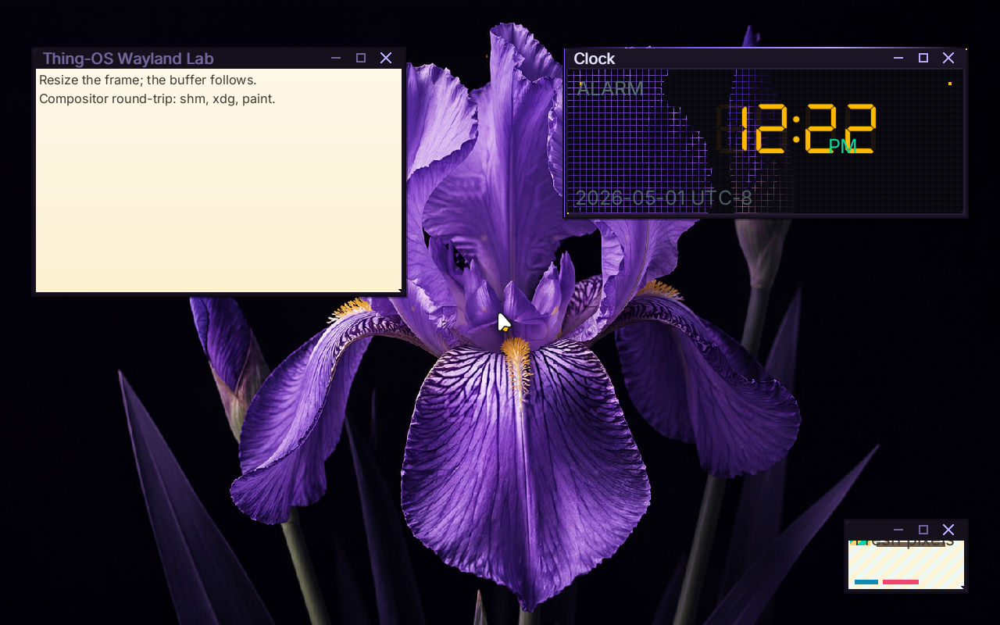

# ✅ Scenario: bloom uses the wallpaper watch without steady-state polling

> Last run: 2026-05-01 13:12:24

## Steps

| # | Step | Result | Duration | Before | After | Artifacts |
|---|------|--------|----------|--------|-------|-----------|
| 1 | Given the machine is booted | ✅ | 11441ms | <a href="./01/before.png"></a> | <a href="./01/after.png"></a> | [📜](./01/serial.log) |
| 2 | Then the serial output should contain "bloom: watching wallpaper config /session/desktop/wallpaper" within 60s | ✅ | 524ms | <a href="./02/before.png"></a> | <a href="./02/after.png"></a> | [📜](./02/serial.log) |
| 3 | When I wait for the shell prompt | ✅ | 998ms | <a href="./03/before.png"></a> | <a href="./03/after.png"></a> | [📜](./03/serial.log) [console_interactive.png](./03/console_interactive.png) |
| 4 | And I type "echo wallpaper-watch-idle" on the serial console | ✅ | 573ms | <a href="./04/before.png"></a> | <a href="./04/after.png"></a> | [📜](./04/serial.log) |
| 5 | And I wait for 2 seconds | ✅ | 1857ms | <a href="./05/before.png"></a> | <a href="./05/after.png"></a> | [📜](./05/serial.log) |
| 6 | Then the latest serial output should not contain "VFS: sys_fs_open path='/session/desktop/wallpaper'" | ✅ | 488ms | <a href="./06/before.png"></a> | <a href="./06/after.png"></a> |  |

<details>
<summary>📜 Full Serial Log</summary>

```
[=3h00BdsDxe: loading Boot0002 "UEFI QEMU DVD-ROM QM00005 " from PciRoot(0x0)/Pci(0x1F,0x2)/Sata(0x2,0xFFFF,0x0)
BdsDxe: starting Boot0002 "UEFI QEMU DVD-ROM QM00005 " from PciRoot(0x0)/Pci(0x1F,0x2)/Sata(0x2,0xFFFF,0x0)
[35052418929] [INFO ] [kernel::boot_progress] [CPU0] boot_progress: milestone="Framebuffer Initialized"
[35319156048] [INFO ] [kernel::boot_progress] [CPU0] boot_progress: milestone="Memory Map OK"
[35339683962] [INFO ] [kernel] [CPU0] Initializing global allocator...
[35372789001] [INFO ] [kernel::boot_progress] [CPU0] boot_progress: milestone="Global Allocator"
[35406282054] [INFO ] [kernel::boot_progress] [CPU0] boot_progress: milestone="Display Registry"
[35427105417] [INFO ] [kernel] [CPU0] Initializing SIMD...
[35429052747] [INFO ] [kernel::boot_progress] [CPU0] boot_progress: milestone="SIMD Ready"
[35467044195] [WARN ] [kernel::entropy] [CPU0] ENTROPY: no hardware RNG available, using timer fallback (weak entropy)
[35468820783] [INFO ] [kernel::boot_progress] [CPU0] boot_progress: milestone="SIMD Ready"
[35488761561] [INFO ] [kernel] [CPU0] Initializing tasking...
[35503495698] [INFO ] [kernel::sched] [CPU0] SCHED: 1 per-CPU scheduler(s) allocated
[35504214834] [INFO ] [kernel::sched] [CPU0] SCHED: per-CPU preemption initialized (1 independent preemption domains, no global preemption lock)
[35539794774] [INFO ] [kernel::sched] [CPU0] Scheduler initialized
[35540947959] [INFO ] [kernel::boot_progress] [CPU0] boot_progress: milestone="Tasking Initialized"
[35629123431] [INFO ] [kernel::boot_progress] [CPU0] boot_progress: milestone="VFS Root Ready"
[35710422891] [INFO ] [kernel::boot_progress] [CPU0] boot_progress: milestone="PCI Bus Scanned"
[35732838537] [INFO ] [kernel::boot_progress] [CPU0] boot_progress: milestone="Legacy Devices"
[35818267221] [INFO ] [kernel::boot_progress] [CPU0] boot_progress: milestone="BSP Timer OK"
[35922086277] [INFO ] [kernel::boot_progress] [CPU0] boot_progress: milestone="SMP Bring-up"
[35948963820] [INFO ] [kernel::boot_progress] [CPU0] boot_progress: milestone="Boot Info OK"
[35972991450] [INFO ] [kernel::boot_progress] [CPU0] boot_progress: milestone="Modules Scanned"
[36072323364] [INFO ] [kernel::boot_progress] [CPU0] boot_progress: hint="Press F12 for a terminal"
[36125157750] [INFO ] [kernel::boot_progress] [CPU0] boot_progress: milestone="Spawning Sprout"
[36260853255] [INFO ] [kernel::boot_progress] [CPU0] boot_progress: milestone="Entering Scheduler"
[36510028269] [INFO ] [kernel] [CPU0] [kernel:start] scheduler-entry total elapsed_ticks=949010040 elapsed_us=474505
[36510868350] [INFO ] [kernel] [CPU0] Entering scheduler loop.
[36666694218] [INFO ] [sprout] [CPU0] SPROUT: ENTERING MAIN (arg0=6291456)
[36672284451] [INFO ] [sprout] [CPU0] SPROUT: v0.4.1 [REBUILT] starting (Supervisor Mode)...
[36720111252] [INFO ] [sprout::supervisor] [CPU0] SPROUT: Initializing Supervisor...
[36765026859] [INFO ] [sprout::supervisor] [CPU0] SPROUT: Supervisor session started (FULL PIPELINE MODE)
[36775601610] [INFO ] [sprout::supervisor] [CPU0] SPROUT: Launching serial shell...
[36779220423] [INFO ] [sprout::pipelines] [CPU0] SPROUT: Setting up serial shell on /dev/console...
[36876092715] [INFO ] [sprout::pipelines] [CPU0] SPROUT: Spawned serial shell '/bin/sh' (PID=6)
[36879467196] [INFO ] [sprout::supervisor] [CPU0] SPROUT: Serial shell launched; yielding 50ms so the prompt can take the foreground
[36890623308] [INFO ] [sh] [CPU3] SH: starting v0.1.0-debug

        .-.
       /   \        THING-OS
      |     |       "People, places, things."
       \   /        
        `-'        
       /   \        v0.1  ��  
      |     |       2026-04-16
       \   /
        `-'

--------------------------------------------------------------
 sprout has taken root. the system is awake.

  try:
    ls /bin       browse available shoots
    ps            observe living processes
    cat /version  inspect the genome

--------------------------------------------------------------
THING-OS [BOOT] / > [?25h[37050885795] [INFO ] [sprout::supervisor] [CPU0] SPROUT: Continuing supervisor startup
[37052753232] [INFO ] [sprout::supervisor] [CPU0] SPROUT: Spawning cambium for driver discovery...
[37089200247] [INFO ] [sprout::pipelines] [CPU0] SPROUT: Skipping early /hosts mount; mesocarp is disabled in init
[37091493318] [INFO ] [sprout::supervisor] [CPU0] SPROUT: Starting full pipeline (graphics + input)
[37092988284] [INFO ] [sprout::supervisor] [CPU0] SPROUT: Entering supervisor service loop (tick=100ms)
[37093666731] [INFO ] [cambium] [CPU1] CAMBIUM: main started
[37117487352] [INFO ] [cambium] [CPU1] CAMBIUM: starting device discovery manager (daemon mode)
[37131117936] [INFO ] [sprout::pipelines] [CPU0] SPROUT: Spawned bristle (PID=8)
[37135915179] [INFO ] [sprout::supervisor] [CPU0] SPROUT: Starting display pipeline setup
[37137582174] [INFO ] [sprout::pipelines] [CPU0] SPROUT: Probing /dev/fb0 for boot framebuffer metadata
[37150686045] [INFO ] [sprout::pipelines] [CPU0] SPROUT: /dev/fb0 ready width=1920 height=1080 stride=7680 format=2
[37155736035] [INFO ] [sprout::pipelines] [CPU0] SPROUT: Selected display driver '/drivers/display_virtio_gpu'
[37157078046] [INFO ] [sprout::pipelines] [CPU0] SPROUT: Creating display request port
[37167869343] [INFO ] [sprout::pipelines] [CPU0] SPROUT: Creating display response port
[37170386088] [INFO ] [sprout::pipelines] [CPU0] SPROUT: Creating display bootstrap memfd
[37176007869] [INFO ] [sprout::pipelines] [CPU0] SPROUT: Mapping display bootstrap memfd
[37182012648] [INFO ] [sprout::pipelines] [CPU0] SPROUT: Launching display driver '/drivers/display_virtio_gpu' (boot_fd=3, bind_id=322371585)
[37193726592] [INFO ] [bristle] [CPU2] bristle: published pid 8 to /run/bristle/pid
[37206904350] [INFO ] [bristle] [CPU2] bristle: published device handles kbd_in=1 mouse_in=3
[37219813323] [INFO ] [bristle] [CPU2] bristle: online (kbd_tok=Some(WaitToken(2)), mouse_tok=Some(WaitToken(3)))
[37244384067] [INFO ] [sprout::supervisor] [CPU0] SPROUT: Display pipeline initialized (backend=virtio_gpu)
[37252445076] [INFO ] [display_virtio_gpu] [CPU3] display_virtio_gpu: starting v0.4.1 (boot_arg=3)
[37346650605] [INFO ] [virtio_gpu] [CPU3] virtio_gpu: caps from sysfs - common BAR2 off=0x1000, notify BAR2 off=0x3000 mult=4
[37357382601] [INFO ] [virtio_gpu] [CPU3] virtio_gpu: device features=0x30000002 virgl=false
[37368790800] [INFO ] [virtio_gpu] [CPU3] virtio_gpu: cursor queue (queue 1) configured
[37369981770] [INFO ] [display_virtio_gpu] [CPU3] display_virtio_gpu: GPU initialized successfully
[37370674671] [INFO ] [display_virtio_gpu] [CPU3] display_virtio_gpu: composition paths: gpu_opaque_copy=enabled cpu_alpha_blend=enabled
[37380858999] [INFO ] [display_virtio_gpu] [CPU3] display_virtio_gpu: host scanout 1280x800 enabled=true (bootfb was 1920x1080)
[37402247520] [INFO ] [cambium::catalog] [CPU1] DEVD CATALOG: registered driver '/drivers/ahci_disk' name='ahci_disk' class=Block kind='dev.storage.Ahci' start='thingos_driver_start_safe'
[37570043049] [INFO ] [cambium::catalog] [CPU1] DEVD CATALOG: registered driver '/drivers/ata_disk' name='ata_disk' class=Block kind='dev.storage.Ide' start='thingos_driver_start_safe'
[37631078496] [INFO ] [display_virtio_gpu] [CPU3] display_virtio_gpu: cursor DMA buffer ready (16 pages at phys=0x2723000)
[37695427374] [INFO ] [sprout::supervisor] [CPU0] SPROUT: Mounted /dev/display/card0 successfully
[37705392780] [INFO ] [display_virtio_gpu] [CPU3] display_virtio_gpu: Sovereign registration COMPLETE. Assigned: /dev/display/card0
[37709544774] [INFO ] [display_virtio_gpu] [CPU3] display_virtio_gpu: VFS provider loop online
[37712603643] [INFO ] [sprout::supervisor] [CPU0] SPROUT: Display service is ready at /dev/display/card0
[37740600645] [INFO ] [cambium::catalog] [CPU1] DEVD CATALOG: registered driver '/drivers/chime' name='chime' class=Audio kind='dev.sound.Chime' start='thingos_driver_start_safe'
[37940521971] [INFO ] [cambium::catalog] [CPU1] DEVD CATALOG: registered driver '/drivers/display_bootfb' name='display_bootfb' class=Display kind='dev.display.Gpu' start='thingos_driver_start_safe'
[38117096391] [INFO ] [cambium::catalog] [CPU1] DEVD CATALOG: registered driver '/drivers/display_virtio_gpu' name='display_virtio_gpu' class=Display kind='dev.display.Gpu' start='thingos_driver_start_safe'
[38122335009] [INFO ] [sprout::supervisor] [CPU0] SPROUT: Spawned bloom (PID=10)
[38218312374] [INFO ] [bloom] [CPU1] bloom: ENTERING MAIN
[38219963892] [INFO ] [bloom] [CPU1] bloom: compositor service starting
[38369679876] [INFO ] [cambium::catalog] [CPU1] DEVD CATALOG: registered driver '/drivers/hdaudio' name='hdaudio' class=Audio kind='dev.sound.Hda' start='thingos_driver_start_safe'
[38462178315] [INFO ] [bloom] [CPU1] bloom: connected to /dev/display/card0 on try 0
[38484096255] [INFO ] [bloom] [CPU1] bloom: output0 1280x800 @ 60000mHz
[38486383518] [INFO ] [bloom] [CPU1] bloom: display driver does not support VBLANK
[38487245643] [INFO ] [bloom] [CPU1] bloom: display driver supports linear dmabuf import
[38487949863] [INFO ] [bloom] [CPU1] bloom: display driver supports GPU blit (hardware transfer/flush)
[38488605276] [INFO ] [bloom] [CPU1] bloom: display driver supports direct scanout (zero-copy path to display)
[38489265309] [INFO ] [bloom] [CPU1] bloom: display driver supports partial flush (damage regions)
[38489880759] [INFO ] [bloom] [CPU1] bloom: display driver supports resource cache (pre-allocated buffer pool)
[38490570855] [INFO ] [bloom] [CPU1] bloom: creating service port...
[38808132759] [INFO ] [bloom::render] [CPU1] bloom: pistil background renderer loaded from /lib/libpistil.so
[38809533345] [INFO ] [bloom::render] [CPU1] bloom: pistil font text renderer loaded with default /share/fonts/Inter-Regular.ttf
[38810426754] [INFO ] [bloom::render] [CPU1] bloom: pistil symbol renderer loaded with /share/fonts/NotoSansSymbol2-Regular.ttf
[38819421135] [INFO ] [bloom] [CPU1] bloom: initial theme configured Facet Frame
[39128456895] [INFO ] [cambium::catalog] [CPU1] DEVD CATALOG: registered driver '/drivers/hwrng' name='hwrng' class=Other kind='dev.rng.HwRng' start='_RNvCs7wlZbVUrQWf_5hwrng20thingos_driver_start'
[39311182581] [INFO ] [bloom] [CPU1] bloom: initial wallpaper configured /share/wallpapers/flower.png
[39480180003] [INFO ] [cambium::catalog] [CPU1] DEVD CATALOG: registered driver '/drivers/pci_stubd' name='pci_stubd' class=Other kind='drv.PciStubd' start='thingos_driver_start_safe'
[39581446806] [INFO ] [bloom::render] [CPU1] bloom: cursor ready buffer=2 size=48x48 hotspot=11,6
[39593697264] [INFO ] [bloom] [CPU1] bloom: watching wallpaper config /session/desktop/wallpaper
[39596492232] [INFO ] [bloom] [CPU1] bloom: watching theme config /session/desktop/theme
[39729204867] [INFO ] [cambium::catalog] [CPU1] DEVD CATALOG: registered driver '/drivers/ps2_kbd' name='ps2_kbd' class=Input kind='drv.Ps2Keyboard' start='thingos_driver_start_safe'
[39912966522] [INFO ] [bloom] [CPU1] bloom: Wayland server thread spawned
[39914960052] [INFO ] [bloom::loop_types] [CPU1] bloom: service loop started
[39915945531] [INFO ] [bloom::loop_types] [CPU1] bloom: output0 1280x800 @ 60000mHz ready
[39918388422] [INFO ] [bloom::wayland] [CPU2] wayland-server: starting
[39932753685] [INFO ] [cambium::catalog] [CPU1] DEVD CATALOG: registered driver '/drivers/ps2_mouse' name='ps2_mouse' class=Input kind='drv.Ps2Mouse' start='thingos_driver_start_safe'
[39940027281] [INFO ] [bloom::wayland] [CPU2] wayland-server: listening on /run/wayland-0
[39941057508] [INFO ] [bloom::wayland] [CPU2] wayland-server: advertising globals wl_compositor wl_shm xdg_wm_base wl_seat wl_output wl_subcompositor wl_data_device_manager zwp_linux_dmabuf_v1
[40113992985] [INFO ] [cambium::catalog] [CPU1] DEVD CATALOG: registered driver '/drivers/rtc_cmos' name='rtc_cmos' class=Other kind='dev.rtc.Cmos' start='thingos_driver_start_safe'
[40199475987] [INFO ] [display_virtio_gpu] [CPU3] display_virtio_gpu: first commit copied buffer=1 rect=1280x800 src_px=0xff0b0a10 dst_px=0xff0b0a10 damage=1280x800+0,0 res_id=1 gpu_planes=0 cpu_planes=2
[40200996066] [INFO ] [display_virtio_gpu] [CPU3] display_virtio_gpu: cursor plane blended buffer=2 at 638,399 src_px=0x10202020 dst_before=0xff0b0a10 dst_after=0xff0c0b11
[40284258201] [INFO ] [bloom::loop_types] [CPU1] First frame rendered
[40293427284] [INFO ] [cambium::catalog] [CPU1] DEVD CATALOG: registered driver '/drivers/rtl8168d' name='rtl8168d' class=Net kind='dev.net.Nic' start='thingos_driver_start_safe'
[40312817490] [INFO ] [bloom::services::input_service] [CPU1] bloom: registered bristle pointer sink
[40318146264] [INFO ] [bristle] [CPU2] bristle: bloom sink registered (handle=5 mask=0x03)
ech[40453363137] [INFO ] [sprout::supervisor] [CPU0] SPROUT: Spawned wayland_hello (PID=12)
[40466814597] [INFO ] [wayland_hello] [CPU3] wayland_hello: connected to /run/wayland-0
[40480363209] [INFO ] [sprout::supervisor] [CPU0] SPROUT: Spawned clock (PID=13)
[40483651428] [INFO ] [cambium::catalog] [CPU1] DEVD CATALOG: registered driver '/drivers/virtio_netd' name='virtio_netd' class=Net kind='dev.net.Nic' start='thingos_driver_start_safe'
[40583685648] [INFO ] [clock] [CPU1] clock: running at low scheduler priority tid=13
[40587251298] [INFO ] [clock] [CPU1] clock: connected to /run/wayland-0
[40770619461] [INFO ] [wayland_hello] [CPU3] wayland_hello: pistil text renderer loaded with default /share/fonts/Inter-Regular.ttf
o BD[40799362362] [INFO ] [wayland_hello] [CPU3] wayland_hello: using zwp_linux_dmabuf_v1 buffers
[40801586364] [INFO ] [wayland_hello] [CPU3] wayland_hello: bound wp_presentation
[40806640248] [INFO ] [wayland_hello] [CPU3] wayland_hello: wl_region smoke test: create+add+set_opaque+destroy
D_CONSOLE[40883036535] [INFO ] [bloom::services::wayland_cmd] [CPU1] bloom: registered titlebar drag zone surface=1 height=28 frame=6
[40898016522] [INFO ] [bloom::wayland::dispatch] [CPU2] wayland-server: xdg_toplevel obj=12 assigned to xdg_surface=11
[40916377788] [INFO ] [clock] [CPU1] clock: pistil DSEG7 text renderer loaded with /share/fonts/DSEG7Classic-Regular.ttf
[40917503913] [INFO ] [clock] [CPU1] clock: pistil generic text renderer loaded with /share/fonts/Inter-Regular.ttf
_R[40979196258] [INFO ] [bloom::wayland::dispatch] [CPU2] wayland-server: imported dmabuf wl_buffer=111 480x320 format=0x34325241
[40998733116] [INFO ] [cambium::catalog] [CPU1] DEVD CATALOG: registered driver '/drivers/virtio_sound' name='virtio_sound' class=Audio kind='dev.sound.Virtio' start='thingos_driver_start_safe'
EA[41160897921] [INFO ] [cambium::catalog] [CPU1] DEVD CATALOG: registered driver '/drivers/xhci' name='xhci' class=Block kind='dev.usb.Xhci' start='thingos_driver_start_safe'
[41162856141] [INFO ] [cambium::catalog] [CPU1] DEVD CATALOG: 15 driver(s) found
[41219985807] [INFO ] [ahci_disk] [CPU2] AHCI: Starting AHCI VFS driver
DY_30[41269527321] [INFO ] [ahci_disk] [CPU2] AHCI: Claimed device /sys/devices/pci-0000:00:1f.2
[41286533673] [INFO ] [rtc_cmos] [CPU3] RTC: claimed /sys/devices/isa-0070 (handle=2)
[41292816114] [INFO ] [ahci_disk] [CPU2] AHCI: Mounted atapi2 at /dev/storage/atapi2
[41294534919] [INFO ] [ahci_disk] [CPU2] AHCI: Provider loop online at /dev/storage/atapi2
[41295833304] [INFO ] [ps2_kbd] [CPU1] ps2_kbd: bristle pid=8
[41310825237] [INFO ] [rtc_cmos] [CPU3] RTC: 2026-05-01 20:22:55 = 1777666975 unix_secs
[41312199027] [INFO ] [kernel::time] [CPU3] System clock anchored: unix_secs=1777666975, mono_ns=20655929002, offset=1777666954344070998ns
[41313011025] [INFO ] [rtc_cmos] [CPU3] RTC: System clock anchored to 1777666975 unix_secs
408[41334425913] [INFO ] [kernel::time] [CPU0] System clock tick: utc=2026-05-01 20:22:55.010511457 unix_secs=1777666975.010511457
49[41384043756] [INFO ] [ps2_mouse] [CPU2] ps2_mouse: bristle pid=8
[41421228090] [INFO ] [ps2_mouse] [CPU2] ps2_mouse: sample rate set to 60 Hz
_[41457854526] [INFO ] [bloom::services::wayland_cmd] [CPU1] bloom: registered titlebar drag zone surface=2 height=28 frame=6
[41465546760] [INFO ] [bloom::wayland::dispatch] [CPU2] wayland-server: xdg_toplevel obj=12 assigned to xdg_surface=11
[41467079709] [INFO ] [bloom::services::wallpaper] [CPU1] bloom: preparing background /share/wallpapers/flower.png
1777666975857552057
BDD_CONSOLE_READY_3040849_1777666975857552057
[?25l[?25hTHING-OS [OK] / > [?25hecho wallpaper-watch-idle
[?25lwallpaper-watch-idle
[?25hTHING-OS [OK] / > [?25h[45620179275] [INFO ] [bloom::services::wayland_cmd] [CPU1] bloom: registered titlebar drag zone surface=3 height=28 frame=6
[45637258194] [INFO ] [bloom::wayland::dispatch] [CPU2] wayland-server: xdg_popup obj=23 assigned to xdg_surface=21
[45662796300] [INFO ] [bloom::wayland::dispatch] [CPU2] wayland-server: imported dmabuf wl_buffer=121 160x96 format=0x34325241
[46436171265] [INFO ] [bloom::render] [CPU1] bloom: flat window overlays ready size=1280x800
[47343712746] [INFO ] [kernel::time] [CPU0] System clock tick: utc=2026-05-01 20:22:58.015772964 unix_secs=1777666978.015772964
[48048185064] [INFO ] [wayland_hello] [CPU3] wayland_hello: frame callback done object=1000 data=24011
[48050879481] [INFO ] [wayland_hello] [CPU3] wayland_hello: wp_presentation_feedback.presented object=1001 tv=24.015205813 refresh_ns=16666666 seq=0
[48392013945] [INFO ] [wayland_hello] [CPU3] wayland_hello: frame callback done object=1002 data=24191
[48393090042] [INFO ] [wayland_hello] [CPU3] wayland_hello: wp_presentation_feedback.presented object=1003 tv=24.193613779 refresh_ns=16666666 seq=1
[53353598661] [
```
</details>
