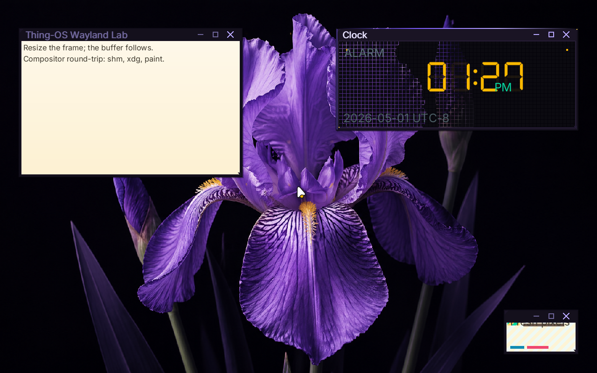

# ✅ Scenario: rtc anchors the system clock before the Wayland clock displays realtime

> Last run: 2026-05-01 14:19:59

## Steps

| # | Step | Result | Duration | Before | After | Artifacts |
|---|------|--------|----------|--------|-------|-----------|
| 1 | Given the machine is booted | ✅ | 12041ms | <a href="./01/before.png"></a> | <a href="./01/after.png"></a> | [📜](./01/serial.log) |
| 2 | Then the serial output should contain "RTC: claimed /sys/devices/isa-0070" within 180s | ✅ | 1167ms | <a href="./02/before.png"></a> | <a href="./02/after.png"></a> | [📜](./02/serial.log) |
| 3 | And the serial output should contain "RTC: System clock anchored" within 180s | ✅ | 134ms | <a href="./03/before.png"></a> | <a href="./03/after.png"></a> |  |
| 4 | And the serial output should contain "System clock tick:" within 180s | ✅ | 126ms | <a href="./04/before.png"></a> | <a href="./04/after.png"></a> |  |
| 5 | And the serial output should contain "clock: tick local=" within 180s | ✅ | 9033ms | <a href="./05/before.png"></a> | <a href="./05/after.png"></a> | [📜](./05/serial.log) |

<details>
<summary>📜 Full Serial Log</summary>

```
[=3h00BdsDxe: loading Boot0002 "UEFI QEMU DVD-ROM QM00005 " from PciRoot(0x0)/Pci(0x1F,0x2)/Sata(0x2,0xFFFF,0x0)
BdsDxe: starting Boot0002 "UEFI QEMU DVD-ROM QM00005 " from PciRoot(0x0)/Pci(0x1F,0x2)/Sata(0x2,0xFFFF,0x0)
[36649407762] [INFO ] [kernel::boot_progress] [CPU0] boot_progress: milestone="Framebuffer Initialized"
[36922666143] [INFO ] [kernel::boot_progress] [CPU0] boot_progress: milestone="Memory Map OK"
[36945001467] [INFO ] [kernel] [CPU0] Initializing global allocator...
[36991322577] [INFO ] [kernel::boot_progress] [CPU0] boot_progress: milestone="Global Allocator"
[37025669868] [INFO ] [kernel::boot_progress] [CPU0] boot_progress: milestone="Display Registry"
[37045972689] [INFO ] [kernel] [CPU0] Initializing SIMD...
[37048238502] [INFO ] [kernel::boot_progress] [CPU0] boot_progress: milestone="SIMD Ready"
[37089675447] [WARN ] [kernel::entropy] [CPU0] ENTROPY: no hardware RNG available, using timer fallback (weak entropy)
[37091593572] [INFO ] [kernel::boot_progress] [CPU0] boot_progress: milestone="SIMD Ready"
[37112440200] [INFO ] [kernel] [CPU0] Initializing tasking...
[37128786156] [INFO ] [kernel::sched] [CPU0] SCHED: 1 per-CPU scheduler(s) allocated
[37129565946] [INFO ] [kernel::sched] [CPU0] SCHED: per-CPU preemption initialized (1 independent preemption domains, no global preemption lock)
[37169606892] [INFO ] [kernel::sched] [CPU0] Scheduler initialized
[37170803274] [INFO ] [kernel::boot_progress] [CPU0] boot_progress: milestone="Tasking Initialized"
[37268183799] [INFO ] [kernel::boot_progress] [CPU0] boot_progress: milestone="VFS Root Ready"
[37353512724] [INFO ] [kernel::boot_progress] [CPU0] boot_progress: milestone="PCI Bus Scanned"
[37376656779] [INFO ] [kernel::boot_progress] [CPU0] boot_progress: milestone="Legacy Devices"
[37452554073] [INFO ] [kernel::boot_progress] [CPU0] boot_progress: milestone="BSP Timer OK"
[37562416254] [INFO ] [kernel::boot_progress] [CPU0] boot_progress: milestone="SMP Bring-up"
[37605419874] [INFO ] [kernel::boot_progress] [CPU0] boot_progress: milestone="Boot Info OK"
[37627911057] [INFO ] [kernel::boot_progress] [CPU0] boot_progress: milestone="Modules Scanned"
[37749965352] [INFO ] [kernel::boot_progress] [CPU0] boot_progress: hint="Press F12 for a terminal"
[37805361660] [INFO ] [kernel::boot_progress] [CPU0] boot_progress: milestone="Spawning Sprout"
[37943374623] [INFO ] [kernel::boot_progress] [CPU0] boot_progress: milestone="Entering Scheduler"
[38201990079] [INFO ] [kernel] [CPU0] [kernel:start] scheduler-entry total elapsed_ticks=1009934574 elapsed_us=504967
[38202943548] [INFO ] [kernel] [CPU0] Entering scheduler loop.
[38296548906] [INFO ] [sprout] [CPU0] SPROUT: ENTERING MAIN (arg0=6291456)
[38301100398] [INFO ] [sprout] [CPU0] SPROUT: v0.4.1 [REBUILT] starting (Supervisor Mode)...
[38420009595] [INFO ] [sprout::supervisor] [CPU0] SPROUT: Initializing Supervisor...
[38467671495] [INFO ] [sprout::supervisor] [CPU0] SPROUT: Supervisor session started (FULL PIPELINE MODE)
[38479248225] [INFO ] [sprout::supervisor] [CPU0] SPROUT: Launching serial shell...
[38481167538] [INFO ] [sprout::pipelines] [CPU0] SPROUT: Setting up serial shell on /dev/console...
[38586451398] [INFO ] [sprout::pipelines] [CPU0] SPROUT: Spawned serial shell '/bin/sh' (PID=6)
[38590025298] [INFO ] [sprout::supervisor] [CPU0] SPROUT: Serial shell launched; yielding 50ms so the prompt can take the foreground
[38602406304] [INFO ] [sh] [CPU3] SH: starting v0.1.0-debug

        .-.
       /   \        THING-OS
      |     |       "People, places, things."
       \   /        
        `-'        
       /   \        v0.1  •  
      |     |       2026-04-16
       \   /
        `-'

--------------------------------------------------------------
 sprout has taken root. the system is awake.

  try:
    ls /bin       browse available shoots
    ps            observe living processes
    cat /version  inspect the genome

--------------------------------------------------------------
THING-OS [BOOT] / > [?25h[38762050206] [INFO ] [sprout::supervisor] [CPU0] SPROUT: Continuing supervisor startup
[38763910614] [INFO ] [sprout::supervisor] [CPU0] SPROUT: Spawning cambium for driver discovery...
[38803833288] [INFO ] [sprout::pipelines] [CPU0] SPROUT: Skipping early /hosts mount; mesocarp is disabled in init
[38807950566] [INFO ] [sprout::supervisor] [CPU0] SPROUT: Starting full pipeline (graphics + input)
[38808712470] [INFO ] [cambium] [CPU1] CAMBIUM: main started
[38811303927] [INFO ] [sprout::supervisor] [CPU0] SPROUT: Entering supervisor service loop (tick=100ms)
[38834301330] [INFO ] [cambium] [CPU1] CAMBIUM: starting device discovery manager (daemon mode)
[38852771694] [INFO ] [sprout::pipelines] [CPU0] SPROUT: Spawned bristle (PID=8)
[38856338301] [INFO ] [sprout::supervisor] [CPU0] SPROUT: Starting display pipeline setup
[38858322591] [INFO ] [sprout::pipelines] [CPU0] SPROUT: Probing /dev/fb0 for boot framebuffer metadata
[38866250544] [INFO ] [sprout::pipelines] [CPU0] SPROUT: /dev/fb0 ready width=1920 height=1080 stride=7680 format=2
[38872446426] [INFO ] [sprout::pipelines] [CPU0] SPROUT: Selected display driver '/drivers/display_virtio_gpu'
[38874360624] [INFO ] [sprout::pipelines] [CPU0] SPROUT: Creating display request port
[38897574540] [INFO ] [sprout::pipelines] [CPU0] SPROUT: Creating display response port
[38902417719] [INFO ] [sprout::pipelines] [CPU0] SPROUT: Creating display bootstrap memfd
[38908447875] [INFO ] [sprout::pipelines] [CPU0] SPROUT: Mapping display bootstrap memfd
[38913820704] [INFO ] [sprout::pipelines] [CPU0] SPROUT: Launching display driver '/drivers/display_virtio_gpu' (boot_fd=3, bind_id=322371585)
[38932188570] [INFO ] [bristle] [CPU2] bristle: published pid 8 to /run/bristle/pid
[38952288804] [INFO ] [bristle] [CPU2] bristle: published device handles kbd_in=1 mouse_in=3
[38972018778] [INFO ] [bristle] [CPU2] bristle: online (kbd_tok=Some(WaitToken(2)), mouse_tok=Some(WaitToken(3)))
[39006375804] [INFO ] [sprout::supervisor] [CPU0] SPROUT: Display pipeline initialized (backend=virtio_gpu)
[39012447177] [INFO ] [display_virtio_gpu] [CPU3] display_virtio_gpu: starting v0.4.1 (boot_arg=3)
[39118170366] [INFO ] [virtio_gpu] [CPU3] virtio_gpu: caps from sysfs - common BAR2 off=0x1000, notify BAR2 off=0x3000 mult=4
[39132552393] [INFO ] [virtio_gpu] [CPU3] virtio_gpu: device features=0x30000002 virgl=false
[39149304117] [INFO ] [virtio_gpu] [CPU3] virtio_gpu: cursor queue (queue 1) configured
[39151151952] [INFO ] [display_virtio_gpu] [CPU3] display_virtio_gpu: GPU initialized successfully
[39152300781] [INFO ] [display_virtio_gpu] [CPU3] display_virtio_gpu: composition paths: gpu_opaque_copy=enabled cpu_alpha_blend=enabled
[39165494775] [INFO ] [display_virtio_gpu] [CPU3] display_virtio_gpu: host scanout 1280x800 enabled=true (bootfb was 1920x1080)
[39206075667] [INFO ] [cambium::catalog] [CPU1] DEVD CATALOG: registered driver '/drivers/ahci_disk' name='ahci_disk' class=Block kind='dev.storage.Ahci' start='thingos_driver_start_safe'
[39397624266] [INFO ] [cambium::catalog] [CPU1] DEVD CATALOG: registered driver '/drivers/ata_disk' name='ata_disk' class=Block kind='dev.storage.Ide' start='thingos_driver_start_safe'
[39577134003] [INFO ] [display_virtio_gpu] [CPU3] display_virtio_gpu: cursor DMA buffer ready (16 pages at phys=0x2723000)
[39669819255] [INFO ] [cambium::catalog] [CPU1] DEVD CATALOG: registered driver '/drivers/chime' name='chime' class=Audio kind='dev.sound.Chime' start='thingos_driver_start_safe'
[39715767300] [INFO ] [sprout::supervisor] [CPU0] SPROUT: Mounted /dev/display/card0 successfully
[39725360631] [INFO ] [display_virtio_gpu] [CPU3] display_virtio_gpu: Sovereign registration COMPLETE. Assigned: /dev/display/card0
[39731609874] [INFO ] [display_virtio_gpu] [CPU3] display_virtio_gpu: VFS provider loop online
[39736396161] [INFO ] [sprout::supervisor] [CPU0] SPROUT: Display service is ready at /dev/display/card0
[39886982421] [INFO ] [cambium::catalog] [CPU1] DEVD CATALOG: registered driver '/drivers/display_bootfb' name='display_bootfb' class=Display kind='dev.display.Gpu' start='thingos_driver_start_safe'
[40145480562] [INFO ] [cambium::catalog] [CPU1] DEVD CATALOG: registered driver '/drivers/display_virtio_gpu' name='display_virtio_gpu' class=Display kind='dev.display.Gpu' start='thingos_driver_start_safe'
[40184776203] [INFO ] [sprout::supervisor] [CPU0] SPROUT: Spawned bloom (PID=10)
[40282035321] [INFO ] [bloom] [CPU1] bloom: ENTERING MAIN
[40283313873] [INFO ] [bloom] [CPU1] bloom: compositor service starting
[40458856647] [INFO ] [cambium::catalog] [CPU1] DEVD CATALOG: registered driver '/drivers/hdaudio' name='hdaudio' class=Audio kind='dev.sound.Hda' start='thingos_driver_start_safe'
[40480743105] [INFO ] [bloom] [CPU1] bloom: connected to /dev/display/card0 on try 0
[40506718923] [INFO ] [bloom] [CPU1] bloom: output0 1280x800 @ 60000mHz
[40507936425] [INFO ] [bloom] [CPU1] bloom: display driver does not support VBLANK
[40508862834] [INFO ] [bloom] [CPU1] bloom: display driver supports linear dmabuf import
[40509646155] [INFO ] [bloom] [CPU1] bloom: display driver supports GPU blit (hardware transfer/flush)
[40510514022] [INFO ] [bloom] [CPU1] bloom: display driver supports direct scanout (zero-copy path to display)
[40511190192] [INFO ] [bloom] [CPU1] bloom: display driver supports partial flush (damage regions)
[40512206691] [INFO ] [bloom] [CPU1] bloom: display driver supports resource cache (pre-allocated buffer pool)
[40513165473] [INFO ] [bloom] [CPU1] bloom: creating service port...
[41021547039] [INFO ] [bloom::render] [CPU1] bloom: pistil background renderer loaded from /lib/libpistil.so
[41023289373] [INFO ] [bloom::render] [CPU1] bloom: pistil font text renderer loaded with default /share/fonts/Inter-Regular.ttf
[41024747379] [INFO ] [bloom::render] [CPU1] bloom: pistil symbol renderer loaded with /share/fonts/NotoSansSymbol2-Regular.ttf
[41034878412] [INFO ] [bloom] [CPU1] bloom: initial theme configured Facet Frame
[41247113721] [INFO ] [cambium::catalog] [CPU1] DEVD CATALOG: registered driver '/drivers/hwrng' name='hwrng' class=Other kind='dev.rng.HwRng' start='_RNvCs7wlZbVUrQWf_5hwrng20thingos_driver_start'
[41411431611] [INFO ] [cambium::catalog] [CPU1] DEVD CATALOG: registered driver '/drivers/pci_stubd' name='pci_stubd' class=Other kind='drv.PciStubd' start='thingos_driver_start_safe'
[41573683734] [INFO ] [cambium::catalog] [CPU1] DEVD CATALOG: registered driver '/drivers/ps2_kbd' name='ps2_kbd' class=Input kind='drv.Ps2Keyboard' start='thingos_driver_start_safe'
[41795984076] [INFO ] [cambium::catalog] [CPU1] DEVD CATALOG: registered driver '/drivers/ps2_mouse' name='ps2_mouse' class=Input kind='drv.Ps2Mouse' start='thingos_driver_start_safe'
[41970079206] [INFO ] [bloom] [CPU1] bloom: initial wallpaper configured /share/wallpapers/flower.png
[42115984317] [INFO ] [cambium::catalog] [CPU1] DEVD CATALOG: registered driver '/drivers/rtc_cmos' name='rtc_cmos' class=Other kind='dev.rtc.Cmos' start='thingos_driver_start_safe'
[42208366860] [INFO ] [bloom::render] [CPU1] bloom: cursor ready buffer=2 size=48x48 hotspot=11,6
[42218352693] [INFO ] [bloom] [CPU1] bloom: watching wallpaper config /session/desktop/wallpaper
[42221312232] [INFO ] [bloom] [CPU1] bloom: watching theme config /session/desktop/theme
[42264758712] [INFO ] [sprout::supervisor] [CPU0] SPROUT: Spawned wayland_hello (PID=11)
[42277975080] [INFO ] [bloom] [CPU1] bloom: Wayland server thread spawned
[42281277159] [INFO ] [bloom::loop_types] [CPU1] bloom: service loop started
[42282587391] [INFO ] [bloom::wayland] [CPU3] wayland-server: starting
[42282665634] [INFO ] [bloom::loop_types] [CPU1] bloom: output0 1280x800 @ 60000mHz ready
[42289717074] [INFO ] [sprout::supervisor] [CPU0] SPROUT: Spawned clock (PID=13)
[42296657238] [INFO ] [bloom::wayland] [CPU3] wayland-server: listening on /run/wayland-0
[42299313969] [INFO ] [bloom::wayland] [CPU3] wayland-server: advertising globals wl_compositor wl_shm xdg_wm_base wl_seat wl_output wl_subcompositor wl_data_device_manager zwp_linux_dmabuf_v1
[42377920629] [INFO ] [cambium::catalog] [CPU1] DEVD CATALOG: registered driver '/drivers/rtl8168d' name='rtl8168d' class=Net kind='dev.net.Nic' start='thingos_driver_start_safe'
[42443021148] [INFO ] [wayland_hello] [CPU2] wayland_hello: connected to /run/wayland-0
[42479420280] [INFO ] [clock] [CPU1] clock: running at low scheduler priority tid=13
[42483008337] [INFO ] [clock] [CPU1] clock: connected to /run/wayland-0
[42652275600] [INFO ] [display_virtio_gpu] [CPU3] display_virtio_gpu: first commit copied buffer=1 rect=1280x800 src_px=0xff0b0a10 dst_px=0xff0b0a10 damage=1280x800+0,0 res_id=1 gpu_planes=0 cpu_planes=2
[42654658299] [INFO ] [display_virtio_gpu] [CPU3] display_virtio_gpu: cursor plane blended buffer=2 at 638,399 src_px=0x10202020 dst_before=0xff0b0a10 dst_after=0xff0c0b11
[42757128249] [INFO ] [bloom::loop_types] [CPU1] First frame rendered
[42775709163] [INFO ] [wayland_hello] [CPU2] wayland_hello: pistil text renderer loaded with default /share/fonts/Inter-Regular.ttf
[42824800722] [INFO ] [bloom::services::input_service] [CPU1] bloom: registered bristle pointer sink
[42830688483] [INFO ] [bristle] [CPU2] bristle: bloom sink registered (handle=5 mask=0x03)
[42836244693] [INFO ] [wayland_hello] [CPU2] wayland_hello: using zwp_linux_dmabuf_v1 buffers
[42837748041] [INFO ] [wayland_hello] [CPU2] wayland_hello: bound wp_presentation
[42843379194] [INFO ] [wayland_hello] [CPU2] wayland_hello: wl_region smoke test: create+add+set_opaque+destroy
[42852451125] [INFO ] [clock] [CPU1] clock: pistil DSEG7 text renderer loaded with /share/fonts/DSEG7Classic-Regular.ttf
[42853983414] [INFO ] [clock] [CPU1] clock: pistil generic text renderer loaded with /share/fonts/Inter-Regular.ttf
[42939892842] [INFO ] [cambium::catalog] [CPU1] DEVD CATALOG: registered driver '/drivers/virtio_netd' name='virtio_netd' class=Net kind='dev.net.Nic' start='thingos_driver_start_safe'
[43105952934] [INFO ] [cambium::catalog] [CPU1] DEVD CATALOG: registered driver '/drivers/virtio_sound' name='virtio_sound' class=Audio kind='dev.sound.Virtio' start='thingos_driver_start_safe'
[43275936693] [INFO ] [cambium::catalog] [CPU1] DEVD CATALOG: registered driver '/drivers/xhci' name='xhci' class=Block kind='dev.usb.Xhci' start='thingos_driver_start_safe'
[43277893659] [INFO ] [cambium::catalog] [CPU1] DEVD CATALOG: 15 driver(s) found
[43338867924] [INFO ] [ahci_disk] [CPU2] AHCI: Starting AHCI VFS driver
[43377503565] [INFO ] [ahci_disk] [CPU2] AHCI: Claimed device /sys/devices/pci-0000:00:1f.2
[43397879184] [INFO ] [ahci_disk] [CPU2] AHCI: Mounted atapi2 at /dev/storage/atapi2
[43400614785] [INFO ] [ahci_disk] [CPU2] AHCI: Provider loop online at /dev/storage/atapi2
[43417892694] [INFO ] [rtc_cmos] [CPU3] RTC: claimed /sys/devices/isa-0070 (handle=2)
[43442391795] [INFO ] [ps2_kbd] [CPU1] ps2_kbd: bristle pid=8
[43458292581] [INFO ] [bloom::services::wayland_cmd] [CPU1] bloom: registered titlebar drag zone surface=1 height=28 frame=6
[43472250063] [INFO ] [rtc_cmos] [CPU3] RTC: 2026-05-01 21:27:15 = 1777670835 unix_secs
[43473796410] [INFO ] [kernel::time] [CPU3] System clock anchored: unix_secs=1777670835, mono_ns=21736718355, offset=1777670813263281645ns
[43474794495] [INFO ] [rtc_cmos] [CPU3] RTC: System clock anchored to 1777670835 unix_secs
[43483603680] [INFO ] [kernel::time] [CPU0] System clock tick: utc=2026-05-01 21:27:15.004263616 unix_secs=1777670835.004263616
[43498984419] [INFO ] [bloom::wayland::dispatch] [CPU3] wayland-server: xdg_toplevel obj=12 assigned to xdg_surface=11
[43561083918] [INFO ] [ps2_mouse] [CPU2] ps2_mouse: bristle pid=8
[43594833117] [INFO ] [bloom::wayland::dispatch] [CPU3] wayland-server: imported dmabuf wl_buffer=111 480x320 format=0x34325241
[43803335202] [INFO ] [bloom::services::wallpaper] [CPU1] bloom: preparing background /share/wallpapers/flower.png
[45527946321] [INFO ] [ps2_kbd] [CPU1] ps2_kbd: read scancode 0x47
[45530635656] [INFO ] [ps2_kbd] [CPU1] ps2_kbd: edge detected: Down { key: Unknown, mods: Mods(0), repeat: false }
[45533700828] [INFO ] [ps2_kbd] [CPU1] ps2_kbd: sent Unknown to bristle (pid=8)
[45540955515] [INFO ] [bristle] [CPU2] bristle: KeyDown received: Unknown
[45559650774] [INFO ] [ps2_mouse] [CPU2] ps2_mouse: sample rate set to 60 Hz
[46850813757] [INFO ] [bloom::input] [CPU1] bloom: KeyDown received: Unknown (raw=0xffff, mods=Mods(0), repeat=false)
[46856964330] [INFO ] [bloom::services::wayland_cmd] [CPU1] bloom: registered titlebar drag zone surface=2 height=28 frame=6
[46868539575] [INFO ] [bloom::wayland::dispatch] [CPU3] wayland-server: xdg_toplevel obj=12 assigned to xdg_surface=11
[47150880975] [INFO ] [bloom::services::wayland_cmd] [CPU1] bloom: registered titlebar drag zone surface=3 height=28 frame=6
[47162458068] [INFO ] [bloom::wayland::dispatch] [CPU3] wayland-server: xdg_popup obj=23 assigned to xdg_surface=21
[47186542062] [INFO ] [bloom::wayland::dispatch] [CPU3] wayland-server: imported dmabuf wl_buffer=121 160x96 format=0x34325241
[48124356819] [INFO ] [bloom::render] [CPU1] bloom: flat window overlays ready size=1280x800
[49511849805] [INFO ] [kernel::time] [CPU0] System clock tick: utc=2026-05-01 21:27:18.019119609 unix_secs=1777670838.019119609
[50974639122] [INFO ] [wayland_hello] [CPU2] wayland_hello: frame callback done object=1000 data=25478
[50977740561] [INFO ] [wayland_hello] [CPU2] wayland_hello: wp_presentation_feedback.presented object=1001 tv=25.484100163 refresh_ns=16666666 seq=0
[51339352416] [INFO ] [wayland_hello] [CPU2] wayland_hello: frame callback done object=1002 data=25663
[51340920939] [INFO ] [wayland_hello] [CPU2] wayland_hello: wp_presentation_feedback.presented object=1003 tv=25.667811196 refresh_ns=16666666 seq=1
[55541290893] [INFO ] [kernel::time] [CPU0] System clock tick: utc=2026-05-01 21:27:21.033856669 unix_secs=1777670841.033856669
[61571461512] [INFO ] [kernel::time] [CPU0] System clock tick: utc=2026-05-01 21:27:24.048938299 unix_secs=1777670844.048938299
[67600451160] [INFO ] [kernel::time] [CPU0] System clock tick: utc=2026-05-01 21:27:27.063465909 unix_secs=1777670847.063465909
[73629998805] [INFO ] [kernel::time] [CPU0] System clock tick: utc=2026-05-01 21:27:30.078242718 unix_secs=1777670850.078242718
[74386136022] [[3
```
</details>
