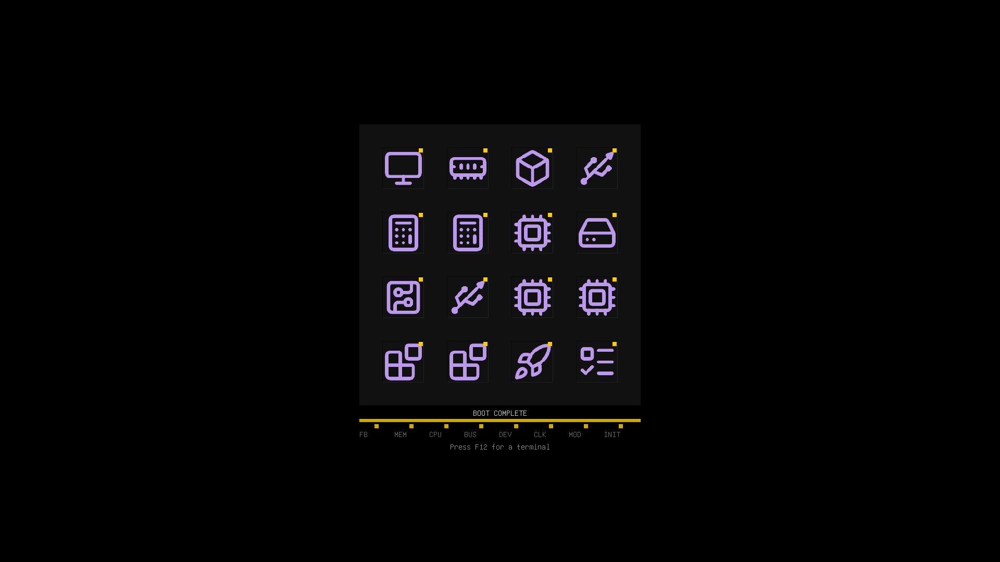
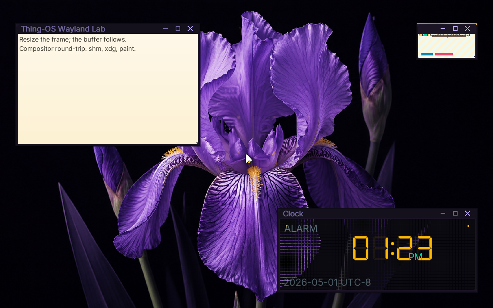

# ✅ Scenario: sprout launches the Wayland clock client

> Last run: 2026-05-01 14:19:59

## Steps

| # | Step | Result | Duration | Before | After | Artifacts |
|---|------|--------|----------|--------|-------|-----------|
| 1 | Given the machine is booted | ✅ | 11404ms | <a href="./01/before.png"></a> | <a href="./01/after.png"></a> | [📜](./01/serial.log) |
| 2 | Then the serial output should contain "SPROUT: Spawned clock" within 180s | ✅ | 731ms | <a href="./02/before.png"></a> | <a href="./02/after.png"></a> | [📜](./02/serial.log) |
| 3 | And the serial output should contain "clock: connected to /run/wayland-0" within 180s | ✅ | 168ms | <a href="./03/before.png"></a> | <a href="./03/after.png"></a> | [📜](./03/serial.log) |
| 4 | And the serial output should contain "clock: pistil DSEG7 text renderer loaded with /share/fonts/DSEG7Classic-Regular.ttf" within 180s | ✅ | 171ms | <a href="./04/before.png"></a> | <a href="./04/after.png"></a> | [📜](./04/serial.log) |
| 5 | And the serial output should contain "System clock tick:" within 180s | ✅ | 852ms | <a href="./05/before.png"></a> | <a href="./05/after.png"></a> | [📜](./05/serial.log) |
| 6 | And the serial output should contain "clock: tick local=" within 180s | ✅ | 9009ms | <a href="./06/before.png"></a> | <a href="./06/after.png"></a> | [📜](./06/serial.log) |

<details>
<summary>📜 Full Serial Log</summary>

```
[=3h00BdsDxe: loading Boot0002 "UEFI QEMU DVD-ROM QM00005 " from PciRoot(0x0)/Pci(0x1F,0x2)/Sata(0x2,0xFFFF,0x0)
BdsDxe: starting Boot0002 "UEFI QEMU DVD-ROM QM00005 " from PciRoot(0x0)/Pci(0x1F,0x2)/Sata(0x2,0xFFFF,0x0)
[34634612100] [INFO ] [kernel::boot_progress] [CPU0] boot_progress: milestone="Framebuffer Initialized"
[34894488684] [INFO ] [kernel::boot_progress] [CPU0] boot_progress: milestone="Memory Map OK"
[34914393426] [INFO ] [kernel] [CPU0] Initializing global allocator...
[34946283570] [INFO ] [kernel::boot_progress] [CPU0] boot_progress: milestone="Global Allocator"
[34978699833] [INFO ] [kernel::boot_progress] [CPU0] boot_progress: milestone="Display Registry"
[34997810397] [INFO ] [kernel] [CPU0] Initializing SIMD...
[34999672158] [INFO ] [kernel::boot_progress] [CPU0] boot_progress: milestone="SIMD Ready"
[35038275558] [WARN ] [kernel::entropy] [CPU0] ENTROPY: no hardware RNG available, using timer fallback (weak entropy)
[35040177711] [INFO ] [kernel::boot_progress] [CPU0] boot_progress: milestone="SIMD Ready"
[35060197062] [INFO ] [kernel] [CPU0] Initializing tasking...
[35075003040] [INFO ] [kernel::sched] [CPU0] SCHED: 1 per-CPU scheduler(s) allocated
[35075709867] [INFO ] [kernel::sched] [CPU0] SCHED: per-CPU preemption initialized (1 independent preemption domains, no global preemption lock)
[35111500314] [INFO ] [kernel::sched] [CPU0] Scheduler initialized
[35112900537] [INFO ] [kernel::boot_progress] [CPU0] boot_progress: milestone="Tasking Initialized"
[35203249620] [INFO ] [kernel::boot_progress] [CPU0] boot_progress: milestone="VFS Root Ready"
[35284181361] [INFO ] [kernel::boot_progress] [CPU0] boot_progress: milestone="PCI Bus Scanned"
[35305845861] [INFO ] [kernel::boot_progress] [CPU0] boot_progress: milestone="Legacy Devices"
[35383810308] [INFO ] [kernel::boot_progress] [CPU0] boot_progress: milestone="BSP Timer OK"
[35486185548] [INFO ] [kernel::boot_progress] [CPU0] boot_progress: milestone="SMP Bring-up"
[35513552316] [INFO ] [kernel::boot_progress] [CPU0] boot_progress: milestone="Boot Info OK"
[35536563612] [INFO ] [kernel::boot_progress] [CPU0] boot_progress: milestone="Modules Scanned"
[35633688552] [INFO ] [kernel::boot_progress] [CPU0] boot_progress: hint="Press F12 for a terminal"
[35684406219] [INFO ] [kernel::boot_progress] [CPU0] boot_progress: milestone="Spawning Sprout"
[35816151096] [INFO ] [kernel::boot_progress] [CPU0] boot_progress: milestone="Entering Scheduler"
[36078634779] [INFO ] [kernel] [CPU0] [kernel:start] scheduler-entry total elapsed_ticks=945369711 elapsed_us=472684
[36079503801] [INFO ] [kernel] [CPU0] Entering scheduler loop.
[36165807942] [INFO ] [sprout] [CPU0] SPROUT: ENTERING MAIN (arg0=6291456)
[36170761077] [INFO ] [sprout] [CPU0] SPROUT: v0.4.1 [REBUILT] starting (Supervisor Mode)...
[36211439418] [INFO ] [sprout::supervisor] [CPU0] SPROUT: Initializing Supervisor...
[36253298400] [INFO ] [sprout::supervisor] [CPU0] SPROUT: Supervisor session started (FULL PIPELINE MODE)
[36262417158] [INFO ] [sprout::supervisor] [CPU0] SPROUT: Launching serial shell...
[36263951295] [INFO ] [sprout::pipelines] [CPU0] SPROUT: Setting up serial shell on /dev/console...
[36370718208] [INFO ] [sprout::pipelines] [CPU0] SPROUT: Spawned serial shell '/bin/sh' (PID=6)
[36375519081] [INFO ] [sprout::supervisor] [CPU0] SPROUT: Serial shell launched; yielding 50ms so the prompt can take the foreground
[36384765582] [INFO ] [sh] [CPU3] SH: starting v0.1.0-debug

        .-.
       /   \        THING-OS
      |     |       "People, places, things."
       \   /        
        `-'        
       /   \        v0.1  ��  
      |     |       2026-04-16
       \   /
        `-'

--------------------------------------------------------------
 sprout has taken root. the system is awake.

  try:
    ls /bin       browse available shoots
    ps            observe living processes
    cat /version  inspect the genome

--------------------------------------------------------------
THING-OS [BOOT] / > [?25h[36562059633] [INFO ] [sprout::supervisor] [CPU0] SPROUT: Continuing supervisor startup
[36564716331] [INFO ] [sprout::supervisor] [CPU0] SPROUT: Spawning cambium for driver discovery...
[36608267553] [INFO ] [sprout::pipelines] [CPU0] SPROUT: Skipping early /hosts mount; mesocarp is disabled in init
[36612742881] [INFO ] [cambium] [CPU1] CAMBIUM: main started
[36613032522] [INFO ] [sprout::supervisor] [CPU0] SPROUT: Starting full pipeline (graphics + input)
[36616381329] [INFO ] [sprout::supervisor] [CPU0] SPROUT: Entering supervisor service loop (tick=100ms)
[36644063808] [INFO ] [cambium] [CPU1] CAMBIUM: starting device discovery manager (daemon mode)
[36667075236] [INFO ] [sprout::pipelines] [CPU0] SPROUT: Spawned bristle (PID=8)
[36672589833] [INFO ] [sprout::supervisor] [CPU0] SPROUT: Starting display pipeline setup
[36675337545] [INFO ] [sprout::pipelines] [CPU0] SPROUT: Probing /dev/fb0 for boot framebuffer metadata
[36714492969] [INFO ] [sprout::pipelines] [CPU0] SPROUT: /dev/fb0 ready width=1920 height=1080 stride=7680 format=2
[36721926417] [INFO ] [sprout::pipelines] [CPU0] SPROUT: Selected display driver '/drivers/display_virtio_gpu'
[36724859424] [INFO ] [sprout::pipelines] [CPU0] SPROUT: Creating display request port
[36741932667] [INFO ] [sprout::pipelines] [CPU0] SPROUT: Creating display response port
[36747472278] [INFO ] [sprout::pipelines] [CPU0] SPROUT: Creating display bootstrap memfd
[36750643413] [INFO ] [bristle] [CPU2] bristle: published pid 8 to /run/bristle/pid
[36756951330] [INFO ] [sprout::pipelines] [CPU0] SPROUT: Mapping display bootstrap memfd
[36764883606] [INFO ] [sprout::pipelines] [CPU0] SPROUT: Launching display driver '/drivers/display_virtio_gpu' (boot_fd=3, bind_id=322371585)
[36774843039] [INFO ] [bristle] [CPU2] bristle: published device handles kbd_in=1 mouse_in=3
[36787649811] [INFO ] [bristle] [CPU2] bristle: online (kbd_tok=Some(WaitToken(2)), mouse_tok=Some(WaitToken(3)))
[36845270418] [INFO ] [sprout::supervisor] [CPU0] SPROUT: Display pipeline initialized (backend=virtio_gpu)
[36855461841] [INFO ] [display_virtio_gpu] [CPU3] display_virtio_gpu: starting v0.4.1 (boot_arg=3)
[37007895903] [INFO ] [cambium::catalog] [CPU1] DEVD CATALOG: registered driver '/drivers/ahci_disk' name='ahci_disk' class=Block kind='dev.storage.Ahci' start='thingos_driver_start_safe'
[37025197836] [INFO ] [virtio_gpu] [CPU3] virtio_gpu: caps from sysfs - common BAR2 off=0x1000, notify BAR2 off=0x3000 mult=4
[37042214814] [INFO ] [virtio_gpu] [CPU3] virtio_gpu: device features=0x30000002 virgl=false
[37060789986] [INFO ] [virtio_gpu] [CPU3] virtio_gpu: cursor queue (queue 1) configured
[37062588915] [INFO ] [display_virtio_gpu] [CPU3] display_virtio_gpu: GPU initialized successfully
[37063411572] [INFO ] [display_virtio_gpu] [CPU3] display_virtio_gpu: composition paths: gpu_opaque_copy=enabled cpu_alpha_blend=enabled
[37076909958] [INFO ] [display_virtio_gpu] [CPU3] display_virtio_gpu: host scanout 1280x800 enabled=true (bootfb was 1920x1080)
[37188807843] [INFO ] [cambium::catalog] [CPU1] DEVD CATALOG: registered driver '/drivers/ata_disk' name='ata_disk' class=Block kind='dev.storage.Ide' start='thingos_driver_start_safe'
[37344442608] [INFO ] [display_virtio_gpu] [CPU3] display_virtio_gpu: cursor DMA buffer ready (16 pages at phys=0x2723000)
[37374824355] [INFO ] [cambium::catalog] [CPU1] DEVD CATALOG: registered driver '/drivers/chime' name='chime' class=Audio kind='dev.sound.Chime' start='thingos_driver_start_safe'
[37422773916] [INFO ] [sprout::supervisor] [CPU0] SPROUT: Mounted /dev/display/card0 successfully
[37432798623] [INFO ] [display_virtio_gpu] [CPU3] display_virtio_gpu: Sovereign registration COMPLETE. Assigned: /dev/display/card0
[37438867950] [INFO ] [display_virtio_gpu] [CPU3] display_virtio_gpu: VFS provider loop online
[37441919724] [INFO ] [sprout::supervisor] [CPU0] SPROUT: Display service is ready at /dev/display/card0
[37548820518] [INFO ] [cambium::catalog] [CPU1] DEVD CATALOG: registered driver '/drivers/display_bootfb' name='display_bootfb' class=Display kind='dev.display.Gpu' start='thingos_driver_start_safe'
[37744655553] [INFO ] [cambium::catalog] [CPU1] DEVD CATALOG: registered driver '/drivers/display_virtio_gpu' name='display_virtio_gpu' class=Display kind='dev.display.Gpu' start='thingos_driver_start_safe'
[37898738988] [INFO ] [sprout::supervisor] [CPU0] SPROUT: Spawned bloom (PID=10)
[37926859443] [INFO ] [bloom] [CPU1] bloom: ENTERING MAIN
[37929610290] [INFO ] [bloom] [CPU1] bloom: compositor service starting
[37946800617] [INFO ] [cambium::catalog] [CPU1] DEVD CATALOG: registered driver '/drivers/hdaudio' name='hdaudio' class=Audio kind='dev.sound.Hda' start='thingos_driver_start_safe'
[38196544386] [INFO ] [bloom] [CPU1] bloom: connected to /dev/display/card0 on try 0
[38221626333] [INFO ] [bloom] [CPU1] bloom: output0 1280x800 @ 60000mHz
[38223200565] [INFO ] [bloom] [CPU1] bloom: display driver does not support VBLANK
[38224261185] [INFO ] [bloom] [CPU1] bloom: display driver supports linear dmabuf import
[38225168553] [INFO ] [bloom] [CPU1] bloom: display driver supports GPU blit (hardware transfer/flush)
[38226244320] [INFO ] [bloom] [CPU1] bloom: display driver supports direct scanout (zero-copy path to display)
[38227124067] [INFO ] [bloom] [CPU1] bloom: display driver supports partial flush (damage regions)
[38228000217] [INFO ] [bloom] [CPU1] bloom: display driver supports resource cache (pre-allocated buffer pool)
[38228773539] [INFO ] [bloom] [CPU1] bloom: creating service port...
[38571586746] [INFO ] [bloom::render] [CPU1] bloom: pistil background renderer loaded from /lib/libpistil.so
[38573228463] [INFO ] [bloom::render] [CPU1] bloom: pistil font text renderer loaded with default /share/fonts/Inter-Regular.ttf
[38574241827] [INFO ] [bloom::render] [CPU1] bloom: pistil symbol renderer loaded with /share/fonts/NotoSansSymbol2-Regular.ttf
[38584650456] [INFO ] [bloom] [CPU1] bloom: initial theme configured Facet Frame
[38804555526] [INFO ] [cambium::catalog] [CPU1] DEVD CATALOG: registered driver '/drivers/hwrng' name='hwrng' class=Other kind='dev.rng.HwRng' start='_RNvCs7wlZbVUrQWf_5hwrng20thingos_driver_start'
[38964874047] [INFO ] [cambium::catalog] [CPU1] DEVD CATALOG: registered driver '/drivers/pci_stubd' name='pci_stubd' class=Other kind='drv.PciStubd' start='thingos_driver_start_safe'
[39290122014] [INFO ] [bloom] [CPU1] bloom: initial wallpaper configured /share/wallpapers/flower.png
[39502385901] [INFO ] [cambium::catalog] [CPU1] DEVD CATALOG: registered driver '/drivers/ps2_kbd' name='ps2_kbd' class=Input kind='drv.Ps2Keyboard' start='thingos_driver_start_safe'
[39788577972] [INFO ] [cambium::catalog] [CPU1] DEVD CATALOG: registered driver '/drivers/ps2_mouse' name='ps2_mouse' class=Input kind='drv.Ps2Mouse' start='thingos_driver_start_safe'
[39882552039] [INFO ] [bloom::render] [CPU1] bloom: cursor ready buffer=2 size=48x48 hotspot=11,6
[39892998090] [INFO ] [bloom] [CPU1] bloom: watching wallpaper config /session/desktop/wallpaper
[39895285188] [INFO ] [bloom] [CPU1] bloom: watching theme config /session/desktop/theme
[39948046974] [INFO ] [bloom] [CPU1] bloom: Wayland server thread spawned
[39951208044] [INFO ] [bloom::loop_types] [CPU1] bloom: service loop started
[39951537549] [INFO ] [bloom::wayland] [CPU2] wayland-server: starting
[39952548834] [INFO ] [bloom::loop_types] [CPU1] bloom: output0 1280x800 @ 60000mHz ready
[39978733344] [INFO ] [bloom::wayland] [CPU2] wayland-server: listening on /run/wayland-0
[39980041200] [INFO ] [bloom::wayland] [CPU2] wayland-server: advertising globals wl_compositor wl_shm xdg_wm_base wl_seat wl_output wl_subcompositor wl_data_device_manager zwp_linux_dmabuf_v1
[39982481484] [INFO ] [sprout::supervisor] [CPU0] SPROUT: Spawned wayland_hello (PID=12)
[40018650771] [INFO ] [sprout::supervisor] [CPU0] SPROUT: Spawned clock (PID=13)
[40054864839] [INFO ] [cambium::catalog] [CPU1] DEVD CATALOG: registered driver '/drivers/rtc_cmos' name='rtc_cmos' class=Other kind='dev.rtc.Cmos' start='thingos_driver_start_safe'
[40154304135] [INFO ] [clock] [CPU1] clock: running at low scheduler priority tid=13
[40157506224] [INFO ] [wayland_hello] [CPU3] wayland_hello: connected to /run/wayland-0
[40159655151] [INFO ] [clock] [CPU1] clock: connected to /run/wayland-0
[40512849828] [INFO ] [wayland_hello] [CPU3] wayland_hello: pistil text renderer loaded with default /share/fonts/Inter-Regular.ttf
[40528452492] [INFO ] [cambium::catalog] [CPU1] DEVD CATALOG: registered driver '/drivers/rtl8168d' name='rtl8168d' class=Net kind='dev.net.Nic' start='thingos_driver_start_safe'
[40559725470] [INFO ] [wayland_hello] [CPU3] wayland_hello: using zwp_linux_dmabuf_v1 buffers
[40561629042] [INFO ] [wayland_hello] [CPU3] wayland_hello: bound wp_presentation
[40595581488] [INFO ] [wayland_hello] [CPU3] wayland_hello: wl_region smoke test: create+add+set_opaque+destroy
[40708387302] [INFO ] [cambium::catalog] [CPU1] DEVD CATALOG: registered driver '/drivers/virtio_netd' name='virtio_netd' class=Net kind='dev.net.Nic' start='thingos_driver_start_safe'
[40724627592] [INFO ] [display_virtio_gpu] [CPU3] display_virtio_gpu: first commit copied buffer=1 rect=1280x800 src_px=0xff0b0a10 dst_px=0xff0b0a10 damage=1280x800+0,0 res_id=1 gpu_planes=0 cpu_planes=2
[40726534365] [INFO ] [display_virtio_gpu] [CPU3] display_virtio_gpu: cursor plane blended buffer=2 at 638,399 src_px=0x10202020 dst_before=0xff0b0a10 dst_after=0xff0c0b11
[40846022778] [INFO ] [bloom::loop_types] [CPU1] First frame rendered
[40907730006] [INFO ] [bloom::services::wayland_cmd] [CPU1] bloom: registered titlebar drag zone surface=1 height=28 frame=6
[40925205288] [INFO ] [bloom::services::input_service] [CPU1] bloom: registered bristle pointer sink
[40931830170] [INFO ] [bristle] [CPU2] bristle: bloom sink registered (handle=5 mask=0x03)
[40952241561] [INFO ] [clock] [CPU1] clock: pistil DSEG7 text renderer loaded with /share/fonts/DSEG7Classic-Regular.ttf
[40954071741] [INFO ] [clock] [CPU1] clock: pistil generic text renderer loaded with /share/fonts/Inter-Regular.ttf
[40956472953] [INFO ] [bloom::wayland::dispatch] [CPU2] wayland-server: xdg_toplevel obj=12 assigned to xdg_surface=11
[41051181732] [INFO ] [cambium::catalog] [CPU1] DEVD CATALOG: registered driver '/drivers/virtio_sound' name='virtio_sound' class=Audio kind='dev.sound.Virtio' start='thingos_driver_start_safe'
[41051426196] [INFO ] [bloom::wayland::dispatch] [CPU2] wayland-server: imported dmabuf wl_buffer=111 480x320 format=0x34325241
[41320772889] [INFO ] [cambium::catalog] [CPU1] DEVD CATALOG: registered driver '/drivers/xhci' name='xhci' class=Block kind='dev.usb.Xhci' start='thingos_driver_start_safe'
[41364269661] [INFO ] [bloom::services::wayland_cmd] [CPU1] bloom: registered titlebar drag zone surface=2 height=28 frame=6
[41382062832] [INFO ] [cambium::catalog] [CPU1] DEVD CATALOG: 15 driver(s) found
[41502229131] [INFO ] [ahci_disk] [CPU2] AHCI: Starting AHCI VFS driver
[41526496341] [INFO ] [bloom::services::wallpaper] [CPU1] bloom: preparing background /share/wallpapers/flower.png
[41545247898] [INFO ] [bloom::wayland::dispatch] [CPU2] wayland-server: xdg_toplevel obj=12 assigned to xdg_surface=11
[41652996363] [INFO ] [ahci_disk] [CPU2] AHCI: Claimed device /sys/devices/pci-0000:00:1f.2
[41682459060] [INFO ] [ahci_disk] [CPU2] AHCI: Mounted atapi2 at /dev/storage/atapi2
[41684004516] [INFO ] [ahci_disk] [CPU2] AHCI: Provider loop online at /dev/storage/atapi2
[45228059943] [INFO ] [rtc_cmos] [CPU3] RTC: claimed /sys/devices/isa-0070 (handle=2)
[45262572366] [INFO ] [rtc_cmos] [CPU3] RTC: 2026-05-01 21:23:41 = 1777670621 unix_secs
[45276036993] [INFO ] [kernel::time] [CPU3] System clock anchored: unix_secs=1777670621, mono_ns=22637807610, offset=1777670598362192390ns
[45278156484] [INFO ] [rtc_cmos] [CPU3] RTC: System clock anchored to 1777670621 unix_secs
[45297389412] [INFO ] [ps2_mouse] [CPU2] ps2_mouse: bristle pid=8
[45300818079] [INFO ] [kernel::time] [CPU0] System clock tick: utc=2026-05-01 21:23:41.011201008 unix_secs=1777670621.011201008
[45305335746] [INFO ] [ps2_kbd] [CPU1] ps2_kbd: bristle pid=8
[45339932616] [INFO ] [ps2_mouse] [CPU2] ps2_mouse: sample rate set to 60 Hz
[47203695066] [INFO ] [bloom::services::wayland_cmd] [CPU1] bloom: registered titlebar drag zone surface=3 height=28 frame=6
[47213630046] [INFO ] [bloom::wayland::dispatch] [CPU2] wayland-server: xdg_popup obj=23 assigned to xdg_surface=21
[47235114894] [INFO ] [bloom::wayland::dispatch] [CPU2] wayland-server: imported dmabuf wl_buffer=121 160x96 format=0x34325241
[47797972926] [INFO ] [bloom::render] [CPU1] bloom: flat window overlays ready size=1280x800
[49413570426] [INFO ] [wayland_hello] [CPU3] wayland_hello: frame callback done object=1000 data=24699
[49416052587] [INFO ] [wayland_hello] [CPU3] wayland_hello: wp_presentation_feedback.presented object=1001 tv=24.702641980 refresh_ns=16666666 seq=0
[50247334368] [INFO ] [wayland_hello] [CPU3] wayland_hello: frame callback done object=1002 data=25113
[50248376904] [INFO ] [wayland_hello] [CPU3] wayland_hello: wp_presentation_feedback.presented object=1003 tv=25.117996200 refresh_ns=16666666 seq=1
[51328181685] [INFO ] [kernel::time] [CPU0] System clock tick: utc=2026-05-01 21:23:44.026186757 unix_secs=1777670624.026186757
[57358392663] [INFO ] [kernel::time] [CPU0] System clock tick: utc=2026-05-01 21:23:47.041223028 unix_secs=1777670627.041223028
[63388223580] [INFO ] [kernel::time] [CPU0] System clock tick: utc=2026-05-01 21:23:50.056249218 unix_secs=1777670630.056249218
[69418301271] [INFO ] [kernel::time] [CPU0] System clock tick: utc=2026-05-01 21:23:53.071295076 unix_secs=1777670633.071295076
[74127567921] [
```
</details>
